# __Lab: Unprotected admin functionality__

Access Lab, thêm robots.txt vào URL 

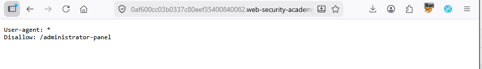

Sẽ có được đuôi để vào được Account admin. Thay thế robots.txt để vào admin panel, delete account carlos và hoàn thành bài lab

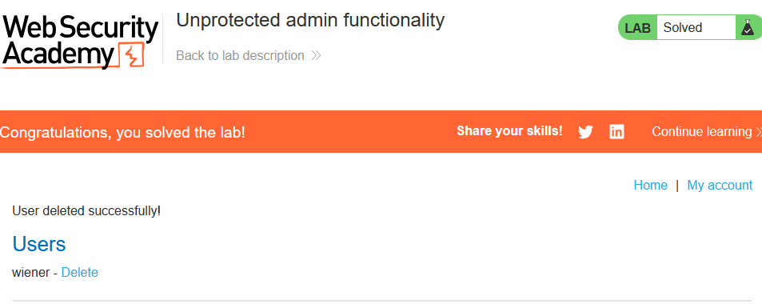

# __Lab: Unprotected admin functionality with unpredictable URL__

Access Lab, kiểm tra bằng việc thêm đuôi robots.txt vào URL

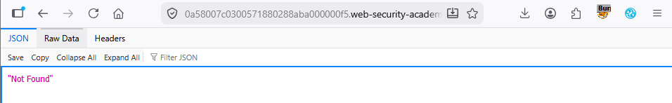

Khi trả về là 404 thử lại bằng cách kiểm tra source của trang 

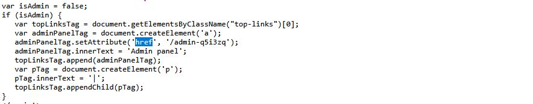

Thấy được đuôi truy cập admin panel thêm vào URL, để truy cập và xóa acccount carlos

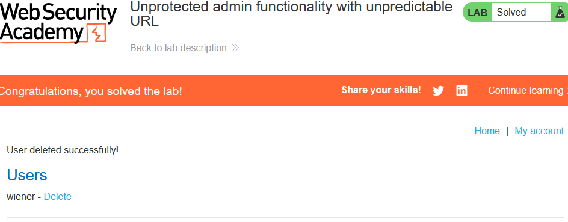

# __Lab: User role controlled by request parameter__

Kiểm tra /robots.txt(404 Not Found), kiểm tra /admin 

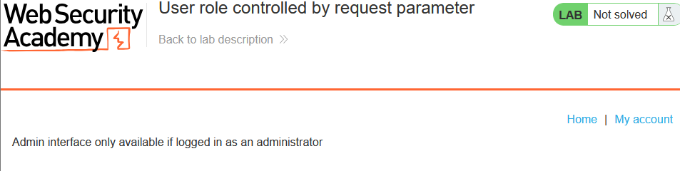

Server chỉ cho phép quyền sau khi đăng nhập. Truy cập và đăng nhập bằng tài khoản khả thi. Bật Intercept trên Burpsuite và load lại trang khi này Burp sẽ chặn được Request GET /my-account?id=wiener 

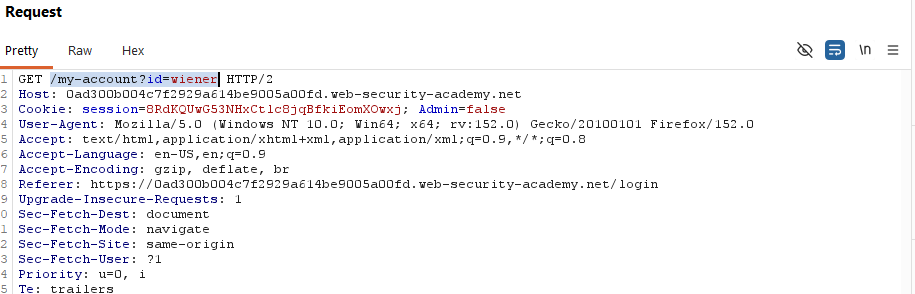

Sửa đổi Admin=false thành Admin=true rồi Forwward để cấp quyền Admin cho account wiener. Khi này account wiener đã có mục Admin Panel, truy cập và tiếp đục chặn và sửa Admin=false, Forward

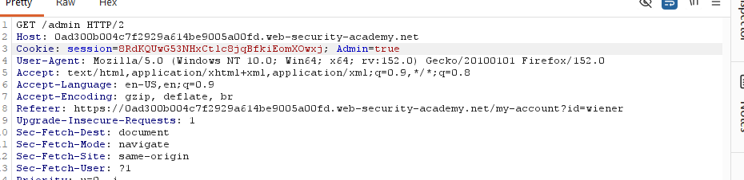

Để có thể truy cập vào và xóa account carlos. Khi xóa account carlos vẫn cần sửa Admin lần nữa để hoàn thành bài lab

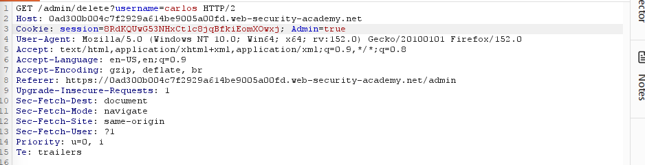
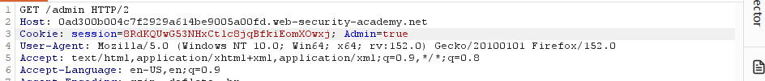
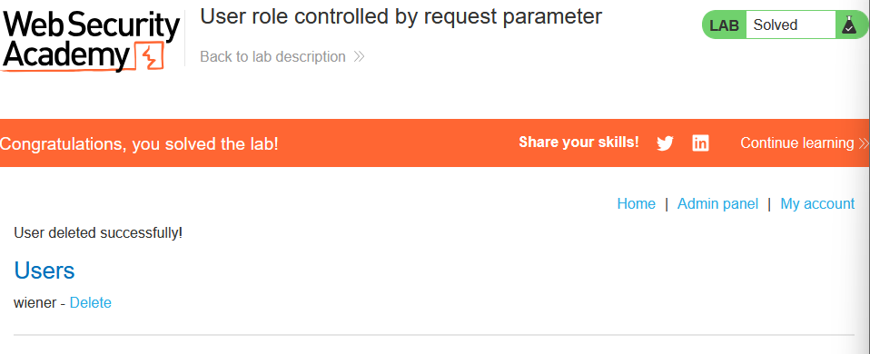

# __Lab: User role can be modified in user profile__

Kiểm tra /robots.txt(404 Not Found), kiểm tra /admin server chỉ cho phép quyền sau khi đăng nhập và chỉ khả thi với cá user có roleid=2

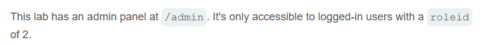

Đầu tiên đăng nhập bằng tài khoản khỉa thi wiener:peter, Update 1 email mói bất kì và dùng Burp để bắt được POST /my-account/change-email

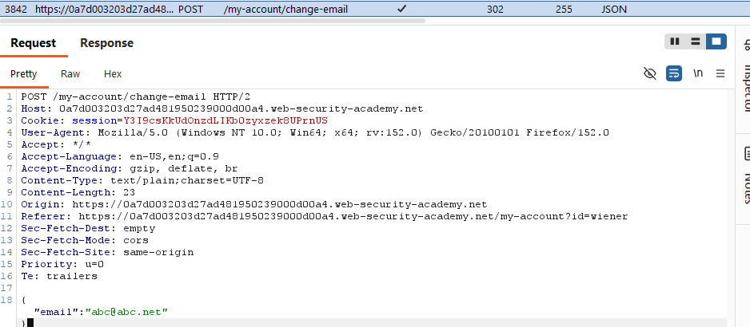

Send to Repeater kiểm tra lại và biết được account wiener có roleid:1 

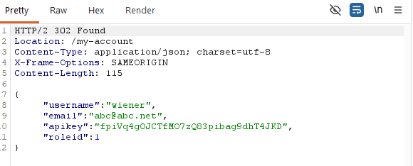

Thêm "roleid":2 vào Request và send lại.

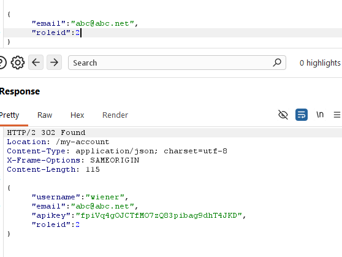 

Bây giờ account wiener đã được sửa roleid thành 2 và có quyền Admin. Truy cập Admin panel để xóa account carlos và hoàn thành bài lab

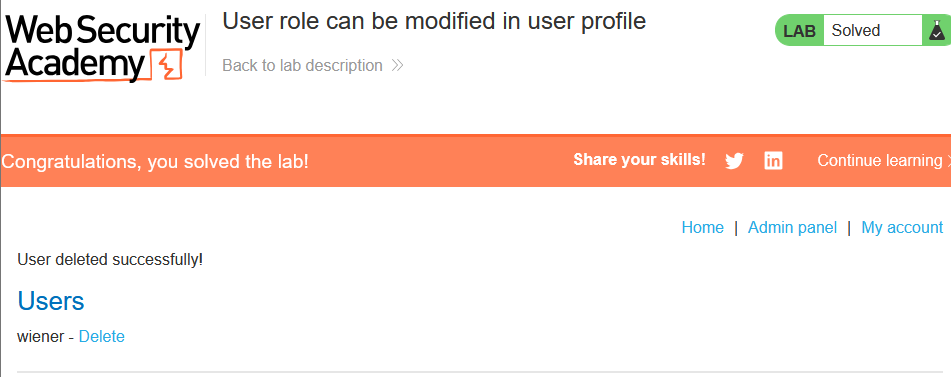

# __Lab: User ID controlled by request parameter__

Access Lab, đăng nhập bằng tài khoản khả thi wiener:peter. Dùng Burpsuite để bắt được GET /my-account?id=wiener

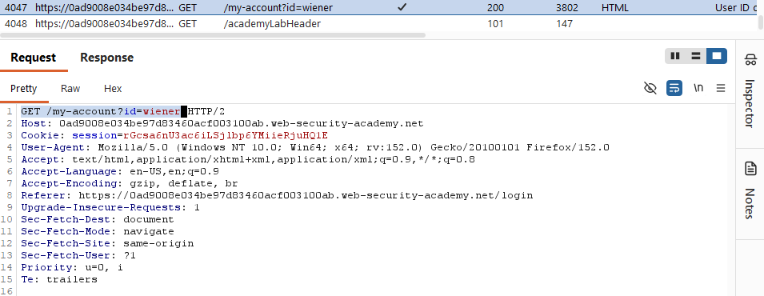

Send to Repeater và sứa đổi id từ wiener thành carlos va send. Khi này respone sẽ trả về source của trang account của carlos và có được API

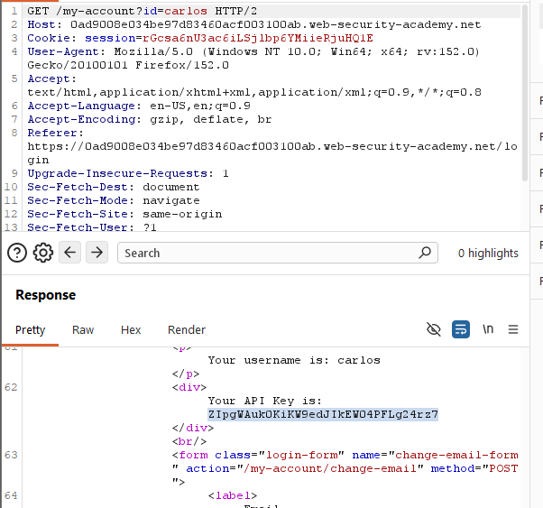

Sử dụng API của carlos để Submit và hoàn thành bài lab

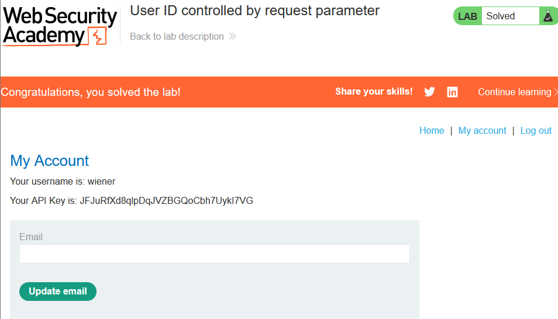

# __Lab: User ID controlled by request parameter, with unpredictable user IDs__

Access Lab, Kiểm tra các blog và tìm thấy được blog của carlos

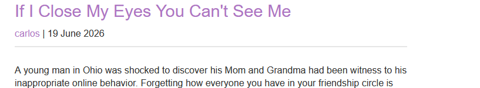

Sử dụng Burpsuite để bắt được GET /blogs?userId

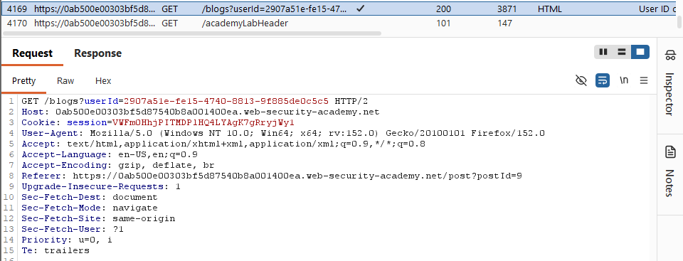

Có được userID của carlos. Đăng nhập bằng account khả thi wiener:peter.
Bắt được GET /my-account?id với id của wiener Send to Repeater thay thế id của wiener bằng id của carlos đã có và send. Response sẽ trả về source của trang account của carlos và có được API

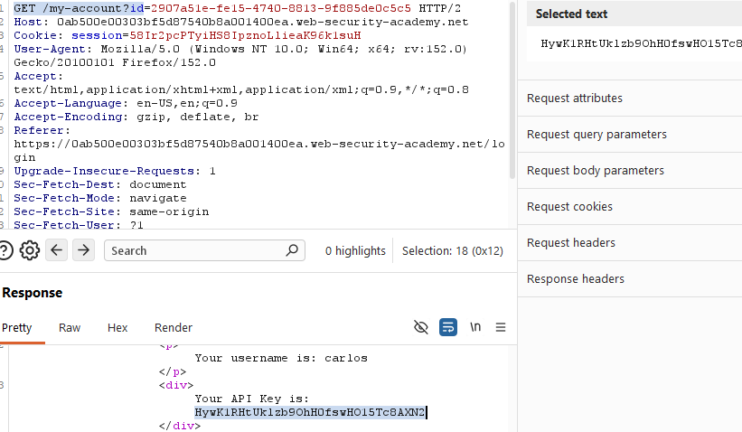

Sử dụng API đã có để submit và hoàn thành bài lab

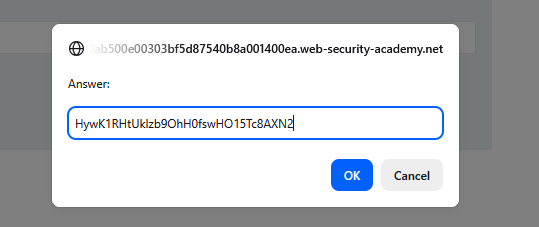
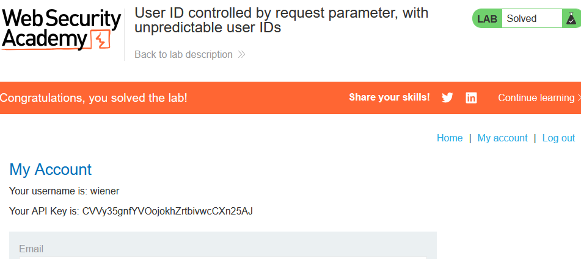

# __Lab: User ID controlled by request parameter with data leakage in redirect__

Access Lab, đăng nhập bằng tài khoản khả thi wiener:peter. Dùng Burpsuite để bắt được GET /my-account?id=wiener

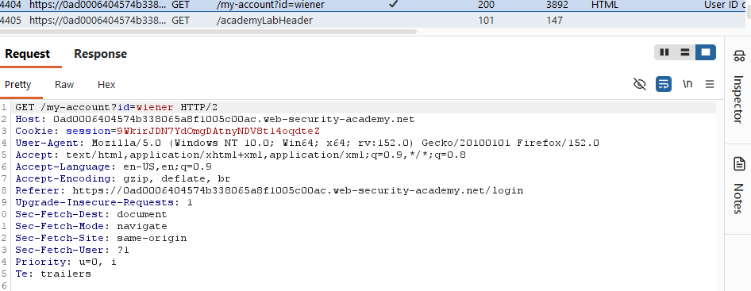

Send to Repeater và sứa đổi id từ wiener thành carlos va send. Khi này respone sẽ trả về source của trang account của carlos và có được API

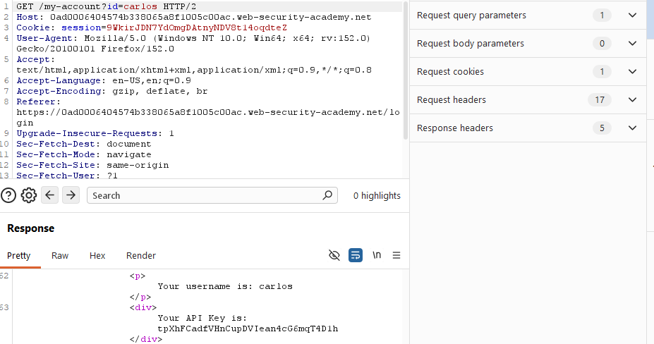

Sử dụng API của carlos để Submit và hoàn thành bài lab

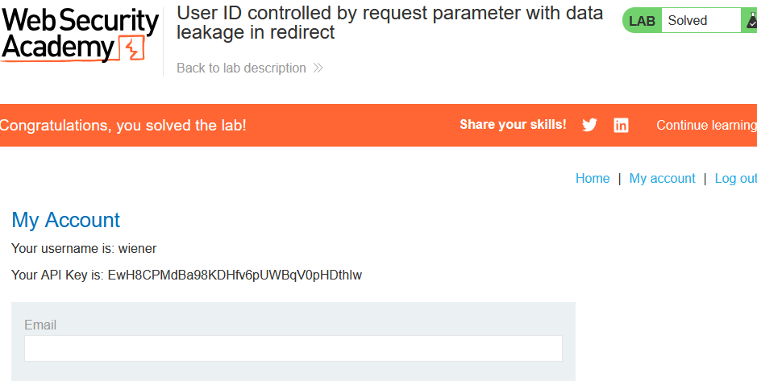

# __Lab: User ID controlled by request parameter with password disclosure__

Access Lab, đăng nhập bằng tài khoản khả thi wiener:peter. Dùng Burpsuite để bắt được GET /my-account?id=wiener

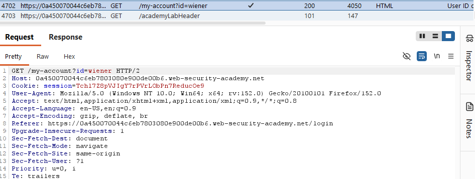

end to Repeater và sứa đổi id từ wiener thành administrator và send. Khi này respone sẽ trả về source của trang account của administrator 

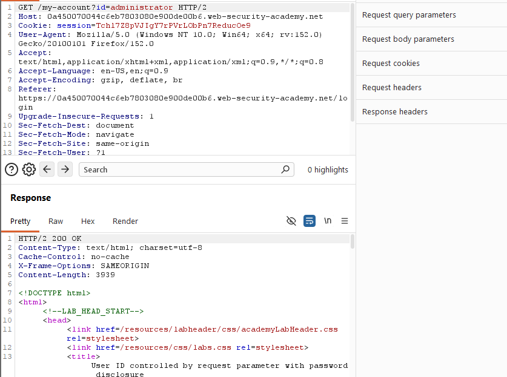

Có được value password của account administrator

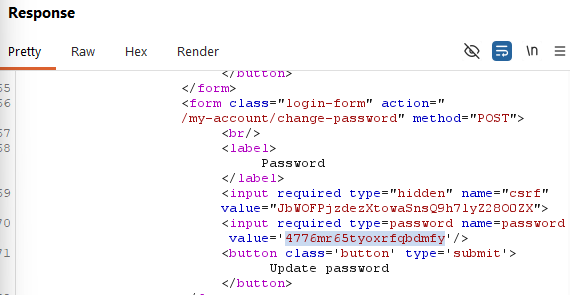

Đăng xuất khỏi account wiener và dùng password vừa lấy được để truy cập vào account admin, delete account carlos và hoàn thành bài lab

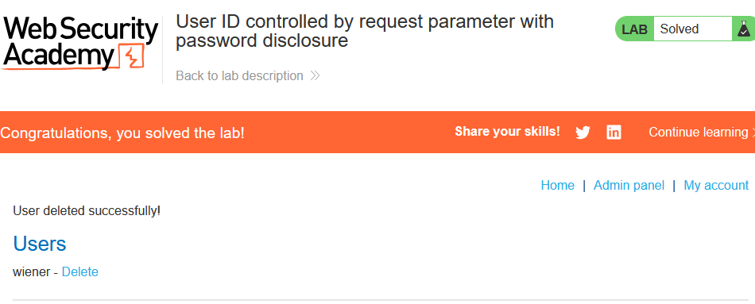

# __Lab: Insecure direct object references__

Access Lab, truy cập live chat và trò chuyện Hal Pline. Nhận thấy rằng mỗi lần view transcript. Giá trị sẽ tăng dần lên 

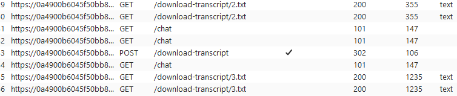

Nhưng file .txt của lần transcipt đầu tiên lại là 2.txt. Send to repeater và thử sửa giá trị thành 1.txt rồi send

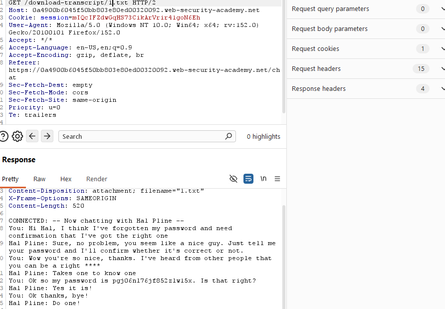

Sẽ có được password của account carlos. Đăng nhập vào account carlos và hoàn thành bài lab

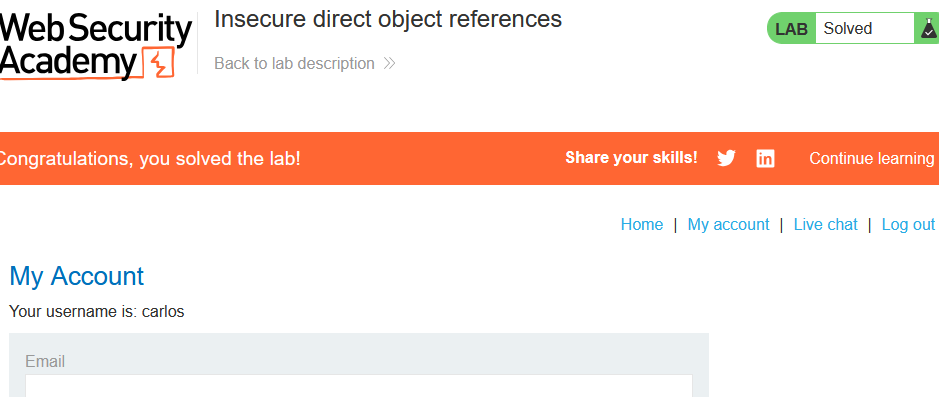

# __Lab: URL-based access control can be circumvented__

Access Lab, khi access thấy được rằng có thể truy cập vào admin panel. Nhưng khi truy cập thì xuất hiện access denied. 

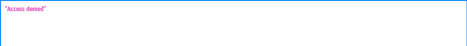

Điều này chúng tỏ front-end đã chặn tương tác vói quyền admin nhưng back-end thì không. Quay trở lại trang chính của bài Lab, Send to Repeater GET / HTTP/2.
Vì back-end có hỗ trọ cho X-Original-URL, add thêm /admin vào và send để có thể lấy được quyền admin.

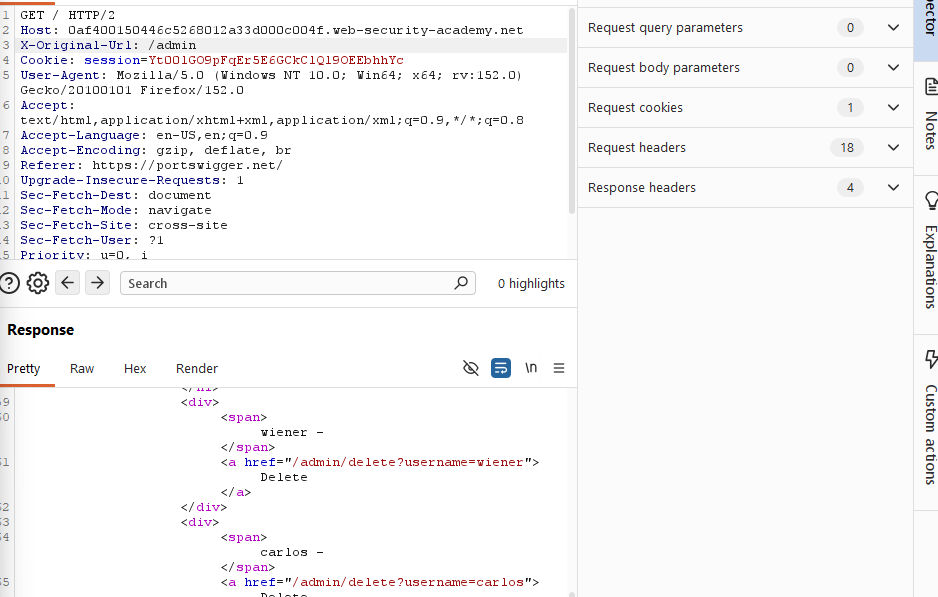

Vì front-end chặn nên bắt buộc phải delete account carlos bằng back-end. Đẻ có thể delete được accouont carlos add thêm /delete cùng với username account cần xóa. 

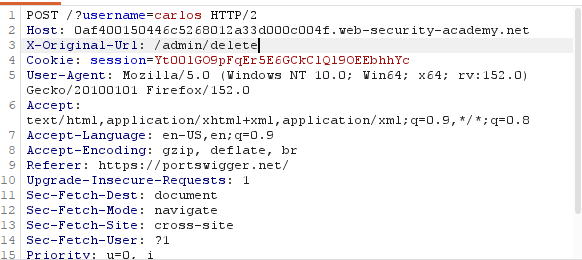

Send để hoàn thành bài lab

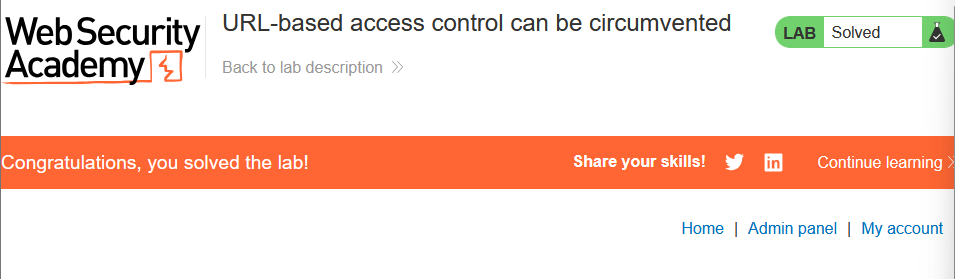

# __Lab: Method-based access control can be circumvented__

Access Lab, sử dụng account admin để đăng nhập và nâng cấp quyền hạn cho account carlos

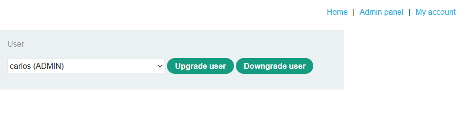

Sử dụng Burpsuite để bắt được POST /admin-role, Send to Repeater. Đăng xuất khỏi account admin và vào lại bằng account wiener:peter. Khi này Burpsuite sẽ bắt được GET /my-account?id=wiener cũng với cookie khi đăng nhập. 

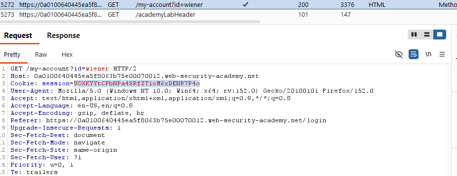

Quay trở lại sửa lại cookie và username thành cookie khi đăng nhập acc wiener và username:wiener

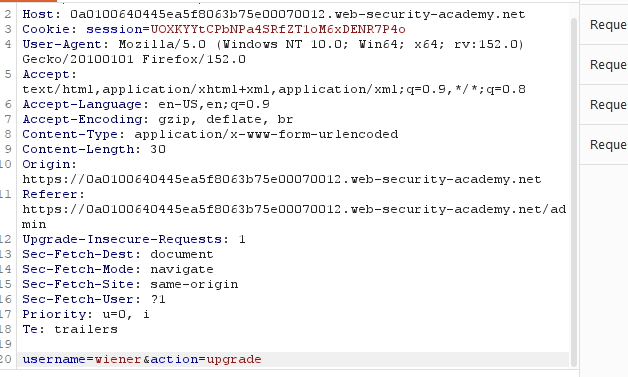

Khi send response sẽ trả về Unauthorized. Change request method để chuyển từ POST thành GET và send.

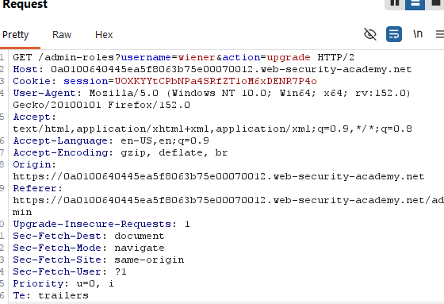

Lúc đấy account wiener sẽ được upgrade quyền admin và hoàn thành bài lab

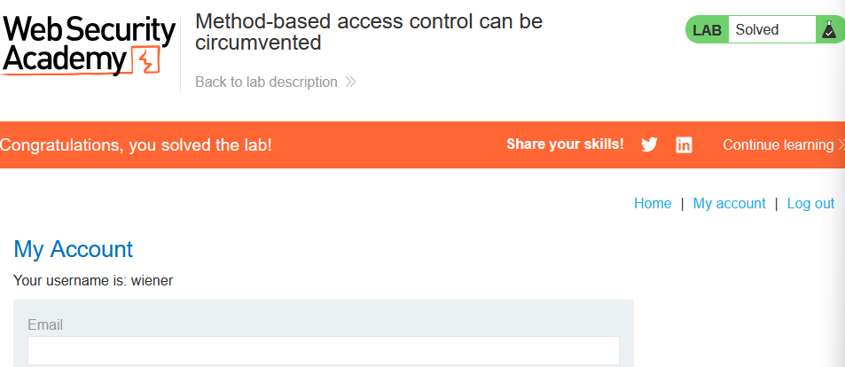

# __Lab: Multi-step process with no access control on one step__

Access Lab, sử dụng account admin để đăng nhập và nâng cấp quyền hạn cho account carlos

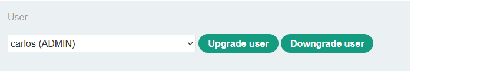

Khi này server sẽ hỏi là có chắc chán muốn sửa đổi quyền hạn hay không

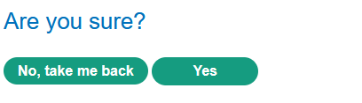

Sau khi Đồng Ý hoặc Không thì dùng Burpsuite bắt POST /admin-roles HTTP/2 và Send to Repeater. Đăng xuất khỏi account admin và vào lại bằng account wiener:peter. Khi này Burpsuite sẽ bắt được GET /my-account?id=wiener cũng với cookie khi đăng nhập.

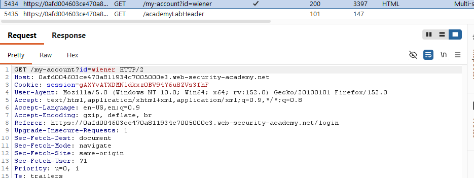

Quay trở lại sửa lại cookie và username thành cookie khi đăng nhập acc wiener và username:wiener và send.

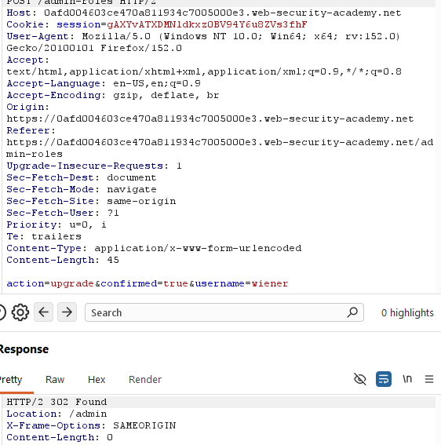

Lúc đấy account wiener sẽ được upgrade quyền admin và hoàn thành bài lab

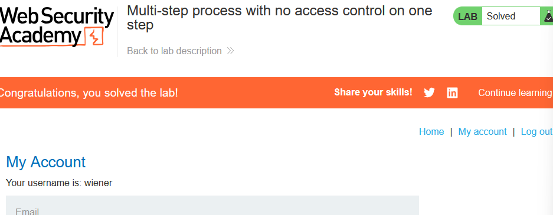

# __Lab: Referer-based access control__

Access Lab, sử dụng account admin để đăng nhập và nâng cấp quyền hạn cho account carlos

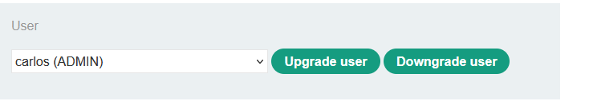

Sử dụng Burpsuite để bắt được GET /admin-roles, Send to Repeater.Đăng xuất khỏi account admin và vào lại bằng account wiener:peter. Khi này Burpsuite sẽ bắt được GET /my-account?id=wiener cũng với cookie khi đăng nhập.

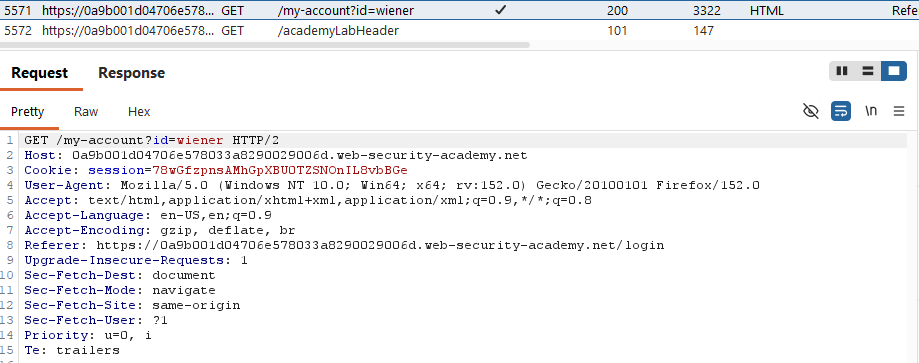

Quay trở lại sửa lại cookie và username thành cookie khi đăng nhập acc wiener và username:wiener và Send.

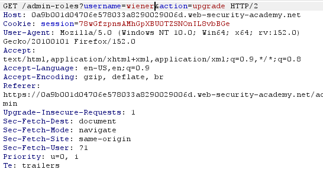

Lúc đấy account wiener sẽ được upgrade quyền admin và hoàn thành bài lab

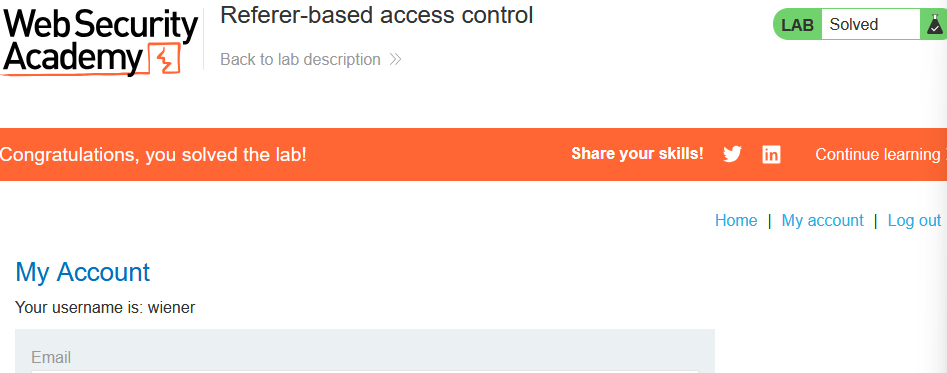