# __Lab: Username enumeration via different responses__

Cấu hình proxy, rồi bật intercept on.

Nhập username và password bất kì để burp chặn được

Request /login 

Send to Intruder, loại bỏ tất cả các đánh dấu Payload và Add đánh dấu vào username

Copy toàn bộ các user khả thi và Dán vào Payload configuration rồi Attack

Thấy được lengths của username:accounts là 3345

accounts chính là username hợp lệ

Trở lại Intruder loại bỏ vị trí đánh dấu Payload ở username và Add vào password

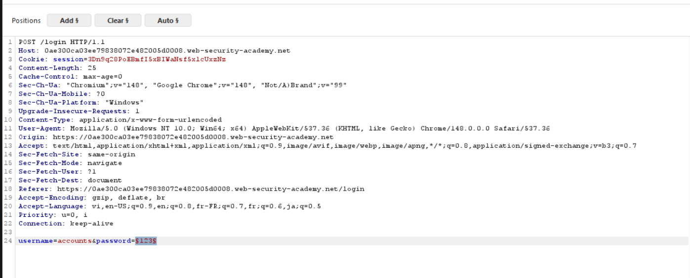

Clear toàn bộ các username khả thi và thay bằng password khả thi vào Payload configuration rồi Attack

Khi đấy burp sẽ trả về password:aaaaaa vs status 302 và length 3345

trở lại lab và nhập username cùng với password để hoàn thành bài lab

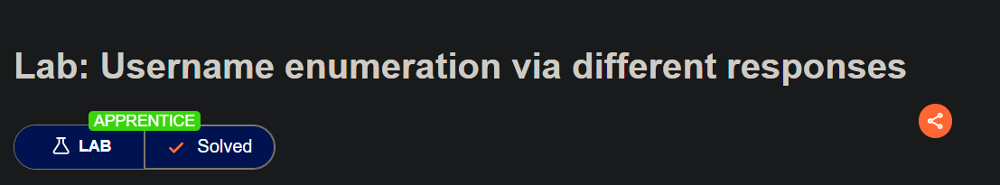

# __Lab: 2FA simple bypass__

Đăng nhập vào bằng tài khoản wiener

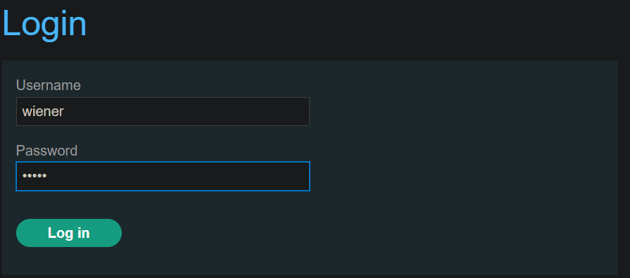

Truy cập vào Email Client để lấy mã security

Sau đấy Đăng xuất tài khoản cá nhân:wiener và đăng nhập bằng tài khoản carlos. Khi bị hỏi mã xác thực back to labhome và vào lại My Account sẽ thấy đã vượt được xác thực và hoàn thành bài lab

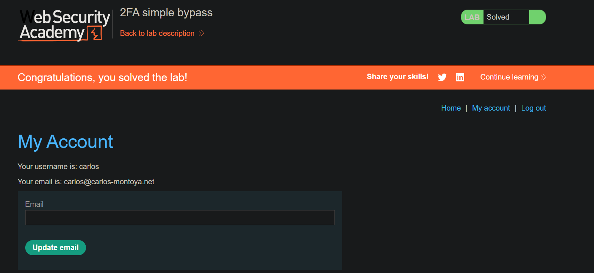

# __Lab: Password reset broken logic__

Sử dụng forgot password và dùng username wiener submit

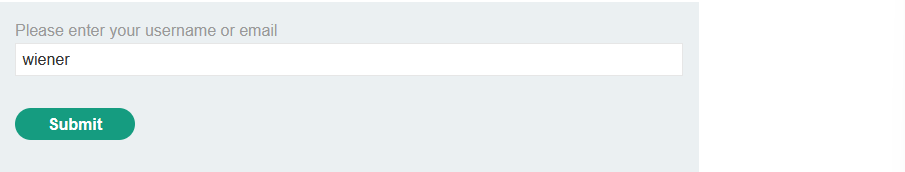

Truy cập vào email để lấy link thay đổi password 

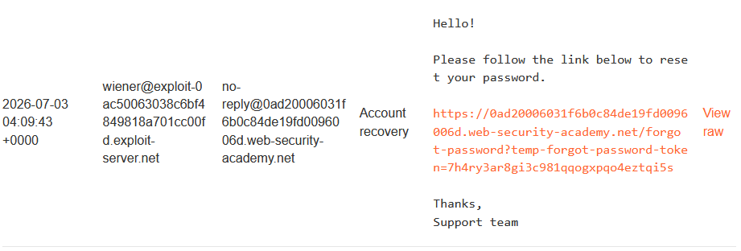

Thay đổi password thành password bản thân muốn và submit.

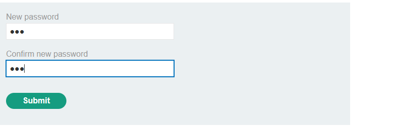

Khi này burpsuite sẽ bắt được POST /forgot-password?temp-forgot-password-token

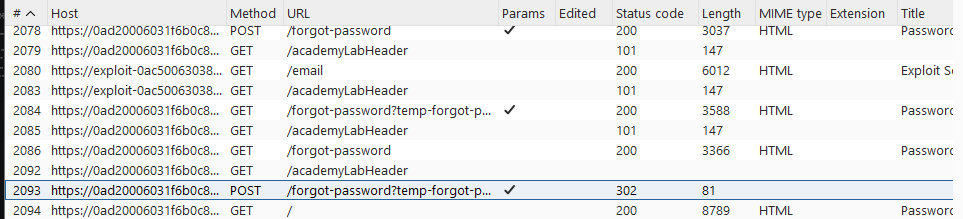

Send to Repeter để sửa username từ wiener thành carlos và send

Quay trở lại trang đăng nhập và đăng nhập bằng tài khoản carlos vs password đã đởi và hoàn thành bài lab

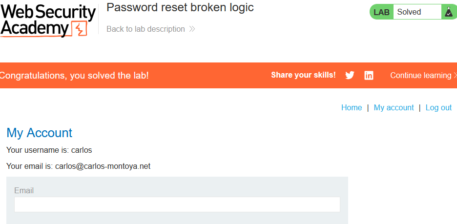

# __Lab: Username enumeration via subtly different responses__

Đăng nhập bằng 1 tài khoản bất kì

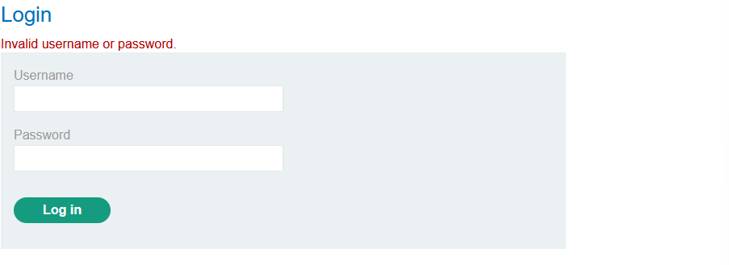

Khi đấy burpsuite sẽ bắt được POST /login

Send to Intruder clear toàn bộ các đánh dấu Payload chỉ Add vào username

Nạp các username khả thi vào Payload. Vào settings highlight Invalid username or password. Rồi attacks

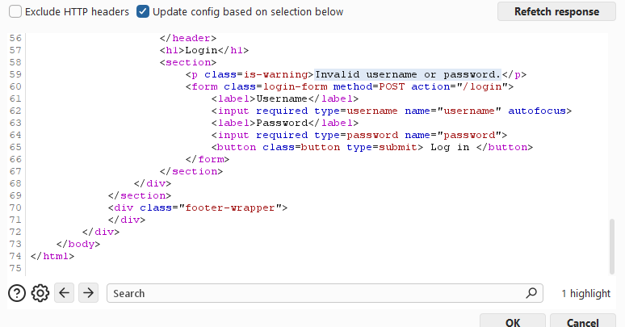

Sau khi attack burpsuite sẽ trả về 1 warning username khác với phần còn lại thì đấy chính là username cần tìm.

Thay thế username đã biết vào Intruder, đánh dấu Payload password và nạp vào danh sách password khả thi rồi attack

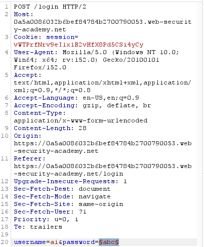

Sau khi attack burp sẽ trả về 1 password vs status 302 

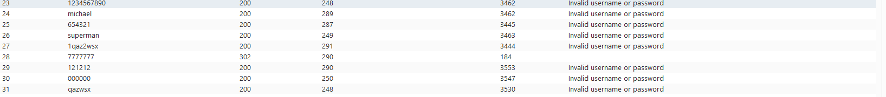

Quay lại trang đăng nhập và sử dụng username cùng với password đã tìm được và hoàn thành bài lab

# __Lab: Username enumeration via response timing__

Truy cập My Account và đăng nhập bằng 1 tài khoản bất kì invalid để burpsuite có thể bắt được POST /login

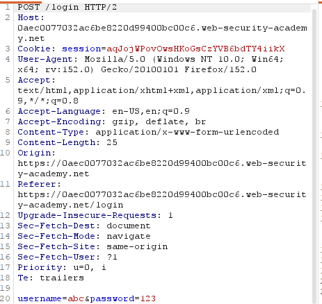

Send to Intruder đánh dấu vị trí Payload, nạp danh sách Payloas và Attack. khi đấy thấy rằng bài lab sẽ chặn IP nếu như invalid quá nhiều trong 1 thời gian ngắn

Send to Intruder và Add thêm X-Forwarded-For vào header, thêm đánh dấu Payload vào địa chỉ X-Forwarded-For

Chuyển cách tấn công từ Sniper attack sang Pitchfork attack.
Khi này Burp sẽ xác định Payload 1: X-Forwarded-For, Payload 2: username

Ở Payload 1 sửa lại Type thành number, Cấu hình lại Number range 

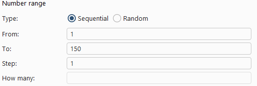

Add thêm Payload processing chọn rule prefix và thêm 1.1.1. 

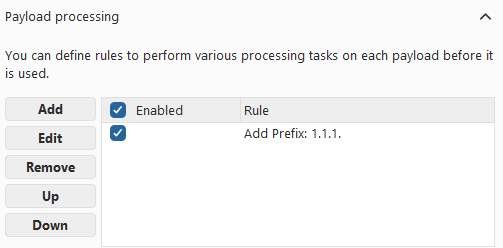

Ở Payload 2 nạp danh sách username,Sửa password thành 1 chuỗi kí tự dài để máy chủ tốn nhiều thời gian phản hồi, Sửa maximum concurrent requests là 1 rồi attack

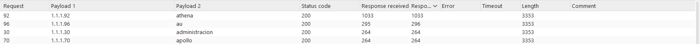

Thay username đã tìm được và đánh dấu Payload cho password. Nạp danh sách password rồi Attack. Khi đấy sẽ thấy 1 password với status là 302

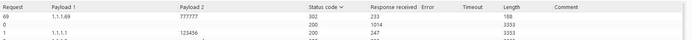

Quay trở lại lab sử dụng username và password đã tìm được để hoàn thành bài lab

# __Lab: Broken brute-force protection, IP block__

Truy cập My Account và đăng nhập bằng 1 tài khoản invalid để Burpsuite có thể bắt được POST /login và trả về respone

Vì bài lab sẽ chặn IP nếu nhập sai quá nhiều lần nên có 2 hướng đi
### 1. Add X-Forwarded-For và thay đổi IP sau mỗi lần để tránh bị khóa 
### 2. Dùng spoof để reset sau mỗi lần thử sai

Nhưng vì bài lab muốn hiểu được logic nên dùng cách 2. Tạo danh sách Payload username vs password. 

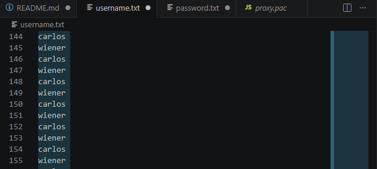

Đánh dấu Payload vào username và password, chuyển từ Sniper attack sang Pitchfork attack, nạp danh sách username và password rồi Attack

Khi đấy burp sẽ trả về danh sách tài khoản khả thi. Sử dụng username và password vừa tìm được để đăng nhập và hoàn thành bài lab

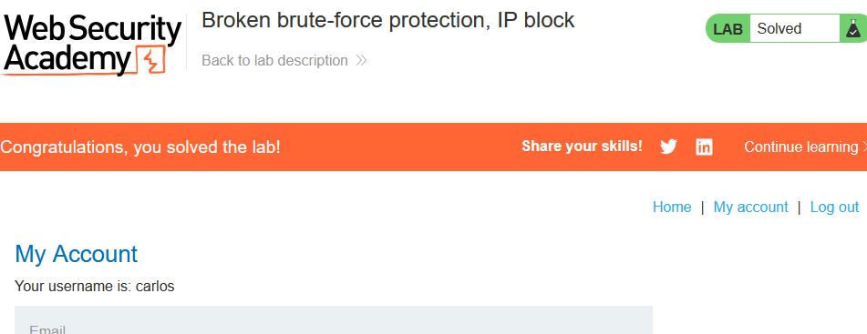

# __Lab: Username enumeration via account lock__

Đăng nhập bằng 1 tài khoản invalid bất kì để Burpsuite có thể bắt được POST /login. Send to Intruder, đánh dấu Payload username và password. Chuyển từ Sniper attack sang cluster bomb, nạp danh sách username ở Payload 1 còn Payload 2 chuyển về Type NULL và set generate 5 payload

Attack. Sau khi set generate 5 payload thì burp sẽ lặp lại 1 username 5 lần để xác định được username có tồn tại hay k

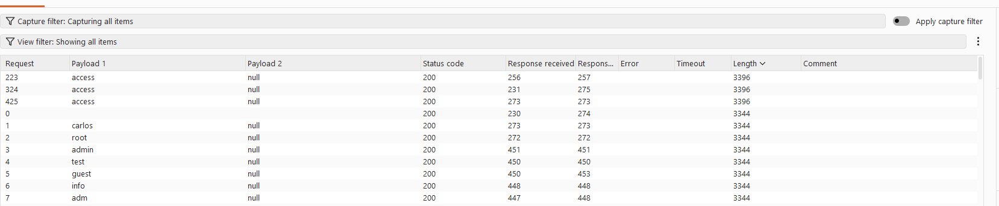

Thấy được độ dài của username:access dài hơn so với các username khác. Quay trở lại Burpsuite sử dụng username:access nạp danh sách password và attack

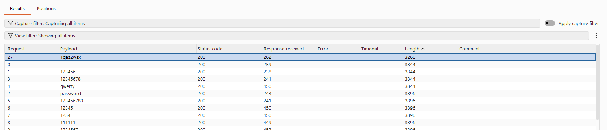

Burpsuite sẽ trả về password xác định dựa trên độ dài khác.

Quay trở lại bài lab sử dụng username và password vừa tìm được để đăng nhập và hoàn thành bài lab

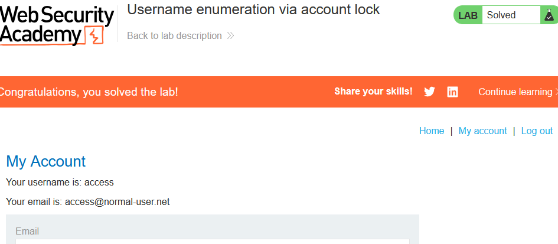

# __Lab: 2FA broken logic__

Đăng nhập bằng tài khoản khả dụng wiener:peter 

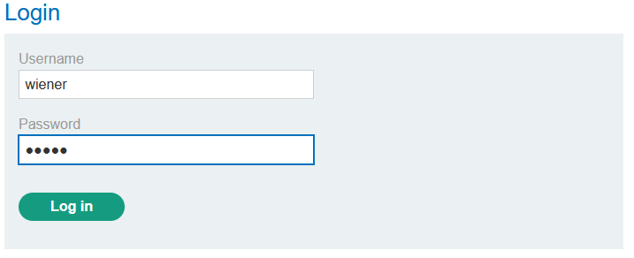

Để burp bắt được GET /login2, Send to Repeater thay đổi cookie từ verify=wiener thành verify=carlos rồi send để server tạo mã xác thực cho account carlos

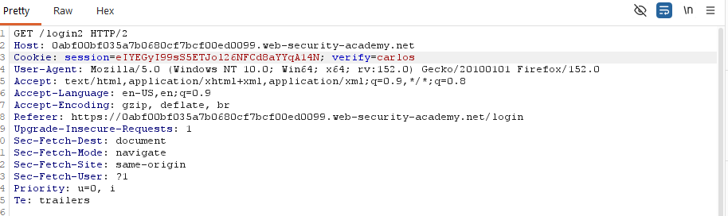

Nhập 1 mã xã thực bất kì để Burp bắt được POST / login2. Send to Intruder thay đổi cookie thành carlos và đánh dấu Payload vào mã mfa

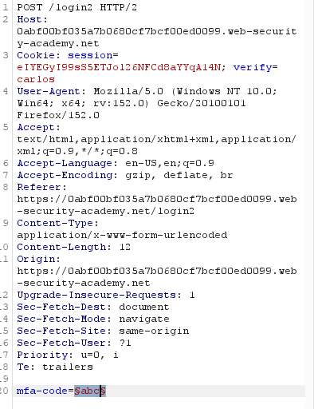

Set Payload type thành number cho chạy từ 1 đến 9999 min interger digit là 4 vì mã luôn gồm 4 chữ số rồi attack

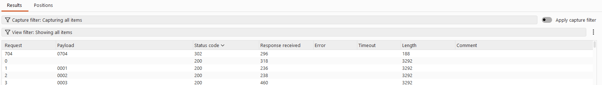

Burpsuite sẽ trả về 1 mã mfa vs status 302. Send to repeater POST /login2 từ intruder và dùng mã mfa đã tìm được sẽ có response trả về là HTTP/2 302 Found. Open response in browser và hoàn thành bài lab

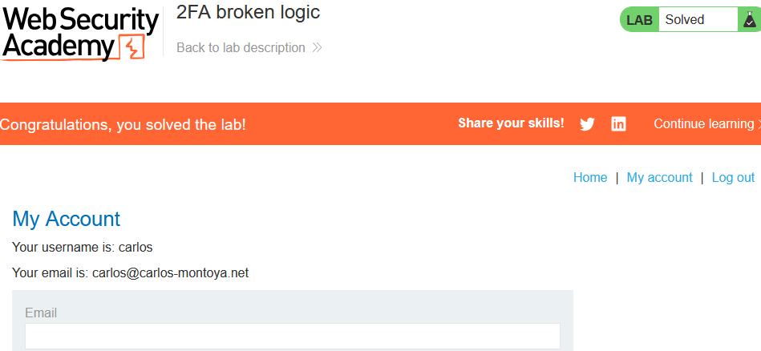

# __Lab: Brute-forcing a stay-logged-in cookie__

Đăng nhập bằng tài khoản khả thi wiener:peter và bật stay-logged-in

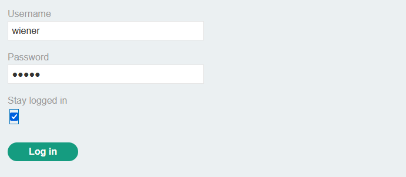

Burpsuite sẽ bắt được GET /my-account?id=wiener

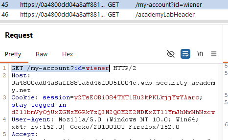

Nhận thấy mã cookie stay logged in được mã hóa Base64. Copy cookie và dán vào decoder 

Mã cookie có dạng username:MD5hashpassword. Send to Intruder GET /my-account?id=wiener, gắn đánh dấu Payload cho cookie stay logged in. Nạp danh sách password khả thi, chuyển id từ wiener sang carlos

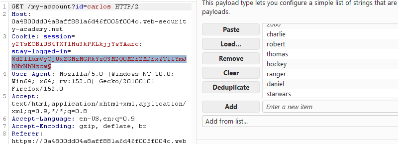

Set thêm vào Payload processing 

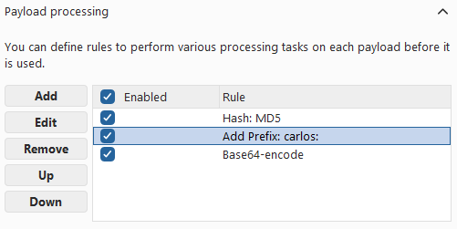

Add thêm 1 flag Update email trong Grep-Match (vì update email chỉ có thể thấy khi truy cập my account) rồi attack

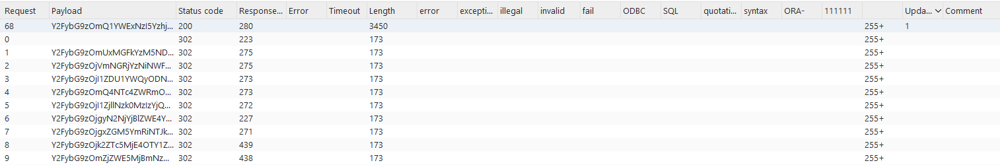

Thấy rằng chỉ duy nhất 1 cookie có Update email. Decode ra sẽ thấy cookie 

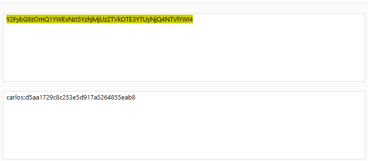

Sử dụng các công cụ hash decode để có thể biết được password của account carlos

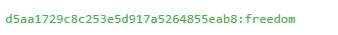

Dùng password vừa tìm được để đăng nhập vào account carlos và hoàn thành bài lab

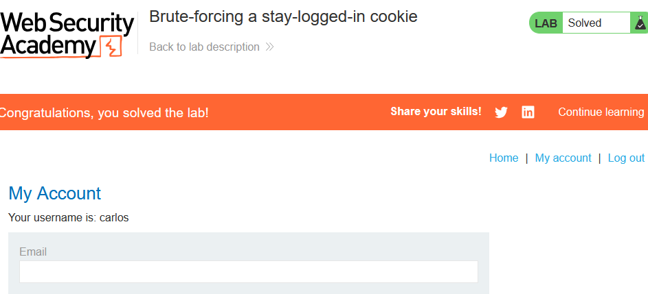

# __Lab: Offline password cracking__

Đăng nhập bằng account wiener:peter và bật stay logged in để Burpsuite bắt được GET /my-account?id=wiener

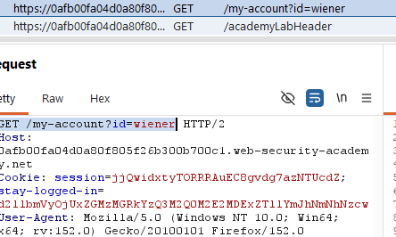

Nhận thấy mã cookie stay logged in được mã hóa Base64. Copy cookie dán vào decoder và cookie có dạng username:MD5hashpassword

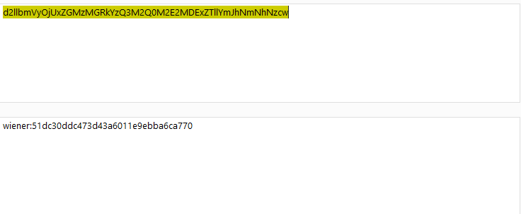

Tuy nhiên không thể brute force được vì chưa có danh sách Payload khả thi. Nên dùng XSS để đánh cắp cookie của carlos. Truy cập vào exploite server để lấy được ID server cá nhân. 

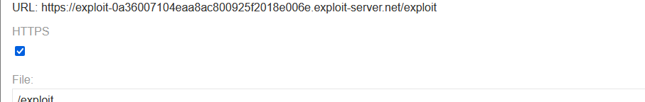

Viết 1 comment vào blog bất kì XSS payload sử dụng ID server cá nhân rồi đăng lên 

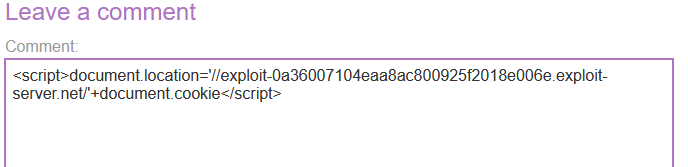

Quay trở lại truy cập vào access log của exploite server t sẽ có được cookie stay logged in của carlos 

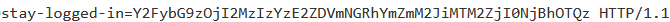

Decode và lấy được mật khẩu của account carlos 

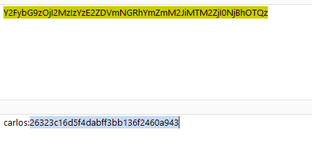

Sử dụng password đăng nhập vào account carlos, delete account và hoàn thành bài lab

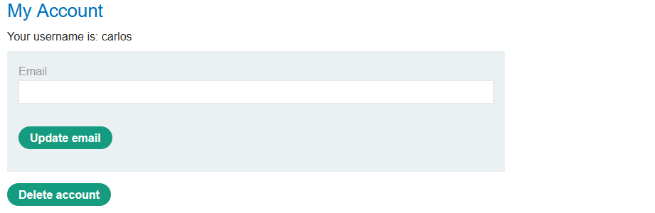
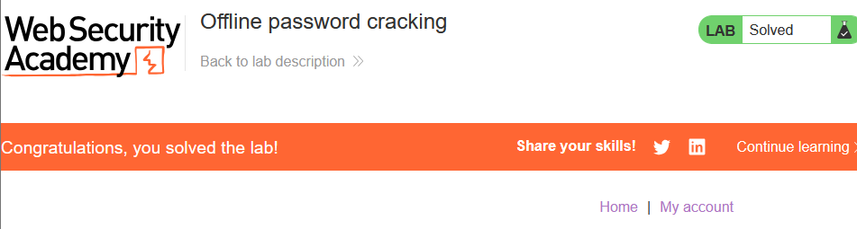

# __Lab: Password reset poisoning via middleware__

Truy cập vào Forgot password, nhập username wiener. Bật intercept lên trước khi submit để Burpsuite có thể chặn được POST /forgot-password. Vào exploit server và viết 1 script để server sẽ gửi email reset vs link chỉ về exploit server của bản thân.

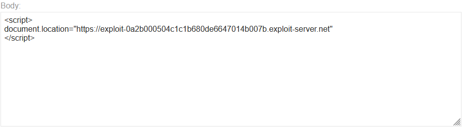

 Send to Repeater POST /forgot-password thêm X-Forwarded-Host và sửa lại id từ wiener thành carlos rồi send

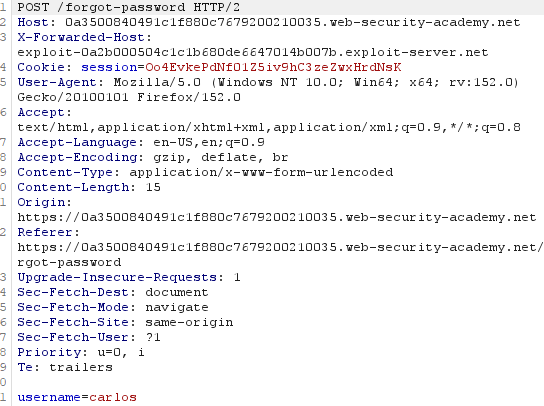

Vào email và sử dụng link hướng dẫn thay đổi mật khẩu để Burpsuite bắt được GET /forgot-password?temp-forgot-password-token, Send to repeater để khi lấy được reset token của carlos có thể thay thế token của bản thân. Khi carlos truy cạp vào link đã được gửi qua email và được trả về server truy cập access log t có thể thấy được reset token của carlos.

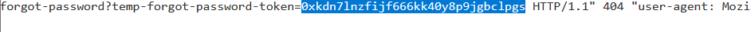

Thay token vừa lấy được vào token của bản thân rồi send

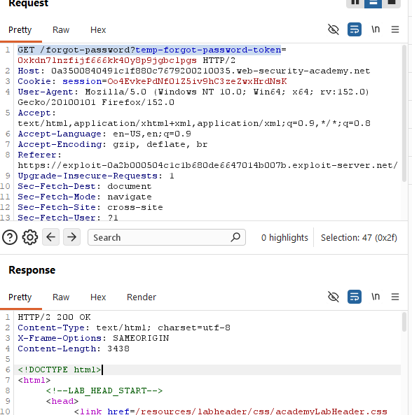

Mở response trong browser, thay đổi mật khẩu của carlos và hoàn thành bài lab

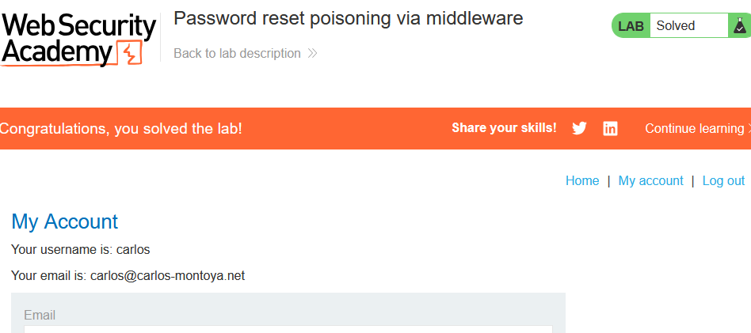

# __Lab: Password brute-force via password change__

Đăng nhập bằng account wiener:peter. Nhập các giá trị vào để đổi password, nhận thấy nếu như nhập 2 giá trị password mới khác nhau server sẽ trả về là new passwword do not match

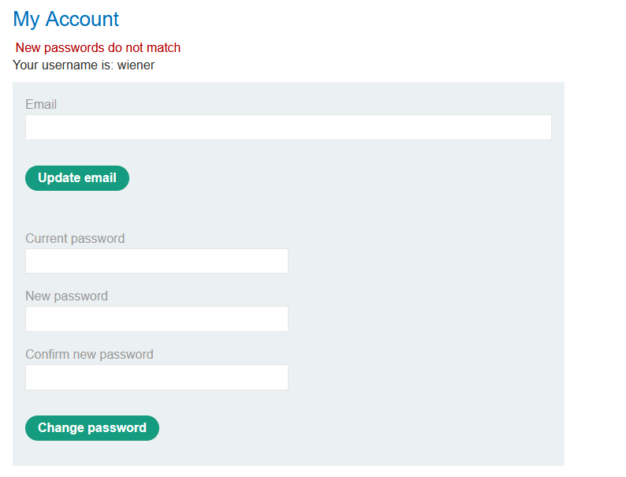

Send to intruder POST /my-account/change-password sửa username từ wiener thành carlos và đánh dấu Payload vào current-password

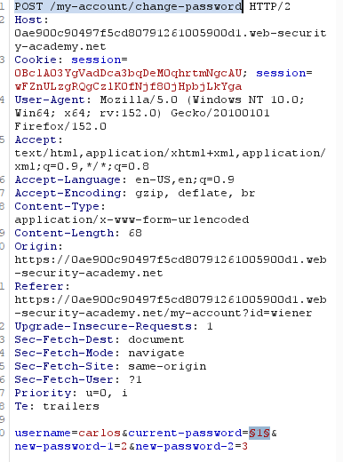

Nạp danh sách Payload mật khẩu khả thi cho acccount carlos. Tô đen New passwords do not match trong Grep-Match để nhận diện. Khi này nếu như 1 password trong danh sách Payload khớp với password hiện tại của carlos thì sẽ có warning là New passwords do not match, nhưng nếu như không giống thì sẽ trả về là Current password is incorrect

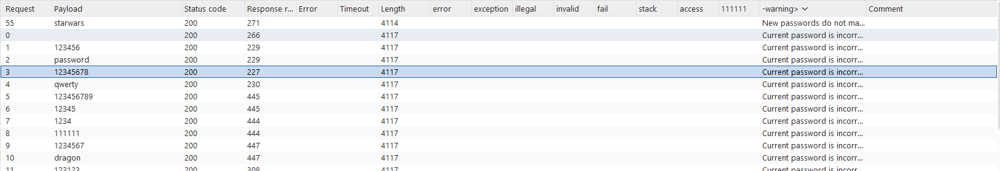

Đăng xuất khỏi account wiener, dùng mật khẩu và đăng nhập vào account carlos, thay đổi mật khẩu và hoàn thành bài lab

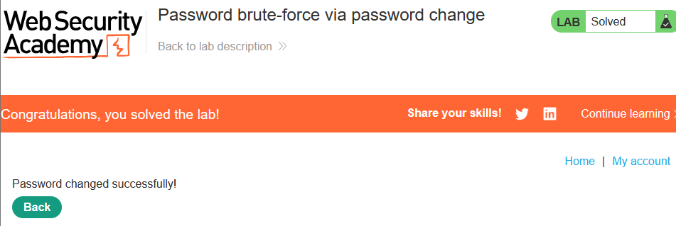

# __Broken brute-force protection, multiple credentials per request__

Đăng nhập bằng tài khoản bất kì invalid để Burpsuite có thể bắt được POST /login

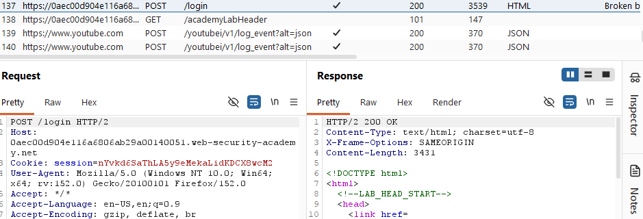

Send to Repeater sửa username thành carlos nạp danh sách theo dạng mảng vào request và send. Open response in browser và hoàn thành bài lab

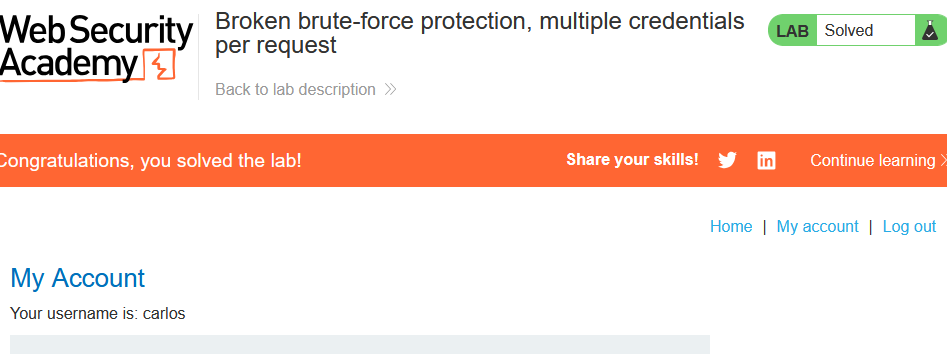