# __Lab: Excessive trust in client-side controls__

Access Lab, đăng nhập bằng account wiener:peter. Bật Intercept trên BurpSuite để có thể chặn được POST /cart khi thêm áo l33t vào giỏ hàng.

Nhận thấy có price ở request thử thay đổi giá của áo rồi forward để gửi về server. Vào giỏ hàng kiểm tra thì thấy giá đã được thay đổi.

Tiến hành thanh toán và hoàn thành bài lab.

# __Lab: High-level logic vulnerability__

Access Lab, đăng nhập bằng account wiener:peter. Bật Intercept trên BurpSuite để có thể chặn được POST /cart khi thêm áo l33t vào giỏ hàng.

Thử thay đổi giá trị quantity thành giá trị âm và forwrad khi này số lượng áo ở trang và total price đều chuyển về âm.

Loại bỏ áo khỏi giỏ hàng thêm vật phẩm khác vào giỏ hàng dùng Burpsuite chặn và chuyển số lường về âm. Sao cho đế khi total price của cả áo và các vật phẩm khác đủ với số tiền đang sở hữu.

Tiến hành thanh toán và hoàn thành bài lab.

# __Lab: Inconsistent security controls__

Access Lab, nhận thấy có thể tự đăng kí 1 tài khoản cá nhân. Truy cập vào email client để lấy được đường dẫn email.

Sử dụng email và đăng kí. 

Quay trở lại email để xác thực đăng kí thành công. Đăng nhập vào account vừa tạo. Nhận thấy có phần thay đổi email vì email đã được xác thực và đăng kí thành công, thay đổi đuôi email thành `@dontwannacry.com`

Vì chỉ khi sử dụng email của dontưannacry mới có quyền truy cập admin. Sau khi đỏi thành công email thì bây giờ account của ta có thêm admin panel.

Truy cập và xóa account carlos để hoàn thành bài lab.

# __Lab: Flawed enforcement of business rules__

Access Lab, đăng nhập bằng account wiener:peter. Nhận thấy có 2 mã giảm giá: `NEWCUST5` và 1 mã khi đăng kí bằng email `SIGNUP30`. Thêm áo vào giỏ hàng và add mã giảm giá.

Tuy nhiên khi add lại cùng 1 mã vừa add thì sẽ được báo là "mã đã được sử dụng" nhưng add một mã khác kể cả là mã đã add trước đó nữa thì hệ thống nhận nhận và giảm giá.

Liên tục thay đổi và add mã vào cho đến khi total price giảm đến mức vừa đủ với số tiền đang sở hữu.

Tiến hành thanh toán và hoàn thành bào lab.

# __Lab: Low-level logic flaw__

Access Lab, đăng nhập bằng account wiener:peter. Sử dụng Burpsuite để bắt được POST /cart. Send to Repeater thử thay đổi giá trị quantity thành 1 số cực lớn.

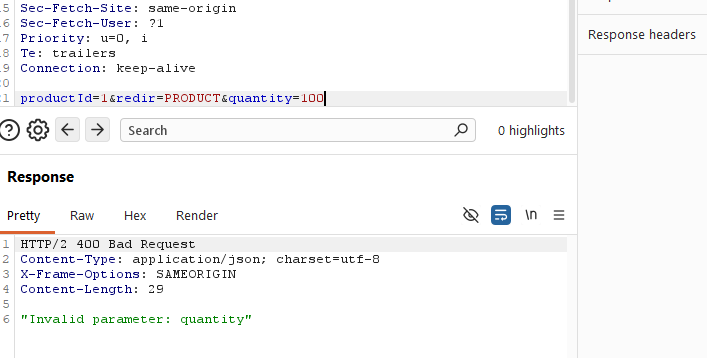

Tuy nhiên khi giá trị vượt quá 2 chữ số thì sẽ đc trả lại `invalid quantity`. Nhận thấy khi thêm nhiều số lượng sản phẩm thì đến một mức độ nào đó sẽ vượt ngưỡng, tức là dùng kiểu int, nên số tiền vượt quá giá trị của int sẽ trả về giá trị âm. Vì vậy cần thêm số lượng sản phẩm để triệt tiêu. Sau đó thực hiện đặt hàng để solve bài lab

Thực hiện Send to Intruder. Thêm đánh dấu Payload và chọn type null. Ở configuration chọn `Continue identifinitely` rồi attack.

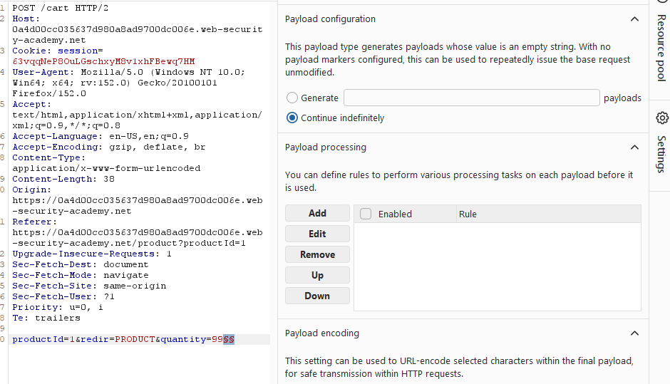

Khi này mỗi khi làm mới trang số lượng sản phẩm sẽ tăng lên 1 số lượng rất lớn dẫn đến tổng giá trị bị vượt quá biến đang được chọn.

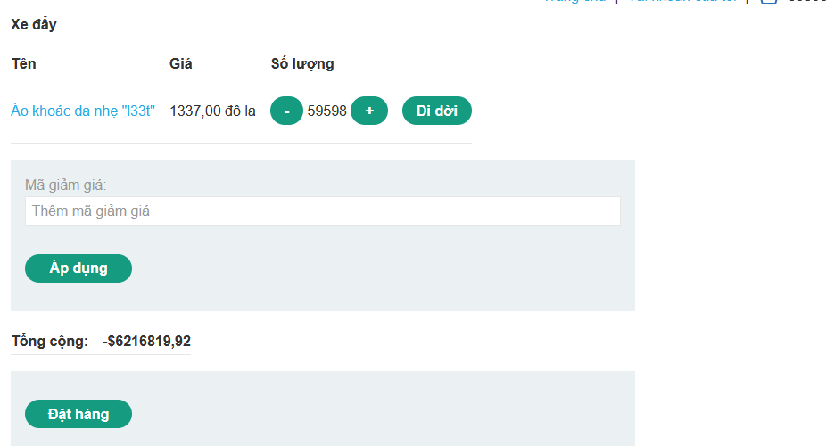

Nhận thấy số lượng sản phẩm càng tăng giá trị càng giảm. Nên để giải bài lab chỉ cần tăng sản phẩm đến 1 ngướng nhất định và thêm các sản phẩm khác vào giỏ hàng để chuyển total price từ âm thành dương.

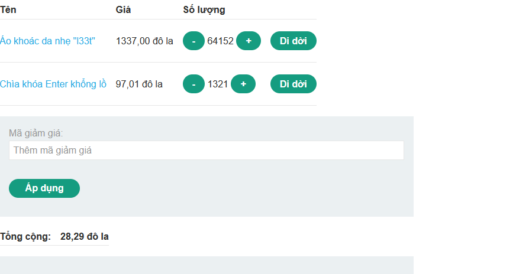

Tiến hành thanh toán và hoàn thành bài lab.

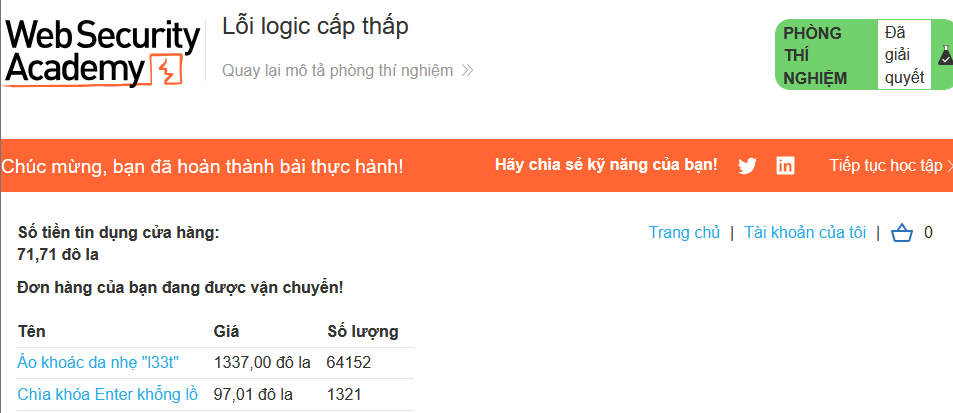

# __Lab: Inconsistent handling of exceptional input__

Access Lab, nhận thấy có thể tự đăng kí 1 tài khoản cá nhân. Truy cập vào email client để lấy được đường dẫn email. Kiểm tra `/admin` khi này server trả về 

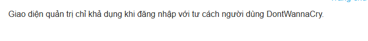

Đăng kí 1 tài khoản cá nhân thử đăng kí với 1 email cực dài kí tự. Sau khi kiểm tra sẽ thấy được rằng chuối email nhập vào đã bị cắt bỏ đi và chỉ còn lại 230 kí tự. 

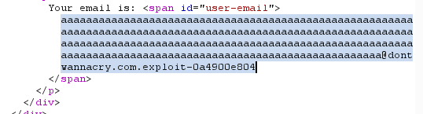

Quay trở lại trang đăng kí tài khoản tạo 1 tài khoản mới với đuôi email là `@dontwannacry.com.exploit-0a4900e804cc8d3586f738e901ad00f2.exploit-server.net` sao cho kí tự thứ 230 là `m`.

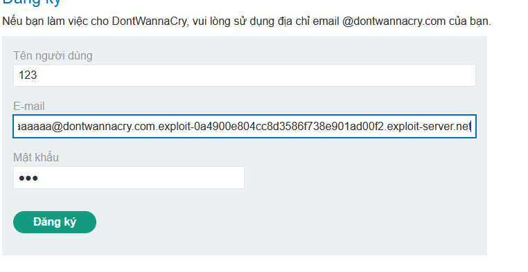

Khi này đăng kí server sẽ tự động loại bỏ toàn bộ phần đuôi sau `m` tuy nhiên vì có gắn đuôi email các nhân vào ta vẫn có thể xác thực tài khoản. Khi đăng nhập vào tài khoản vừa tạo sẽ xuất hiện bảng admin panel, sử dụng để xóa tài khoản carlos và hoàn thành bài lab.

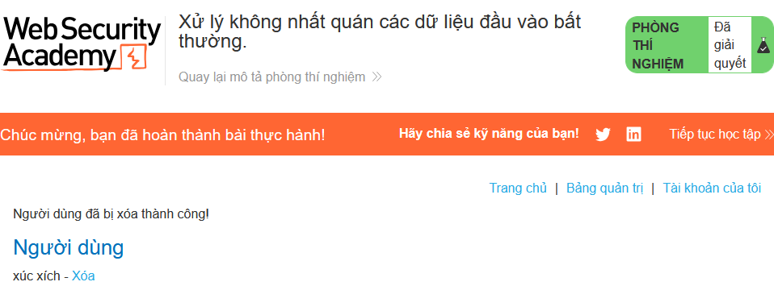

# __Lab: Weak isolation on dual-use endpoint__

Access Lab, đăng nhập bằng account wiener:peter. Thay đổi mật khấu, sử dụng Burpsuite để bắt được POST /my-account/change-password.

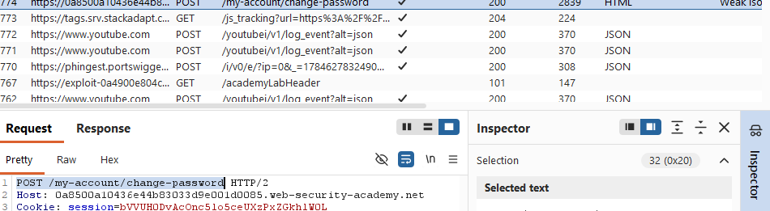

Send to Repeater, thay đổi username thành `administrator` và thử loại bỏ `current-password`.

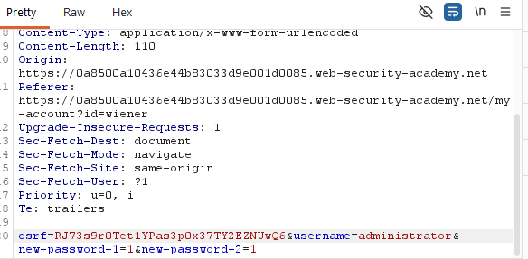

Send, khi này server sẽ k kiểm tra xem account có password hay không mà sẽ đổi mới passwd luôn. Sử dụng passwd vừa đổi để đăng nhập vào account của admin. Thực hiện xóa account carlos và hoàn thành bài lab.

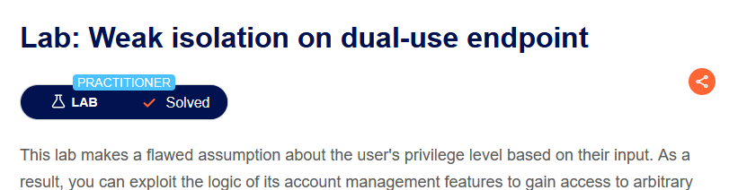

# __Lab: Insufficient workflow validation__

Access Lab, đăng nhập bằng account wiener:peter. Mua 1 sản phẩm bất kì. Sử dụng Burpsuite để bắt được POST /cart, POST /cart/checkout và GET /cart/order-confirmation?order-confirmed=true. Send to Repeater. Quay trở lại thêm sản phầm cần mua vào giỏ hàng 

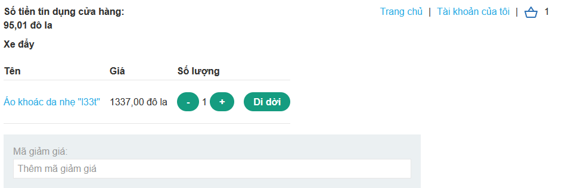

Send GET /cart/order-confirmation?order-confirmed=true để server nhầm và xác định ta đã mua sản phảm và hoàn thành bài lab.

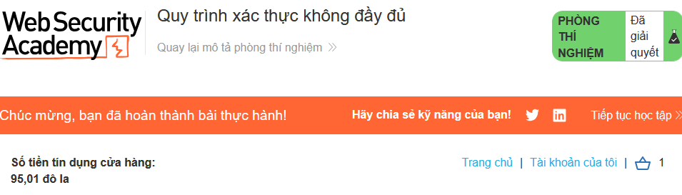