# __Lab: Excessive trust in client-side controls__

Access Lab, đăng nhập bằng account wiener:peter. Bật Intercept trên BurpSuite để có thể chặn được POST /cart khi thêm áo l33t vào giỏ hàng.

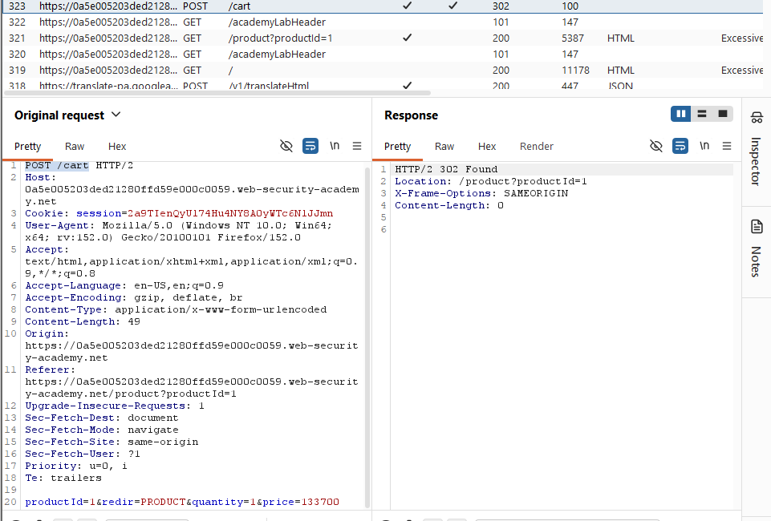

Nhận thấy có price ở request thử thay đổi giá của áo rồi forward để gửi về server. Vào giỏ hàng kiểm tra thì thấy giá đã được thay đổi.

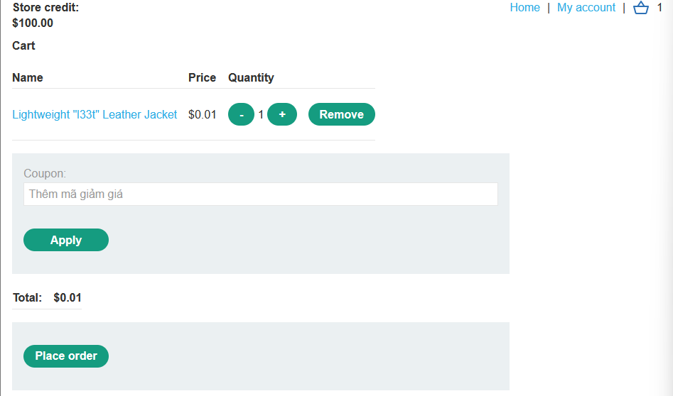

Tiến hành thanh toán và hoàn thành bài lab.

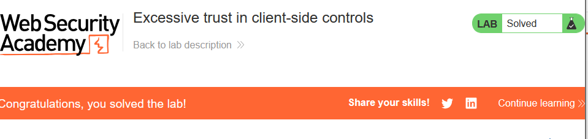

# __Lab: High-level logic vulnerability__

Access Lab, đăng nhập bằng account wiener:peter. Bật Intercept trên BurpSuite để có thể chặn được POST /cart khi thêm áo l33t vào giỏ hàng.

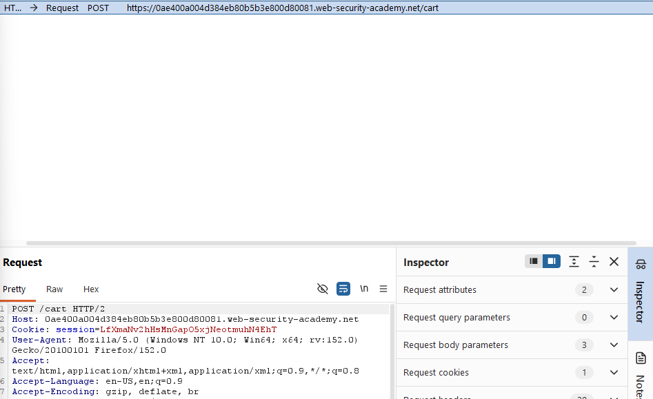

Thử thay đổi giá trị quantity thành giá trị âm và forwrad khi này số lượng áo ở trang và total price đều chuyển về âm.

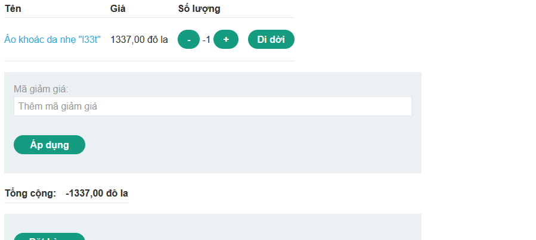

Loại bỏ áo khỏi giỏ hàng thêm vật phẩm khác vào giỏ hàng dùng Burpsuite chặn và chuyển số lường về âm. Sao cho đế khi total price của cả áo và các vật phẩm khác đủ với số tiền đang sở hữu.

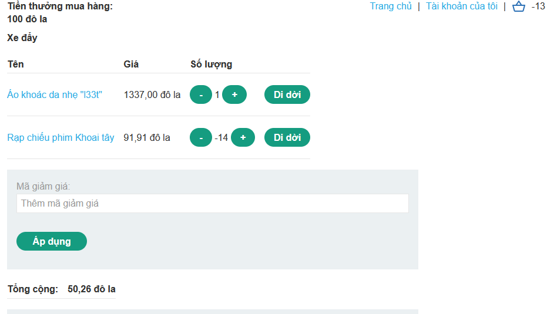

Tiến hành thanh toán và hoàn thành bài lab.

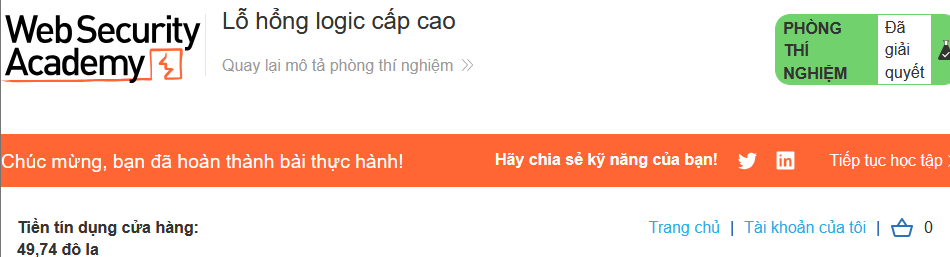

# __Lab: Inconsistent security controls__

Access Lab, nhận thấy có thể tự đăng kí 1 tài khoản cá nhân. Truy cập vào email client để lấy được đường dẫn email.

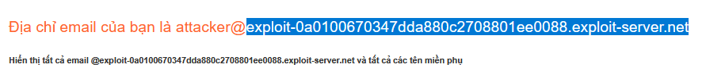

Sử dụng email và đăng kí. 

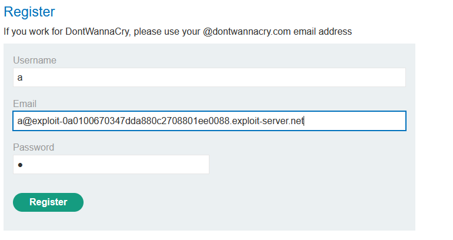

Quay trở lại email để xác thực đăng kí thành công. Đăng nhập vào account vừa tạo. Nhận thấy có phần thay đổi email vì email đã được xác thực và đăng kí thành công, thay đổi đuôi email thành `@dontwannacry.com`

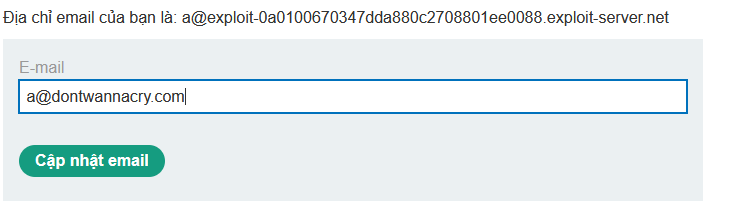

Vì chỉ khi sử dụng email của dontưannacry mới có quyền truy cập admin. Sau khi đỏi thành công email thì bây giờ account của ta có thêm admin panel.

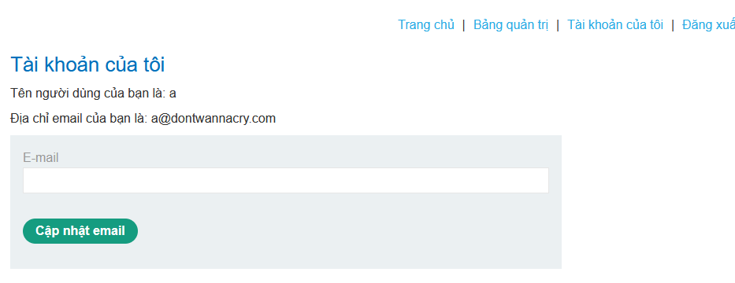

Truy cập và xóa account carlos để hoàn thành bài lab.

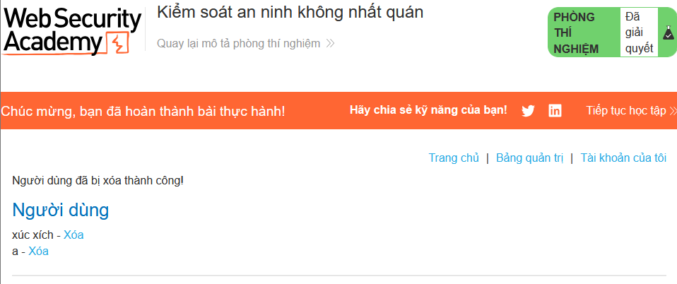

# __Lab: Flawed enforcement of business rules__

Access Lab, đăng nhập bằng account wiener:peter. Nhận thấy có 2 mã giảm giá: `NEWCUST5` và 1 mã khi đăng kí bằng email `SIGNUP30`. Thêm áo vào giỏ hàng và add mã giảm giá.

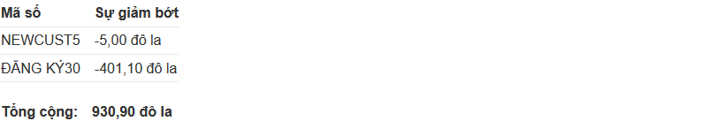

Tuy nhiên khi add lại cùng 1 mã vừa add thì sẽ được báo là "mã đã được sử dụng" nhưng add một mã khác kể cả là mã đã add trước đó nữa thì hệ thống nhận nhận và giảm giá.

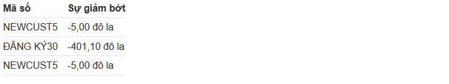

Liên tục thay đổi và add mã vào cho đến khi total price giảm đến mức vừa đủ với số tiền đang sở hữu.

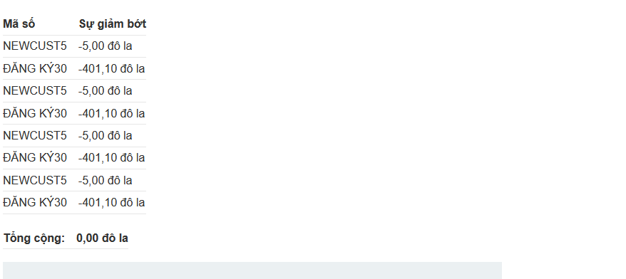

Tiến hành thanh toán và hoàn thành bào lab.

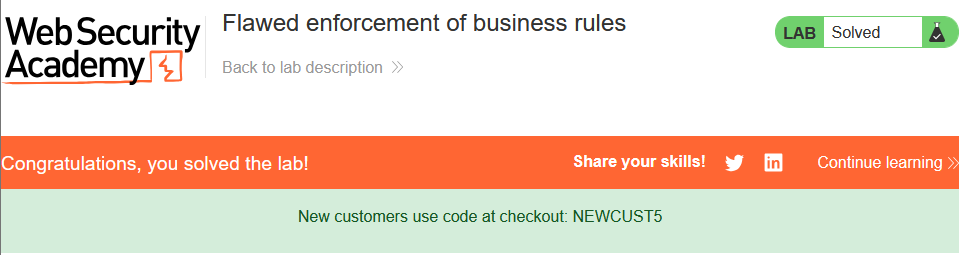