# CSRF là gì?
CSRF là một lỗ hổng bảo mật web cho phép kẻ tấn công dụ dỗ người dùng thực hiện các hành động mà họ không có ý định thực hiện. Nó cho phép kẻ tấn công phần nào vượt qua chính sách cùng nguồn gốc, được thiết kế để ngăn chặn các trang web khác nhau can thiệp lẫn nhau.

# __Lab: CSRF vulnerability with no defenses__
Access lab, theo như đề bài thì lab này có 1 lỗ hổng csrf ở việc `change email`. Đăng nhập bằng account `wiener:peter` và đổi `email`. Sử dụng Burpsuite để bắt được request `/my-account/change-email`

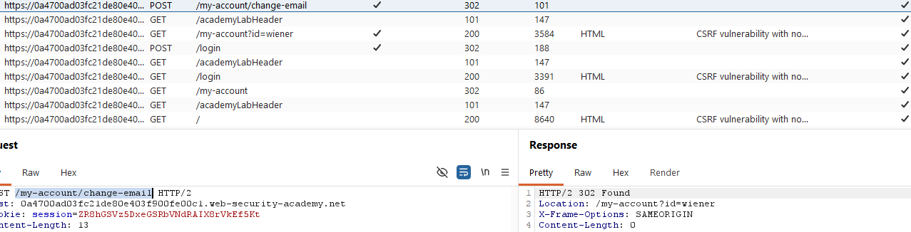

Sử dụng Tool có sẵn của Burpsuite Pro để tạo ra được PoC CSRF

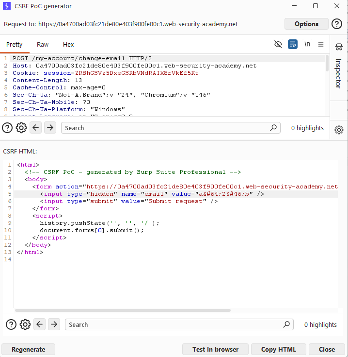

Sửa đổi email thành 1 email mà chưa được đăng kí, không tồn tài trên DB của ứng dụng. Dán source HTML vào Body của máy chủ khai thác và gửi đến máy nạn nhân.

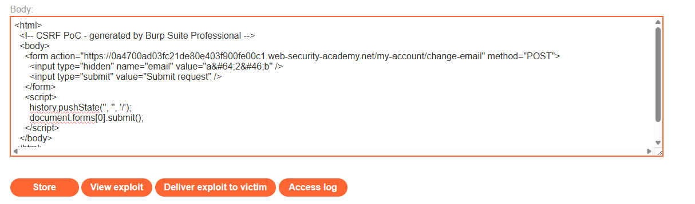

Khi này sẽ hoàn thành được bài lab.

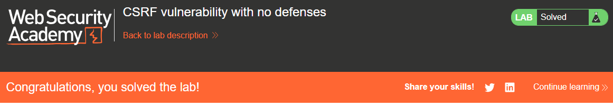

# __Lab: CSRF where token validation depends on request method__
Access lab, theo như đề bài thì lab này có 1 lỗ hổng csrf ở việc `change email`. Đăng nhập bằng account `wiener:peter` và đổi `email`. Sử dụng Burpsuite để bắt được request `/my-account/change-email`

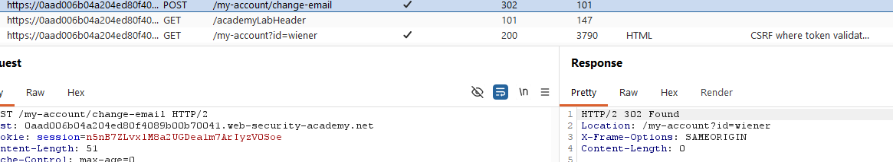

Sử dụng Tool có sẵn của Burpsuite Pro để tạo ra được PoC CSRF

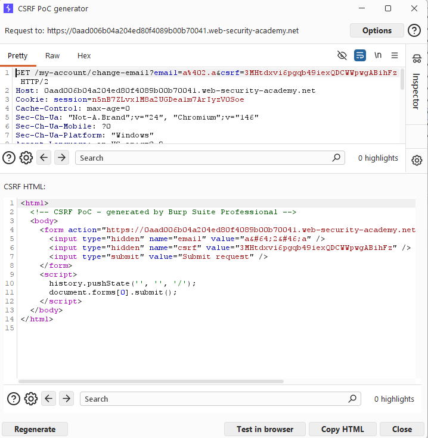

Sửa đổi email thành 1 email mà chưa được đăng kí, không tồn tài trên DB của ứng dụng. Dán source HTML vào Body của máy chủ khai thác và gửi đến máy nạn nhân.

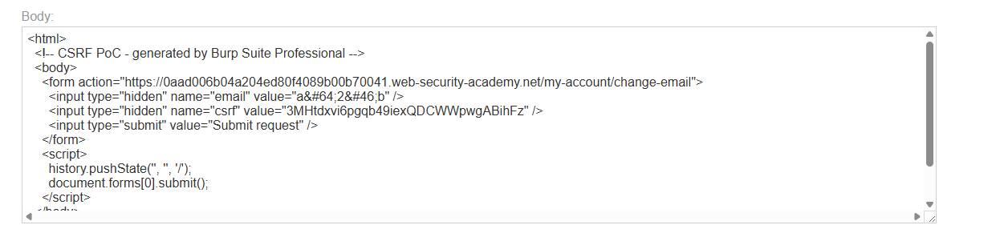

Khi này sẽ hoàn thành được bài lab.

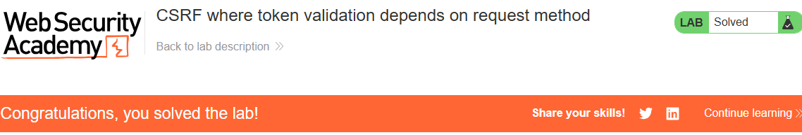

# __Lab: CSRF where token validation depends on token being present__
Access lab, theo như đề bài thì lab này có 1 lỗ hổng csrf ở việc `change email`. Đăng nhập bằng account `wiener:peter` và đổi `email`. Sử dụng Burpsuite để bắt được request `/my-account/change-email`

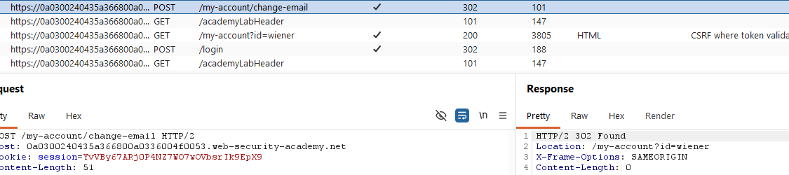

Sử dụng Tool có sẵn của Burpsuite Pro để tạo ra được PoC CSRF

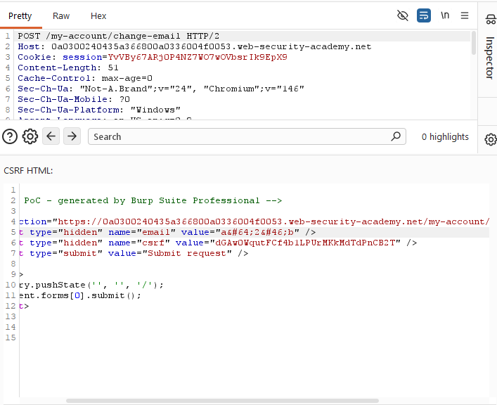

Sửa đổi email thành 1 email mà chưa được đăng kí, không tồn tài trên DB của ứng dụng. Dán source HTML vào Body của máy chủ khai thác và gửi đến máy nạn nhân. Nhận thấy khi đi kèm vs mã `csrf` thì không solved đc bài lab. Điều này là do một số ứng dụng sẽ thông báo khi có mã csrf nhưng lại bỏ qua xác thực nếu thiếu mã.

Xóa bỏ tham số csrf và gửi tới nạn nhân.

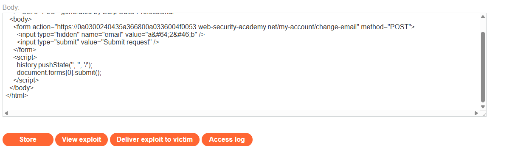

Khi này sẽ hoàn thành được bài lab.

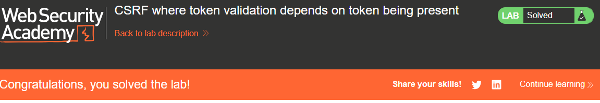

# __Lab: CSRF where token is not tied to user session__
Access lab, theo như đề bài thì lab này có 1 lỗ hổng csrf ở việc `change email`. Đăng nhập bằng account `wiener:peter` và đổi `email`. Sử dụng Burpsuite để bắt được request `/my-account/change-email`

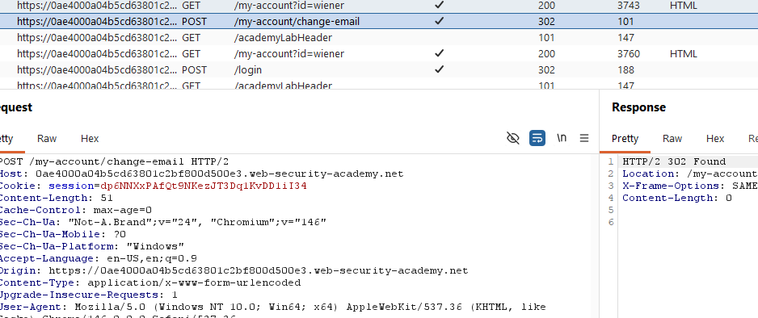

Sử dụng Tool có sẵn của Burpsuite Pro để tạo ra được PoC CSRF

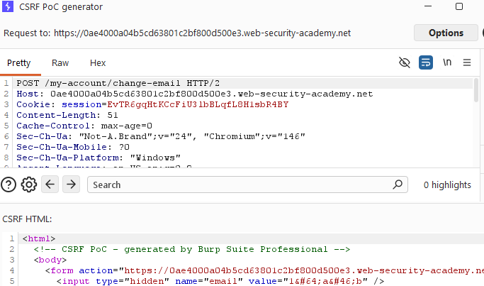

Sửa đổi email thành 1 email mà chưa được đăng kí, không tồn tài trên DB của ứng dụng. Dán source HTML vào Body của máy chủ khai thác và gửi đến máy nạn nhân. Tuy nhiên một vài ứng dụng sẽ k xác thực mã csrf đang diễn ra chung 1 phiên với yêu cầu đang được đưa ra. Nên chặn lại request đổi bằng Burp Intercept tạo ra PoC mới từ Request đang chặn.

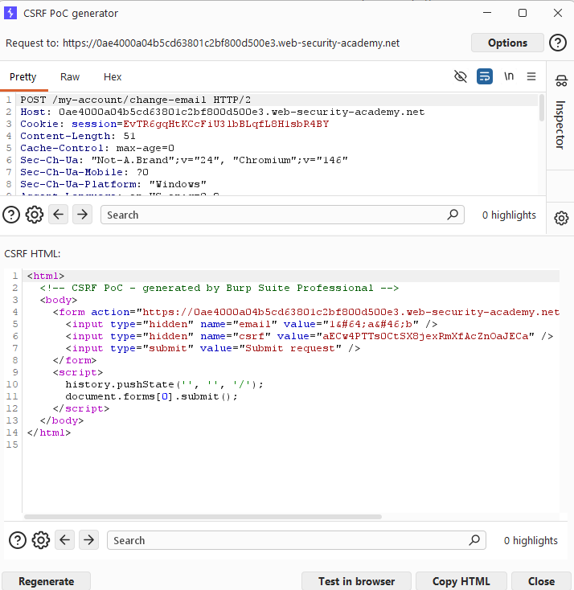

Sửa đổi email. Dán source HTML vào Body của máy chủ khai thác và gửi đến máy nạn nhân.

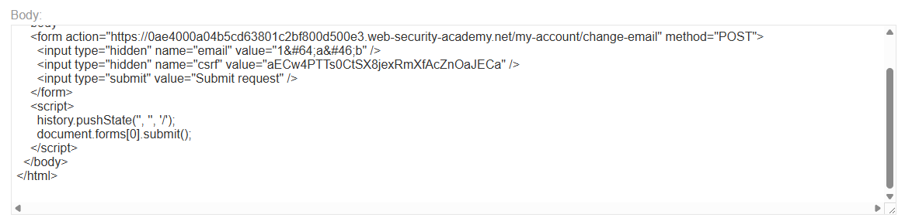

Foward các reqest cần thiết để có thể gửi tới máy nạn nhân và hoàn thành bài lab.

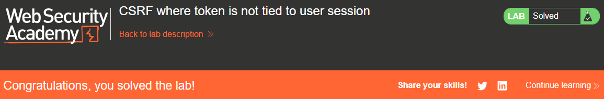

# __