# __Lab: Remote code execution via web shell upload__

Access Lab, đăng nhập bằng tài khoản wiener:peter đã được cung cấp. Để có thể giải được bài lab tải lên 1 file PHP web shell để có thể truy cập và lấy được secret của carlos. File PHP sẽ có nội dung:

`<?php echo file_get_contents('/home/carlos/secret'); ?>`

Quay trở lại bài lab sử dụng upload avatar để upload file PHP. Khi này Burpsuite sẽ có thể bắt được GET /files/avatars/exploit.php và trả về response là secret của carlos.

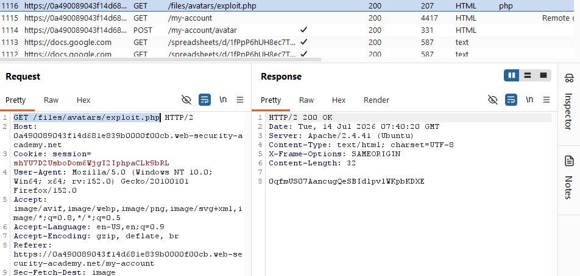

Submit mã và hoàn thành bài lab

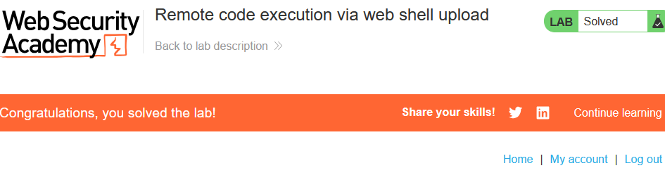

# __Lab: Web shell upload via Content-Type restriction bypass__

Access Lab, đăng nhập bằng tài khoản wiener:peter đã được cung cấp. Để có thể giải được bài lab tải lên 1 file PHP web shell để có thể truy cập và lấy được secret của carlos. File PHP sẽ có nội dung:

`<?php echo file_get_contents('/home/carlos/secret'); ?>`

Quay trở lại bài lab sử dụng upload avatar để upload file PHP. Khác với lab trước ở đây server sẽ trả về là chỉ nhận image/jpeg hoặc image/png
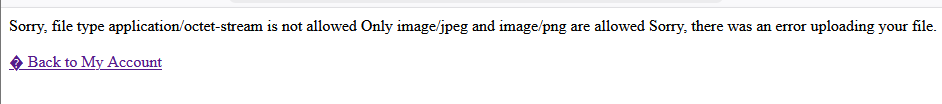

Tuy nhiên Burp vẫn sẽ bắt được POST /my-account/avatar

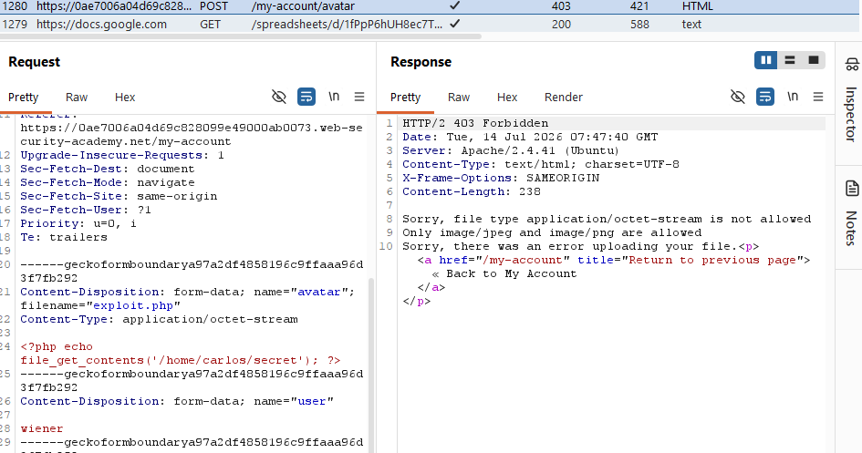

Send to Repeater, sủa đổi định dạng file upload thành image/jpeg để seerver hiểu rằng file PHP là file ảnh jpeg.

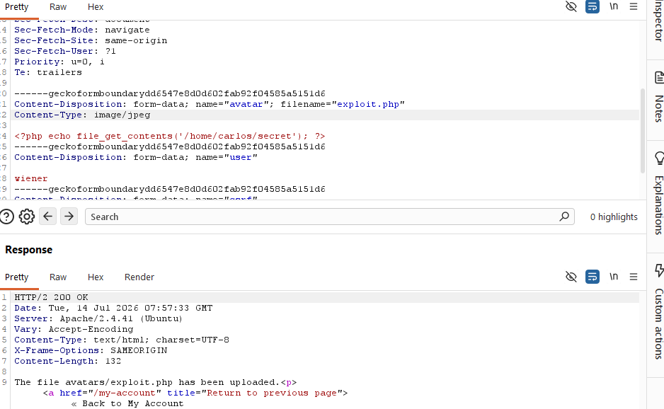

Lúc này server đã bị lừa và tải lên thành công file php. Quay trở lại tải lên 1 ảnh bất kì để Burpsuite bắt được GET /files/avatars/image.jpg. Thay image bằng file exploit.php và send khi này server sẽ trả về mã secret của carlos

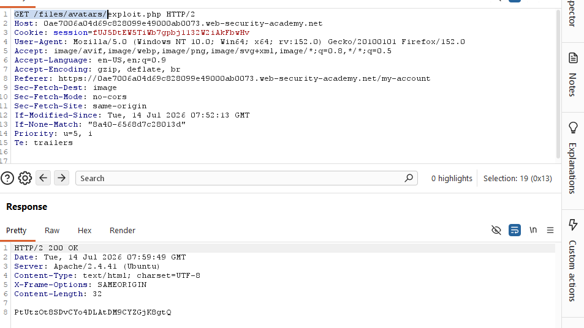

Submit mã và hoàn thành bài lab

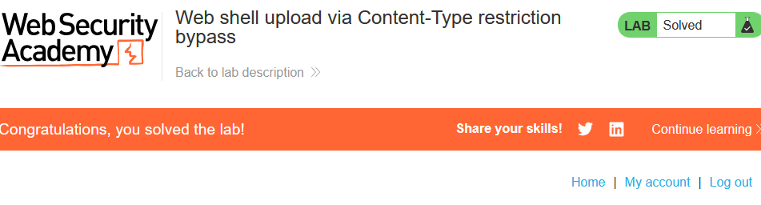

# __Lab: Web shell upload via path traversal__

Access Lab, đăng nhập bằng tài khoản wiener:peter đã được cung cấp. Để có thể giải được bài lab tải lên 1 file PHP web shell để có thể truy cập và lấy được secret của carlos. File PHP sẽ có nội dung:

`<?php echo file_get_contents('/home/carlos/secret'); ?>`

Quay trở lại bài lab sử dụng upload avatar để upload file PHP. Khi này file PHP đã được tải lên server tuy nhiên thì file mới chỉ được upload nhưng chưa chạy sau khi upload nên response chỉ trả về nội dung file php

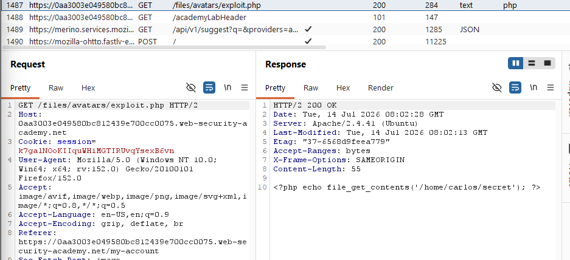

Vì đường dẫn /files/avatars chỉ phục vụ file tĩnh nên đưa file php về nơi có thể được thực thi. Thêm `../` vào trước exploit.php ở khu vực Content-Disposition. Rồi send.

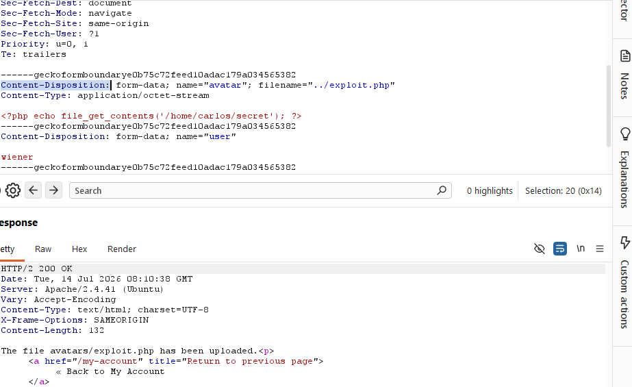

Tuy nhiên server đã trả về /exploit.php chứng tỏ server đã loại bỏ `../` nên mã hóa `/` thành `%2f` để server không còn loại bỏ `../` nữa.

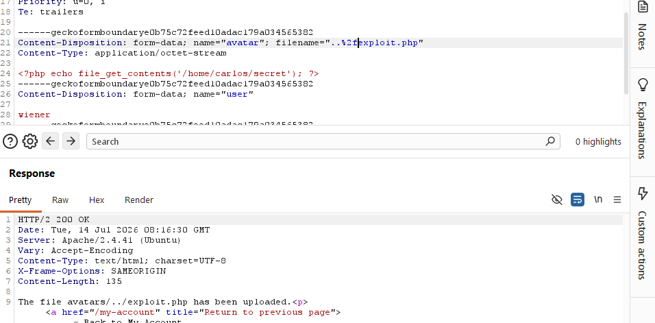

Open in browser, và back lại my account để Burpsuite bắt được `GET /files/avatars/..%2fexploit.php` send to repeater và sửa lại đường dẫn thành /files/exploit.php. Khi này sẽ có được mã secret của carlos

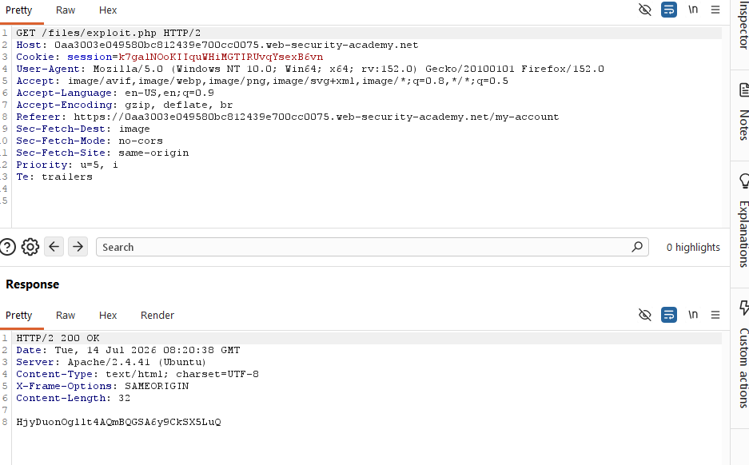

Submit mã và hoàn thành bài lab

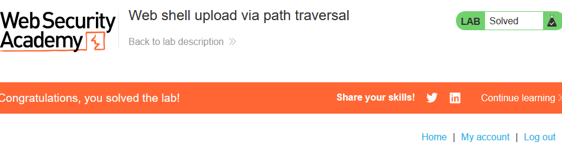

# __Lab: Web shell upload via extension blacklist bypass__

Access Lab, đăng nhập bằng tài khoản wiener:peter đã được cung cấp. Để có thể giải được bài lab tải lên 1 file PHP web shell để có thể truy cập và lấy được secret của carlos. File PHP sẽ có nội dung:

`<?php echo file_get_contents('/home/carlos/secret'); ?>`

Quay trở lại bài lab sử dụng upload avatar để upload file PHP. Khi này server báo k thể tải lên file PHP

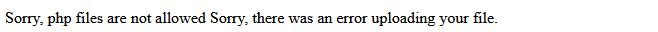

Nên phải upload 1 file `.htaccess` có tác dụng ép Apache phải xử lí file. File `.htaccess` sẽ có nội dung:

##  `AddType application/x-httpd-php .abc`

Sửa đổi đuôi file PHP thành .abc và upload file lên server khi này server sẽ trả về response là mã secret của carlos.

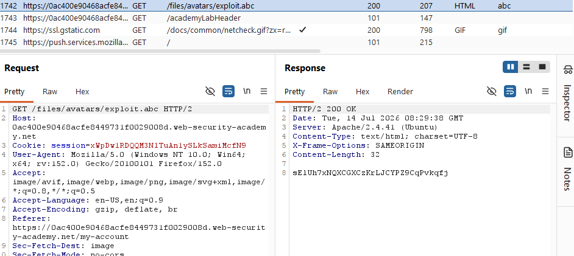

Submit mã và hoàn thành bài lab

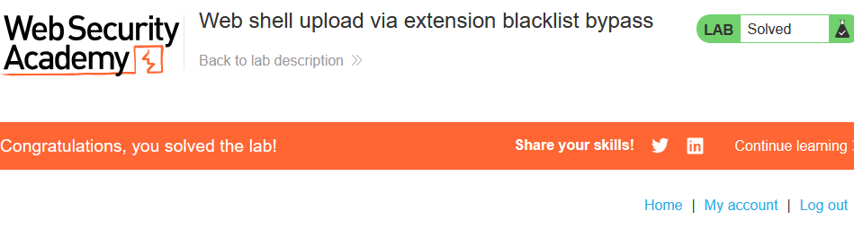

# __Lab: Web shell upload via obfuscated file extension__

Access Lab, đăng nhập bằng tài khoản wiener:peter đã được cung cấp. Để có thể giải được bài lab tải lên 1 file PHP web shell để có thể truy cập và lấy được secret của carlos. File PHP sẽ có nội dung:

`<?php echo file_get_contents('/home/carlos/secret'); ?>`

Quay trở lại bài lab sử dụng upload avatar để upload file PHP. Khi này server báo chỉ nhận tải lên file thuộc định dạng jpg hoặc png.

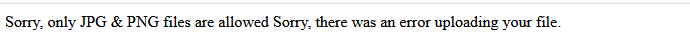

Ta có thể thử upload file PHP bằng cách bypass do NULL. Khi upload file PHP Burpsuite sẽ bắt được POST /my-account/avatar

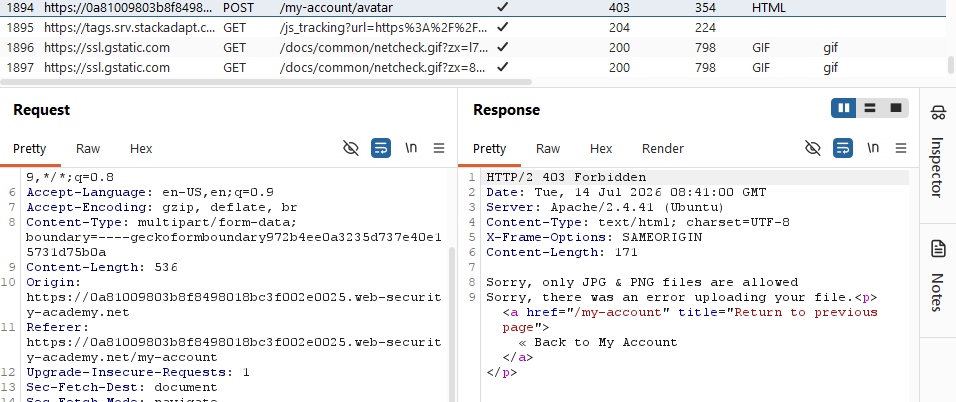

Send to repeater, thêm `%00.jpg` vào sau đuôi .php rồi send.

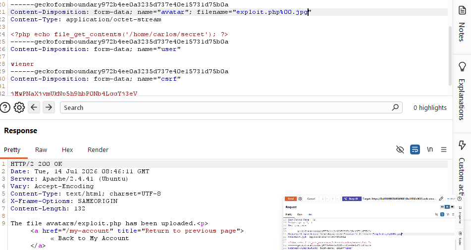

Khi này server sẽ hiểu rằng file PHP là 1 file ảnh. Open in browser và trở lại my account khi này Burpsuite sẽ bắt được GET /files/avatars/exploit.php%00.jpg

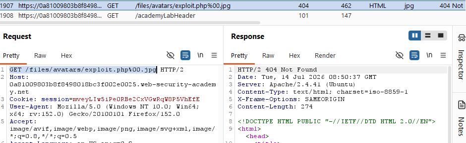

Send to Repeater, loại bỏ đuôi %00.jpg và send khi này server sẽ trả về response là mã secret của carlos.

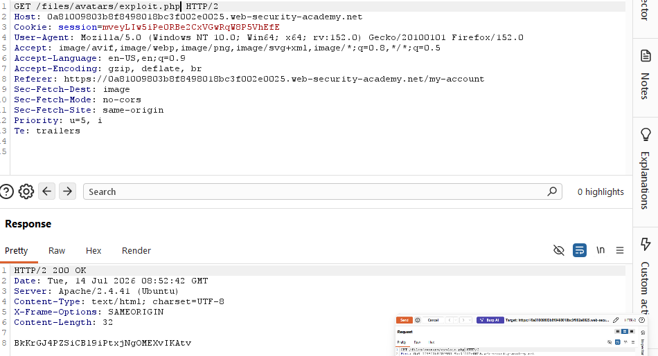

Submit mã và hoàn thành bài lab

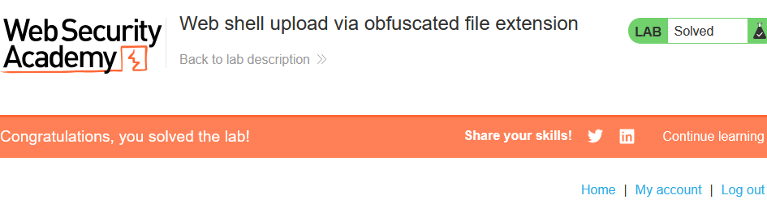

# __Lab: Remote code execution via polyglot web shell upload__

Access Lab, đăng nhập bằng tài khoản wiener:peter đã được cung cấp. Để có thể giải được bài lab tải lên 1 file PHP web shell để có thể truy cập và lấy được secret của carlos. File PHP sẽ có nội dung:

`<?php echo file_get_contents('/home/carlos/secret'); ?>`

Quay trở lại bài lab sử dụng upload avatar để upload file PHP. Khi này server báo đây không phải file hình ảnh nên gập lỗi trong quá trình tải lên. 

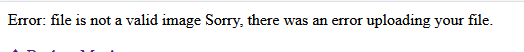

Tuy nhiên trong lab này khi đổi đổi dịnh dạng mà nội dung là PHP vẫn bị từ chối là vì server kiểm tra cả nội dung file chứ k chỉ tên file và định dạng. Vì vậy phải biến PHP thành hình ảnh bằng cách chèn thêm nội dung file PHP vào hình ảnh. Để chèn dữ liệu php vào ảnh thì có thể dùng tool Exiftool. Download tool và nhập lệnh:

`./exiftool -Comment='<?php echo file_get_contents("/home/carlos/secret"); ?>' image.jpg`

Tuy nhiên để có thể nhận biết mã secret sau khi upload file dễ hơn thì có thể dùng:

`./exiftool -Comment="<?php echo 'START ' . file_get_contents('/home/carlos/secret') . ' END'; ?>" IMAGE.jpg -o polyglot.php`

Khi này exiftool sẽ tạo ra 1 file polyglot.php chứ nội dung để có thể lấy được mã secret của carlos vừa chứa nội dung của hình ảnh chèn cùng để khi server quét sẽ cho phép tải file lên. sử dụng upload avatar để upload file `polyglot.php`. Burpsuite sẽ bắt được GET /files/avatars/polyglot.php

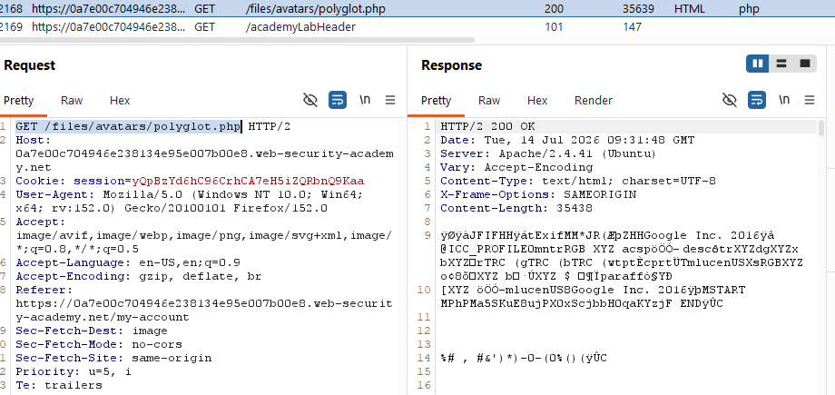

Ở giữa START và END sẽ là mã secret của carlos.

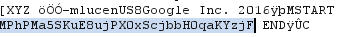

Submit mã và hoàn thành bài lab

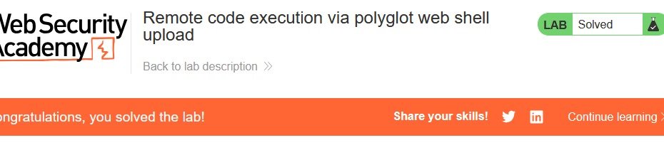