# __Lab: Information disclosure in error messages__

## Logic lỗ hổng ở bài này là khi mà nhập sai kiểu dữ liệu ứng dụng sẽ bị gãy exception và server trả về thông báo debug. Dẫn đến việc attacker có thể biết được tên và phiên ban mà ứng dụng đang dùng.

Access Lab, sử dụng Burpsuite bật Intercept và truy cập vào 1 bài post bất kì để chặn được GET /product?productId=1

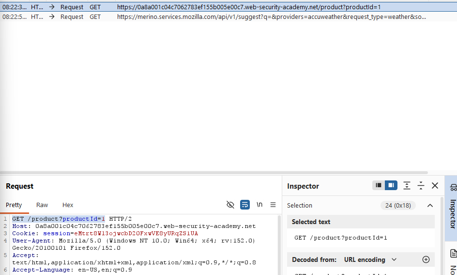

Thử sửa đổi productId thành 1 giá trị khác bất kì mà trang web đang k sở hữu. Forward để trả về server

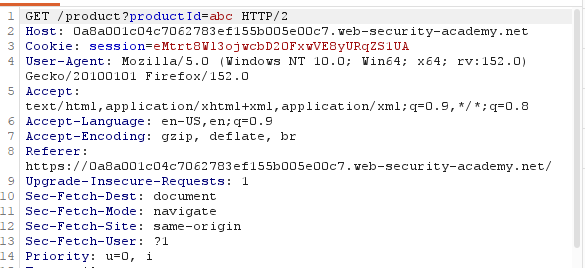

Khi này vì k sở hữu ID đấy server sẽ bị lỗi và trả về các giá trị.

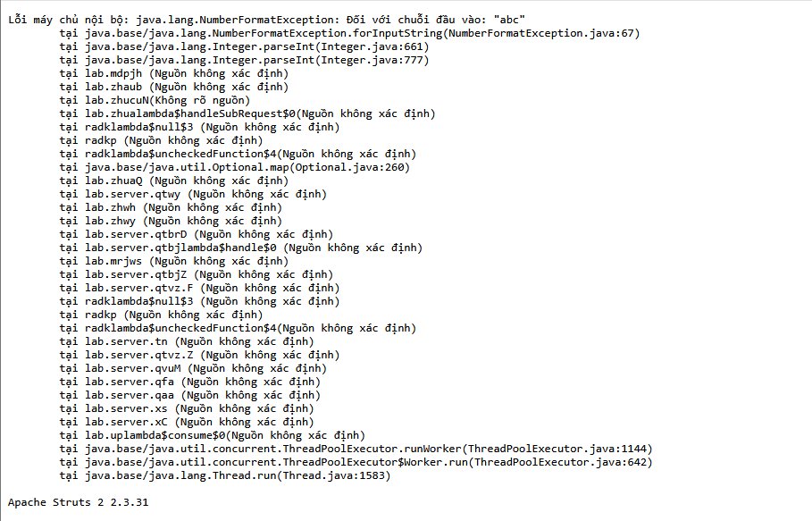

Từ đây có được phiên bản mà server đang dùng. Sử dụng và Submit để hoàn thành bài lab.

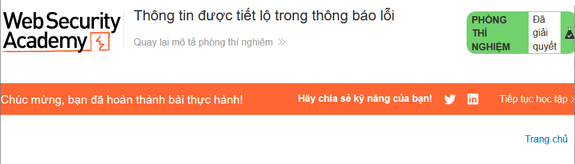

# __Lab: Information disclosure on debug page__

## Logic lỗ hổng ở bài này là khi quên không gỡ bỏ hoặc không phân quyền cho các trang Debug

Access Lab, truy cập vào 1 bài viết bất kì và kiểm tra source html của trang. Khi này nhận thấy trong source có đường dẫn cho trang debug.

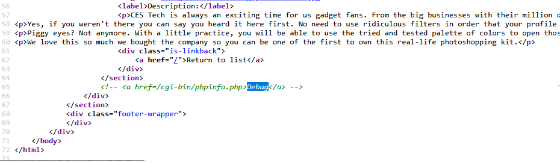

Dán đường dẫn vào URL để truy cập trang Debug

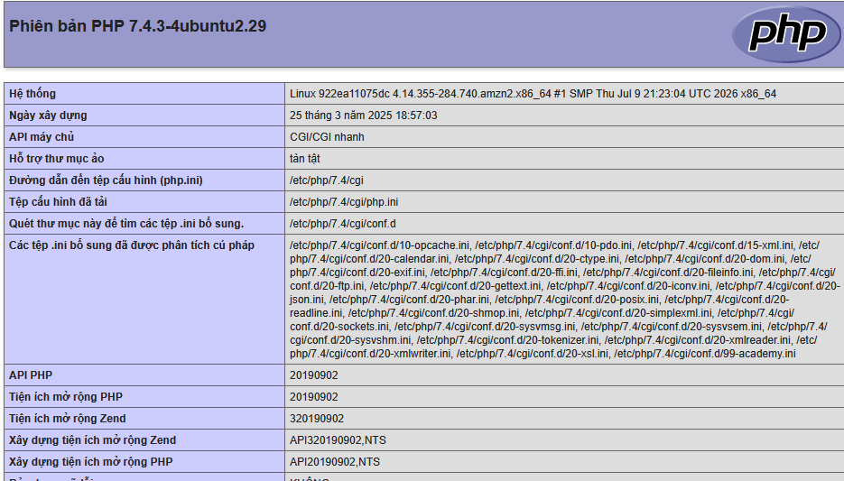

Từ đấy sẽ thấy được thông tin phiên bản mà ứng dụng đang dùng. Tìm thấy SECRET_KEY 

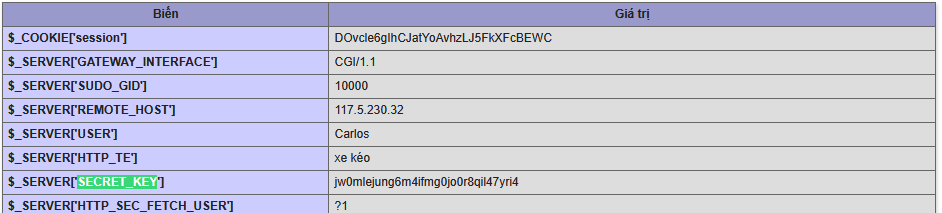

Sử dụng SECRET_KEY để submit và hoàn thành bài lab.

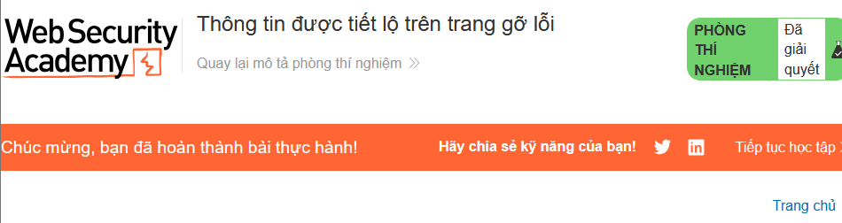

# __Lab: Source code disclosure via backup files__

## Logic lỗ hổng ở bài này là khi mà lưu trữ ở các file dự phòng hoặc tệp tạm trong thư mục public mà không có biện pháp ngắn chặn truy cập. Dẫn đến việc attacker có thể truy cập và lấy được thông tin.

Access Lab, kiểm tra các file như robots.txt,... Nhận thấy trong file robots.txt có xuất hiện /backup. 

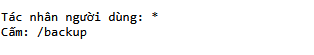

Sửa và /backup vào URL để kiểm tra. Khi này sẽ có được gói dữ liệu sản phẩm. Đồng thời tìm được password của cơ sở dũ liệu.

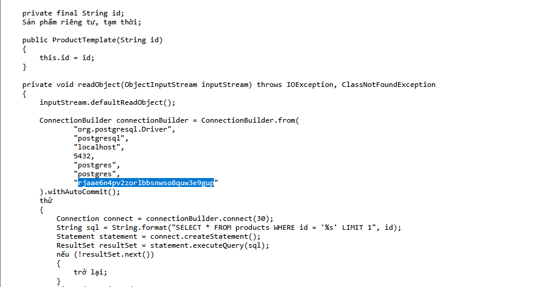

Sử dụng password kiếm được và submit để hoàn thành bài lab.

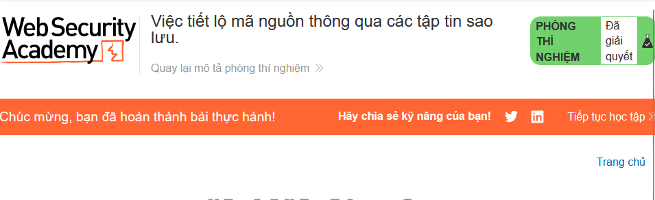

# __Lab: Authentication bypass via information disclosure__

## Logic lỗ hổng của bài này là khi mà header nội bộ bị rò rỉ nhưng server vẫn tin tưởng vào header do người dùng thao tác

Access Lab, đăng nhập bằng tài khoản wiener:peter do bài cung cấp. Thử truy cập vào account admin bằng cách thêm /admin vào URL. Khi này nhận thấy rằng không có quyền truy cập nếu không phải người dùng cục bộ.

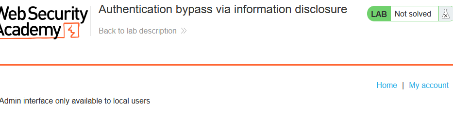

Sử dụng Burpsuite để bắt được GET /admin

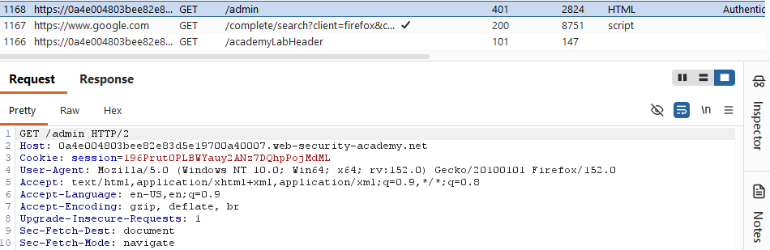

Send to Repeater, thay GET bằng TRACE khi này Burpsuite sẽ trả về các giá trị cũng như là IP cục bộ.

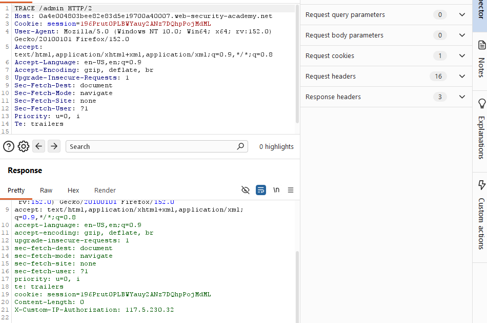

Sử dụng Match and Replace của Burpsuite để truy cập được vào mạng cục bộ dựa trên IP đã có. Ở Match and Replace Add thêm rule điền vào ô replace `X-Custom-IP-Authorization: 127.0.0.1`

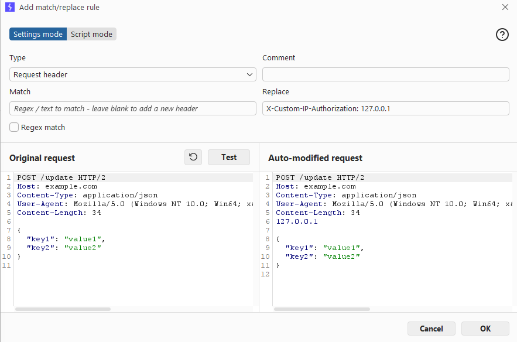

Test thử và xác nhận. Khi này Burp sẽ luôn gắn `X-Custom-IP-Authorization` vào mọi request mà ta gửi. Quay trở lại /admin và xóa account carlos để hoàn thành bài lab.

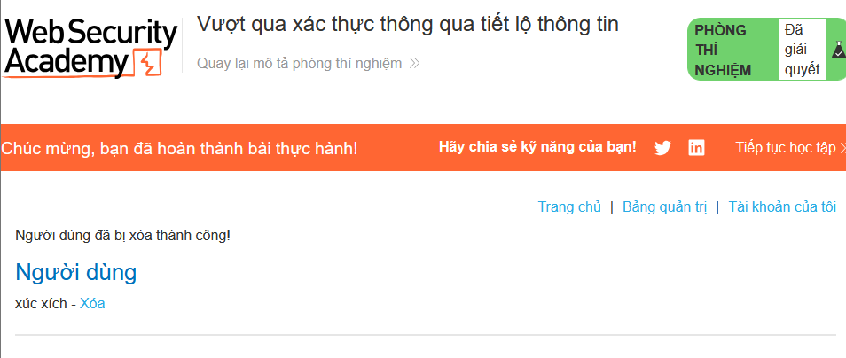

# __Lab: Information disclosure in version control history__

## Logic lỗ hổng ở bài này là khi mà để lộ thông tin lịch sử kiếm soát. Ở bài lab này thì là để lộ thông tin commit qua ./git

Access Lab, thêm ./git vào URL từ đó có thể thấy được toàn bộ index.

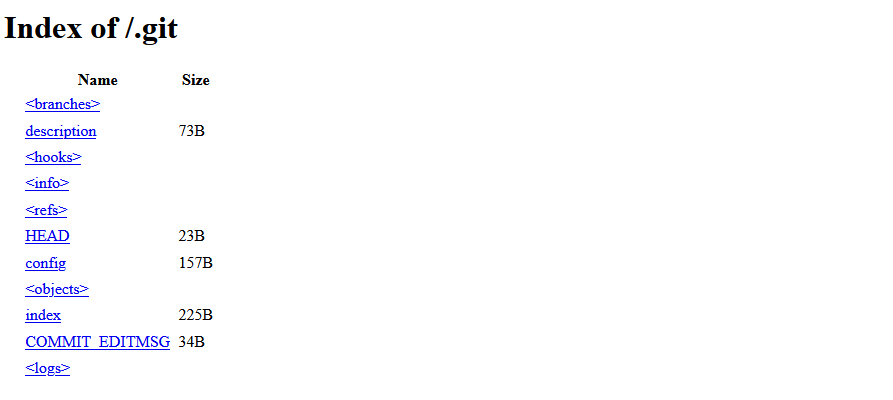

Truy cập vào logs/master để kiểm tra lịch sử commt của admin.

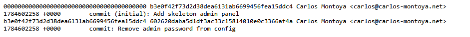

Có thể thấy được commit: `Remove admin password from config`. Điều này chứng tỏ rằng mật khẩu đã được add và bị xóa đi sau đó. Để có thể xem được password cần sử dụng bằng UNIX/LINUX. Sử dụng `wget` để tải xuống bản sao /logs. Dùng:`https://0a4b007d03cff48880d8a88500a700ad.web-security-academy.net/.git`

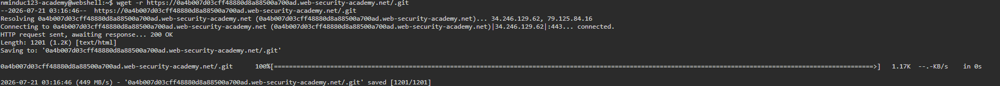

Thực hiện show để giải thấy được Password trước khi xóa và có được. Đăng nhập bằng tài khoản của admin và xóa account carlos để hoàn thành bài lab.

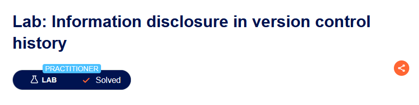