# __Lab: File path traversal, simple case__

Access Lab, Bật Intercept và truy cập vào 1 bài viết bats kì để Burpsuite chặn được GET /image?filename

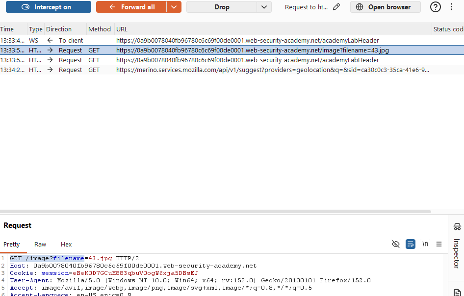

Send to Repeater, sửa đổi filename=43.jpg thành filename=../../../etc/passwd

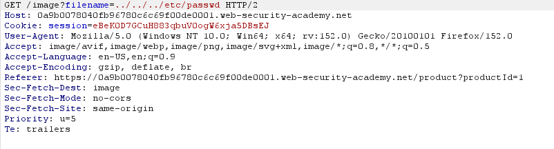

Send để hoàn thành bài lab

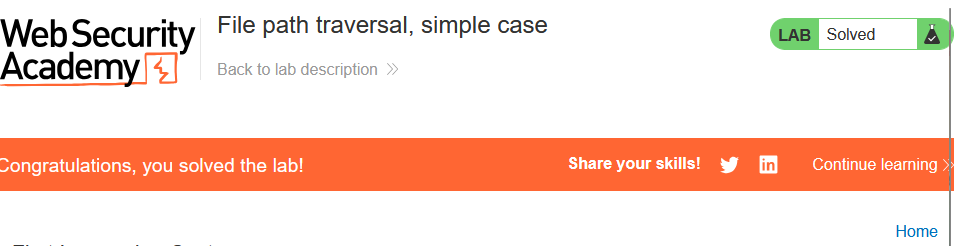

# __Lab: File path traversal, traversal sequences blocked with absolute path bypass__

Access Lab, Bật Intercept và truy cập vào 1 bài viết bất kì để Burpsuite chặn được GET /image?filename

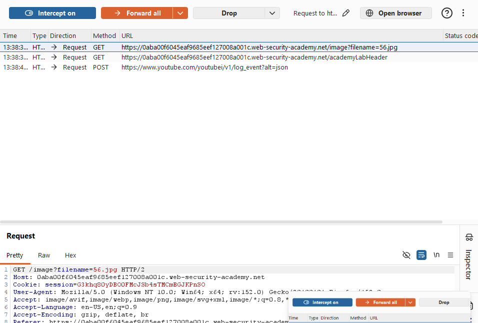

Send to Repeater, sửa đổi filename=56.jpg thành filename=/etc/passwd. Vì hệ thống chặn quyền sửa đổi, di chuyển từ người dùng nhưng lại có thể trích dẫn trực tiếp từ gôc hệ thống tệp.

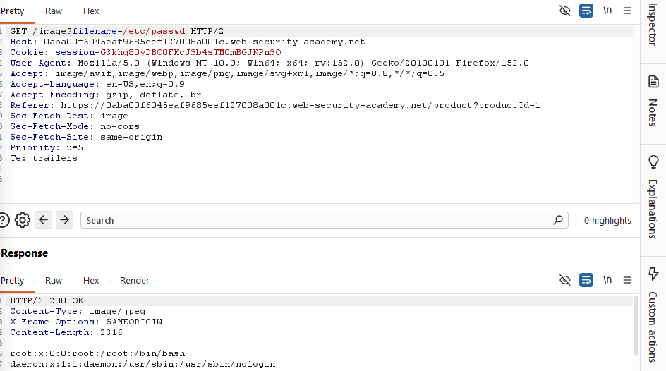

Send để hoàn thành bài lab

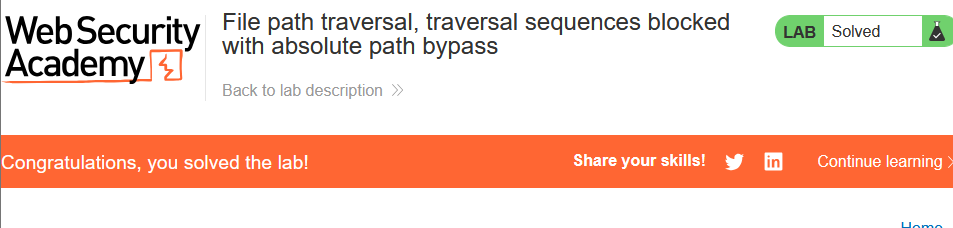

# __Lab: File path traversal, traversal sequences stripped non-recursively__

Access Lab, Bật Intercept và truy cập vào 1 bài viết bats kì để Burpsuite chặn được GET /image?filename

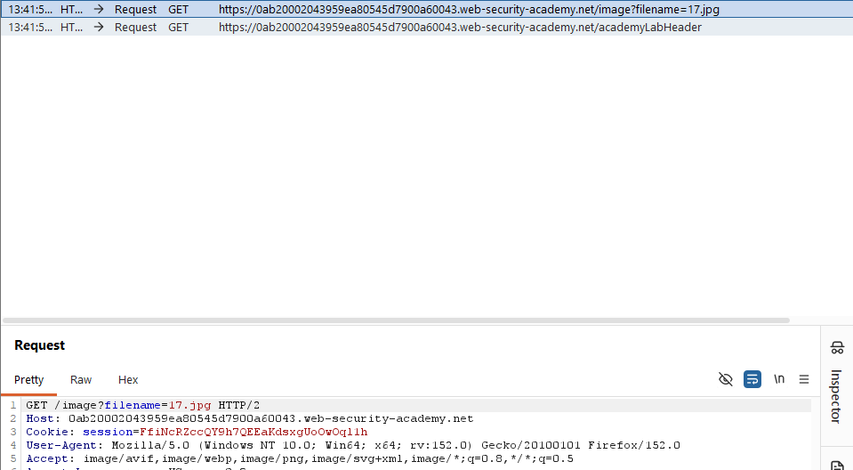

Send to Repeater, sửa đổi filename=17.jpg thành filename=....//....//....//etc/passwd. Vì hệ thống bài lab chỉ quét và xóa chuỗi ../ nên lồng thêm 1 chuỗi ../ vào chung để tạo thành ....// và bypasss

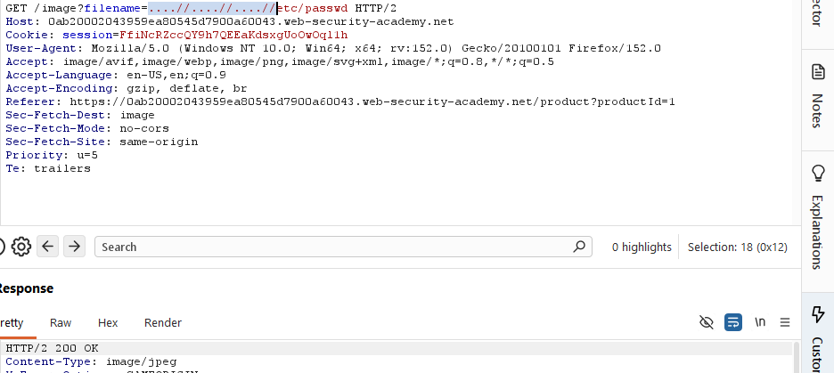

Send để hoàn thành bài lab

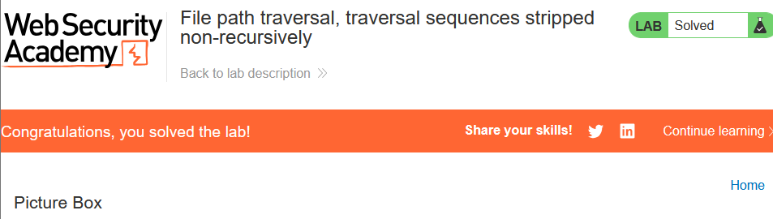

# __Lab: File path traversal, traversal sequences stripped with superfluous URL-decode__

Access Lab, Bật Intercept và truy cập vào 1 bài viết bats kì để Burpsuite chặn được GET /image?filename

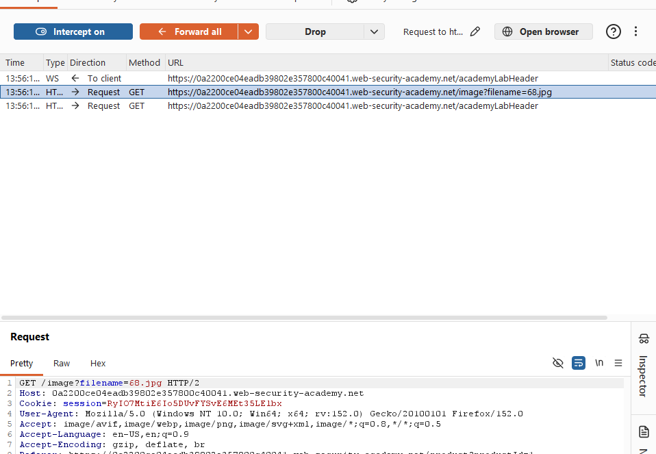

Send to Repeater, sửa đổi filename=68.jpg thành filename=..%252f..%252f..%252fetc/passwd. Mã hóa 2 lần / thành %2f, % thành %25

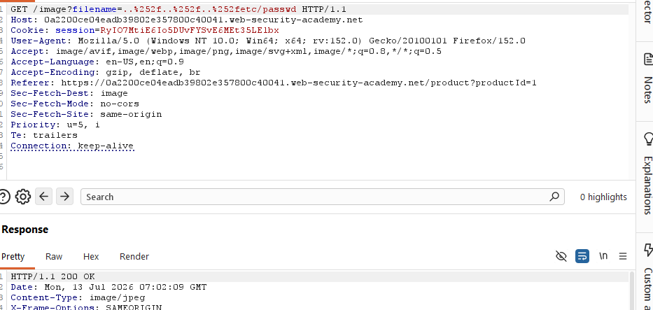

Send để hoàn thành bài lab

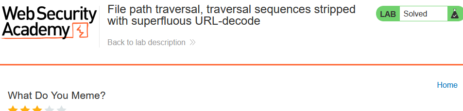

# __Lab: File path traversal, validation of start of path__

Access Lab, Bật Intercept và truy cập vào 1 bài viết bats kì để Burpsuite chặn được GET /image?filename

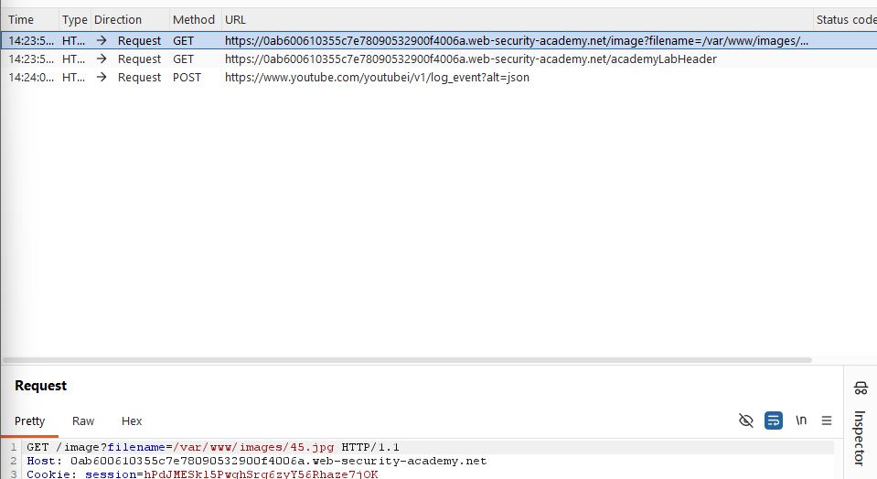

Send to Repeater, sửa đổi filename=/var/www/images/45.jpg thành filename=/var/www/images/../../../etc/passwd. Nhiều khi hệ thống sẽ set cố định từ tên tệp gốc có sẵn.

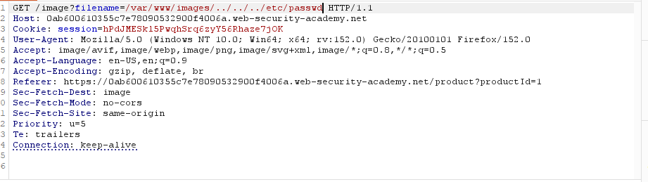

Send để hoàn thành bài lab

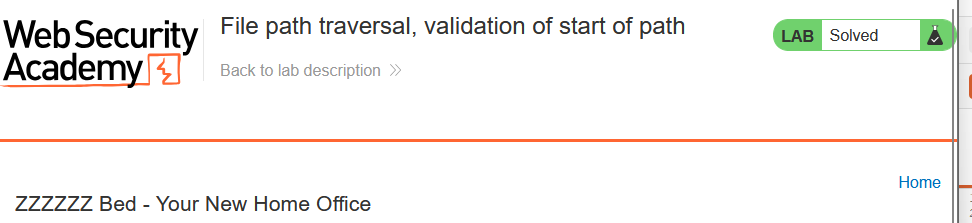

# __Lab: File path traversal, validation of file extension with null byte bypass__

Access Lab, Bật Intercept và truy cập vào 1 bài viết bats kì để Burpsuite chặn được GET /image?filename

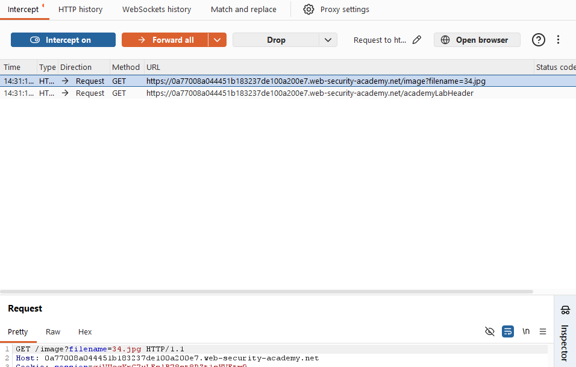

Send to Repeater, sửa đổi filename=34.jpg thành filename=../../../etc/passwd%00.png. Vì hệ thống sẽ chỉ nhận và kết thúc bằng 1 phần mở rộng đã set như jpg hay png. Lúc này sẽ sử dụng thêm NULL vào để kết thúc đường dẫn bằng phần cần thiết.

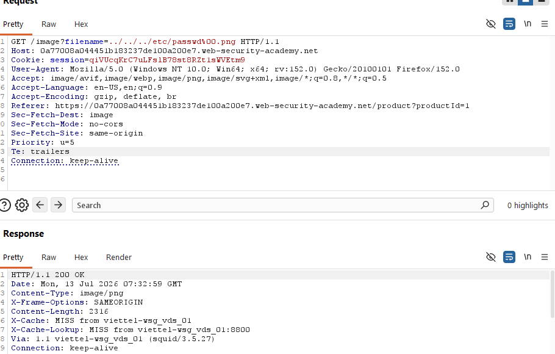

Send để hoàn thành bài lab

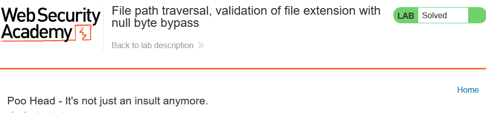