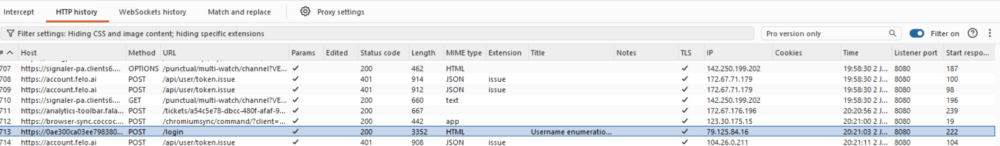
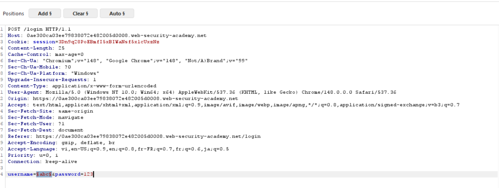
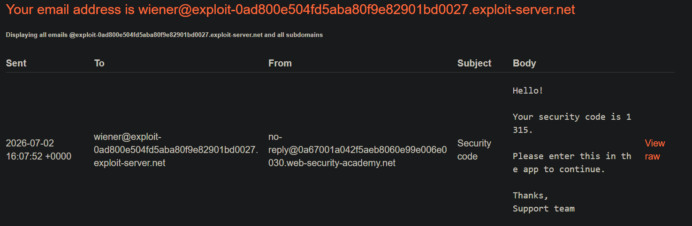
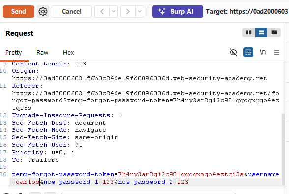
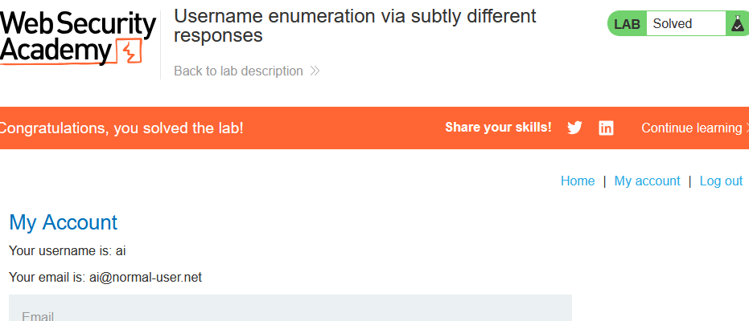

Lab: Username enumeration via different responses

Cấu hình proxy, rồi bật intercept on.

Nhập username và password bất kì để burp chặn được

Request /login 

Send to Intruder, loại bỏ tất cả các đánh dấu Payload và Add đánh dấu vào username

Copy toàn bộ các user khả thi và Dán vào Payload configuration rồi Attack

Thấy được lengths của username:accounts là 3345

accounts chính là username hợp lệ

Trở lại Intruder loại bỏ vị trí đánh dấu Payload ở username và Add vào password

Clear toàn bộ các username khả thi và thay bằng password khả thi vào Payload configuration rồi Attack

Khi đấy burp sẽ trả về password:aaaaaa vs status 302 và length 3345

trở lại lab và nhập username cùng với password để hoàn thành bài lab

Lab: 2FA simple bypass

Đăng nhập vào bằng tài khoản wiener

Truy cập vào Email Client để lấy mã security

Sau đấy Đăng xuất tài khoản cá nhân:wiener và đăng nhập bằng tài khoản carlos. Khi bị hỏi mã xác thực back to labhome và vào lại My Account sẽ thấy đã vượt được xác thực và hoàn thành bài lab

Lab: Password reset broken logic

Sử dụng forgot password và dùng username wiener submit

Truy cập vào email để lấy link thay đổi password 

Thay đổi password thành password bản thân muốn và submit.

Khi này burpsuite sẽ bắt được POST /forgot-password?temp-forgot-password-token

Send to Repeter để sửa username từ wiener thành carlos và send

Quay trở lại trang đăng nhập và đăng nhập bằng tài khoản carlos vs password đã đởi và hoàn thành bài lab

Lab: Username enumeration via subtly different responses

Đăng nhập bằng 1 tài khoản bất kì

Khi đấy burpsuite sẽ bắt được POST /login

Send to Intruder clear toàn bộ các đánh dấu Payload chỉ Add vào username

Nạp các username khả thi vào Payload. Vào settings highlight Invalid username or password. Rồi attacks

Sau khi attack burpsuite sẽ trả về 1 warning username khác với phần còn lại thì đấy chính là username cần tìm.

Thay thế username đã biết vào Intruder, đánh dấu Payload password và nạp vào danh sách password khả thi rồi attack

Sau khi attack burp sẽ trả về 1 password vs status 302 

Quay lại trang đăng nhập và sử dụng username cùng với password đã tìm được và hoàn thành bài lab

