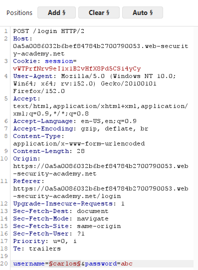
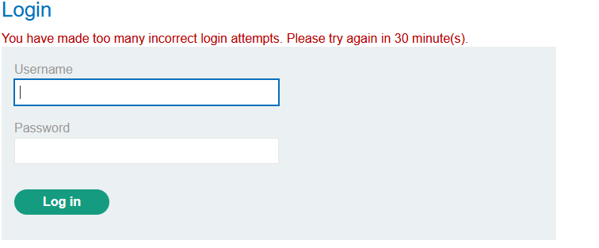
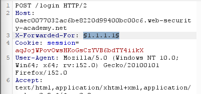
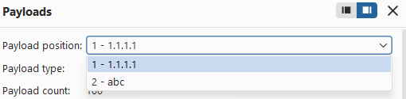
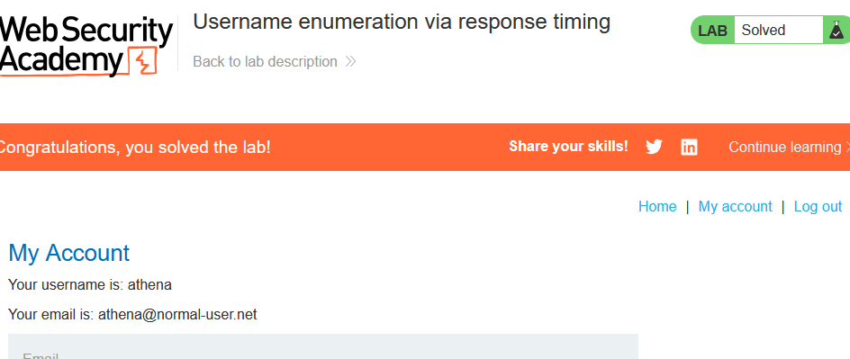
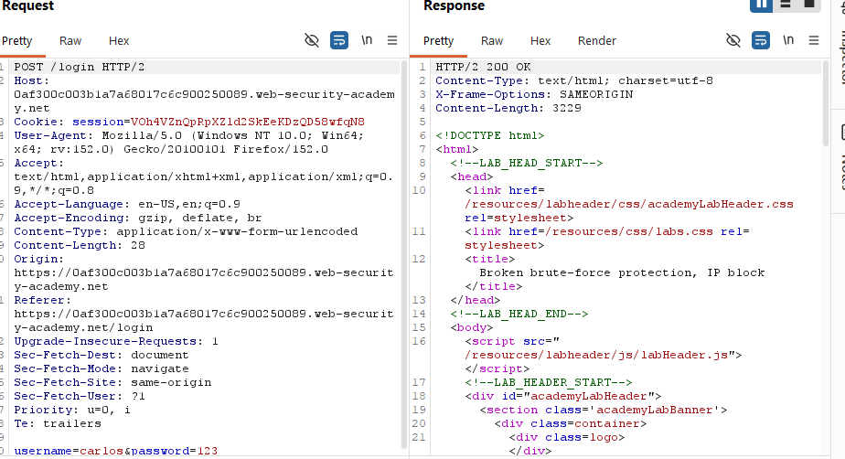
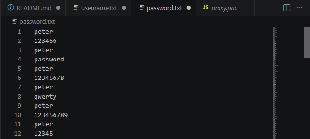
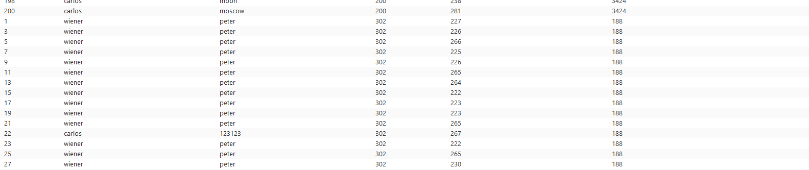
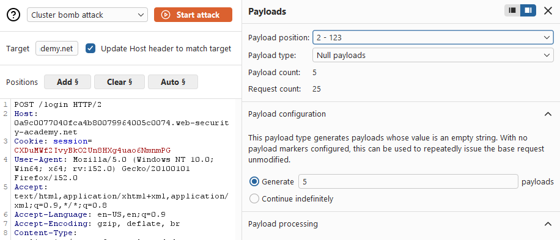

# __Lab: Username enumeration via different responses__

Cấu hình proxy, rồi bật intercept on.

Nhập username và password bất kì để burp chặn được

Request /login 

Send to Intruder, loại bỏ tất cả các đánh dấu Payload và Add đánh dấu vào username

Copy toàn bộ các user khả thi và Dán vào Payload configuration rồi Attack

Thấy được lengths của username:accounts là 3345

accounts chính là username hợp lệ

Trở lại Intruder loại bỏ vị trí đánh dấu Payload ở username và Add vào password

Clear toàn bộ các username khả thi và thay bằng password khả thi vào Payload configuration rồi Attack

Khi đấy burp sẽ trả về password:aaaaaa vs status 302 và length 3345

trở lại lab và nhập username cùng với password để hoàn thành bài lab

# __Lab: 2FA simple bypass__

Đăng nhập vào bằng tài khoản wiener

Truy cập vào Email Client để lấy mã security

Sau đấy Đăng xuất tài khoản cá nhân:wiener và đăng nhập bằng tài khoản carlos. Khi bị hỏi mã xác thực back to labhome và vào lại My Account sẽ thấy đã vượt được xác thực và hoàn thành bài lab

# __Lab: Password reset broken logic__

Sử dụng forgot password và dùng username wiener submit

Truy cập vào email để lấy link thay đổi password 

Thay đổi password thành password bản thân muốn và submit.

Khi này burpsuite sẽ bắt được POST /forgot-password?temp-forgot-password-token

Send to Repeter để sửa username từ wiener thành carlos và send

Quay trở lại trang đăng nhập và đăng nhập bằng tài khoản carlos vs password đã đởi và hoàn thành bài lab

# __Lab: Username enumeration via subtly different responses__

Đăng nhập bằng 1 tài khoản bất kì

Khi đấy burpsuite sẽ bắt được POST /login

Send to Intruder clear toàn bộ các đánh dấu Payload chỉ Add vào username

Nạp các username khả thi vào Payload. Vào settings highlight Invalid username or password. Rồi attacks

Sau khi attack burpsuite sẽ trả về 1 warning username khác với phần còn lại thì đấy chính là username cần tìm.

Thay thế username đã biết vào Intruder, đánh dấu Payload password và nạp vào danh sách password khả thi rồi attack

Sau khi attack burp sẽ trả về 1 password vs status 302 

Quay lại trang đăng nhập và sử dụng username cùng với password đã tìm được và hoàn thành bài lab

# __Lab: Username enumeration via response timing__

Truy cập My Account và đăng nhập bằng 1 tài khoản bất kì invalid để burpsuite có thể bắt được POST /login

Send to Intruder đánh dấu vị trí Payload, nạp danh sách Payloas và Attack. khi đấy thấy rằng bài lab sẽ chặn IP nếu như invalid quá nhiều trong 1 thời gian ngắn

Send to Intruder và Add thêm X-Forwarded-For vào header, thêm đánh dấu Payload vào địa chỉ X-Forwarded-For

Chuyển cách tấn công từ Sniper attack sang Pitchfork attack.
Khi này Burp sẽ xác định Payload 1: X-Forwarded-For, Payload 2: username

Ở Payload 1 sửa lại Type thành number, Cấu hình lại Number range 

Add thêm Payload processing chọn rule prefix và thêm 1.1.1. 

Ở Payload 2 nạp danh sách username,Sửa password thành 1 chuỗi kí tự dài để máy chủ tốn nhiều thời gian phản hồi, Sửa maximum concurrent requests là 1 rồi attack

Thay username đã tìm được và đánh dấu Payload cho password. Nạp danh sách password rồi Attack. Khi đấy sẽ thấy 1 password với status là 302

Quay trở lại lab sử dụng username và password đã tìm được để hoàn thành bài lab

# __Lab: Broken brute-force protection, IP block__

Truy cập My Account và đăng nhập bằng 1 tài khoản invalid để Burpsuite có thể bắt được POST /login và trả về respone

Vì bài lab sẽ chặn IP nếu nhập sai quá nhiều lần nên có 2 hướng đi
### 1. Add X-Forwarded-For và thay đổi IP sau mỗi lần để tránh bị khóa 
### 2. Dùng spoof để reset sau mỗi lần thử sai

Nhưng vì bài lab muốn hiểu được logic nên dùng cách 2. Tạo danh sách Payload username vs password. 

Đánh dấu Payload vào username và password, chuyển từ Sniper attack sang Pitchfork attack, nạp danh sách username và password rồi Attack

Khi đấy burp sẽ trả về danh sách tài khoản khả thi. Sử dụng username và password vừa tìm được để đăng nhập và hoàn thành bài lab

# __Lab: Username enumeration via account lock__

Đăng nhập bằng 1 tài khoản invalid bất kì để Burpsuite có thể bắt được POST /login. Send to Intruder, đánh dấu Payload username và password. Chuyển từ Sniper attack sang cluster bomb, nạp danh sách username ở Payload 1 còn Payload 2 chuyển về Type NULL và set generate 5 payload

Attack. Sau khi set generate 5 payload thì burp sẽ lặp lại 1 username 5 lần để xác định được username có tồn tại hay k

Thấy được độ dài của username:access dài hơn so với các username khác. Quay trở lại Burpsuite sử dụng username:access nạp danh sách password và attack

Burpsuite sẽ trả về password xác định dựa trên độ dài khác.

Quay trở lại bài lab sử dụng username và password vừa tìm được để đăng nhập và hoàn thành bài lab

