# Mục Lục

1. [Lab: Limit overrun race conditions](#lab-limit-overrun-race-conditions)

2. [Lab: Bypassing rate limits via race conditions](#lab-bypassing-rate-limits-via-race-conditions)

3. [Lab: Multi-endpoint race conditions](#lab-multi-endpoint-race-conditions)

4. [Lab: Single-endpoint race conditions](#lab-single-endpoint-race-conditions)

5. [Lab: Exploiting time-sensitive vulnerabilities](#lab-exploiting-time-sensitive-vulnerabilities)
---

# __Lab: Limit overrun race conditions__

Access Lab, đăng nhập bằng account được cung cấp wiener:peter. Thêm sản phẩm áo khoác da vào giỏ hàng và add thêm voucher `PROMO20` để Burpsuite có thể bắt được cá POST /cart và /cart/coupon

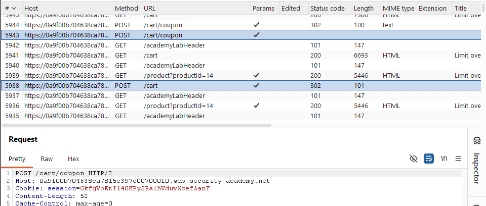

Send to Repeater, gộp 2 POST vào thành 1 group, duplicate thêm nhiều request POST /cart/coupon 

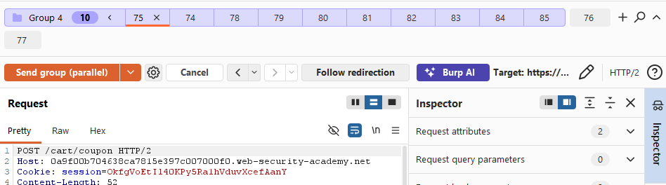

Send group ở dạng parallel. Khi này load lại trang t sẽ thấy voucher đã được tích lại rất nhiều và giảm được 1 số lớn giá trị 

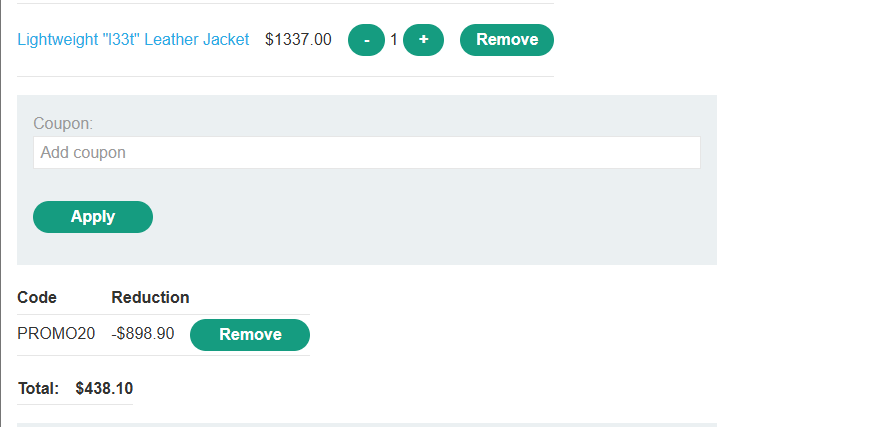

Add thêm cho đến khi giá trị của sản phầm vừa với giá trị của tài sản

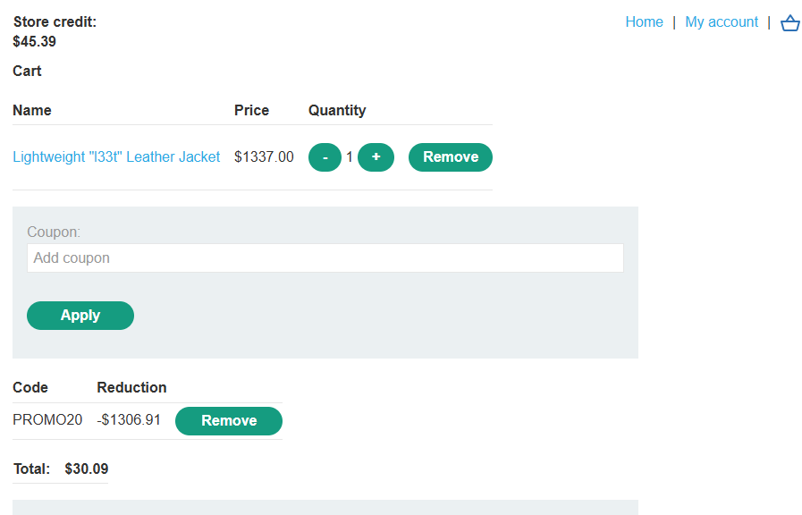

Tiến hành thanh toán và hoàn thành bài lab.

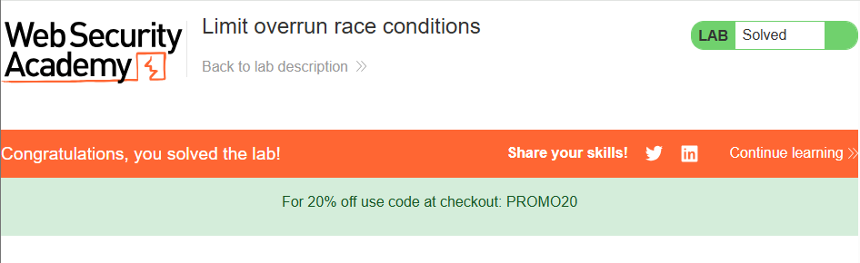

# __Lab: Bypassing rate limits via race conditions__

Access Lab, thử đăng nhập sai nhiều lần để kiểm tra. Ở đây thấy được rằng sau khi đăng nhập sai quá 3 lần thì account sẽ bị khóa và sau 1 mốc thời gian mới được thử lại.

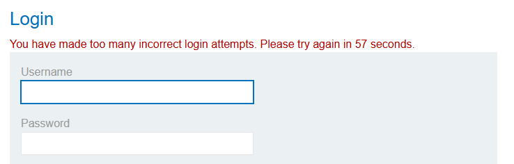

Restart lại bài lab thực hiện đăng nhập sai 1 lần để Burpsuite bắt được request /login.

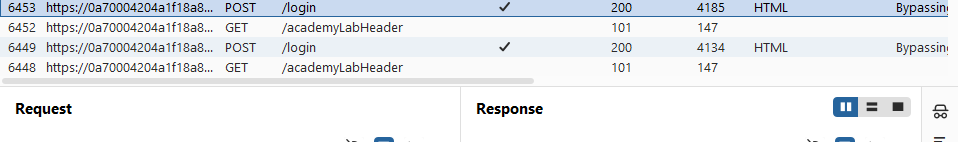

Send to Intruder, đánh dấu Payload vào password, nạp danh sách password khả thi.

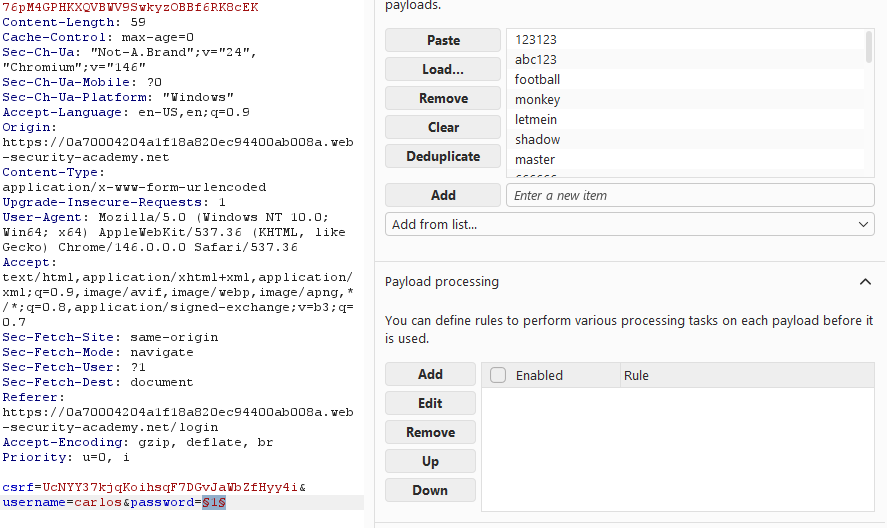

Tuy nhiên nếu như set resource pool để cho `Maximum concurrent requests` là só lượng yêu cầu đồng thời lên tối đa bằng với số lượng password thì khi này các password sẽ được gửi đi cùng lúc. 

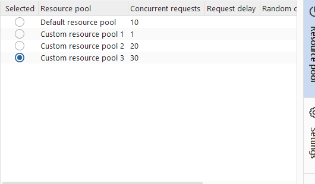

Burpsuite sẽ trả về password đúng. Sử dụng password để đăng nhập vào tài khoản của carlos.

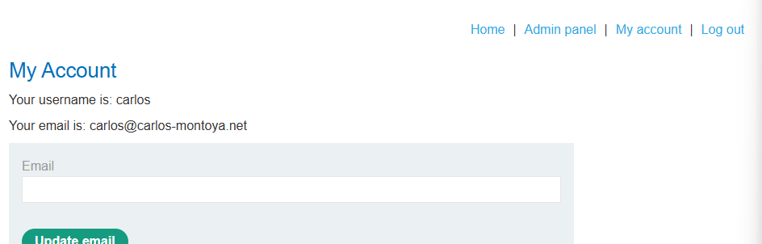

Truy cập vào admin panel, tiến hành xóa tài khoản carlos và hoàn thành bài lab.

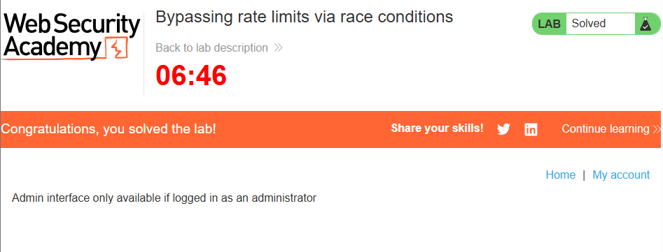

# __Lab: Multi-endpoint race conditions__

Access Lab, đăng nhập bằng account được cung cấp wiener:peter. 

# __Lab: Single-endpoint race conditions__

Access Lab, đăng nhập bằng account được cung cấp wiener:peter. Thay đổi email để Burpsuite có thể bắt đc POST /my-account/change-email.

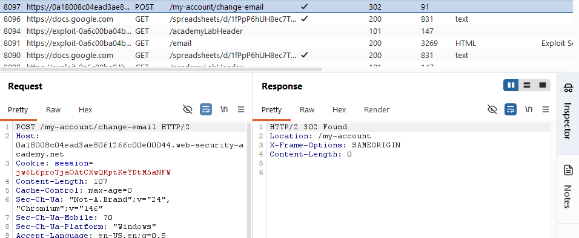

Send to Repeater, tạo 1 group và duplicate request. Vì server sử dụng chung 1 biến nên khi gửi cùng lúc 2 request server có thể lấy nhầm giá trị. Duplicate ra 3 tab sửa đổi giá trị email của 1 tab thành `carlos@ginandjuice.shop`.

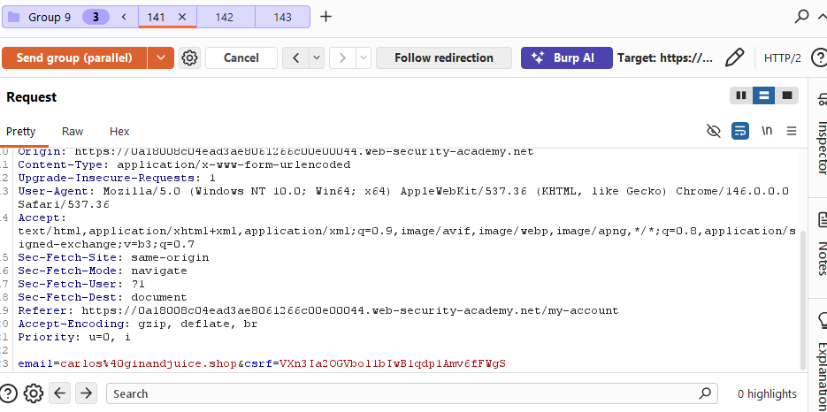

Send group theo dạng parallel để gửi đồng thời 3 request, vào email client để kiểm tra

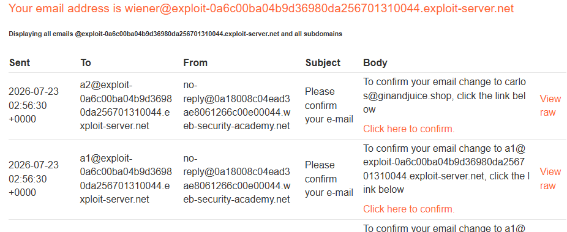

Nếu như chưa có mail xác nhận đổi email thành `carlos@ginandjuice.shop` hoặc khi xác nhận bị báo lỗi(invalid token) thì tiếp tục send cho đến khi có thể đổi email thành công.

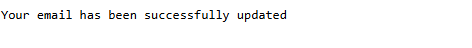

Thông thường lỗi Invalid token xảy ra khi các respone đc trả về k đồng thời nên response sau sẽ xóa bỏ token của respone trc. Nhưng sau khi đã xác thực thành công việc đổi email thành của `carlos` thì ta sẽ có quyền truy cập vào admin panel.

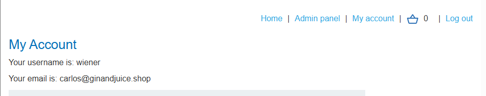

Truy cập vào admin panel tiến hành xóa account carlos và hoàn thành bài lab.

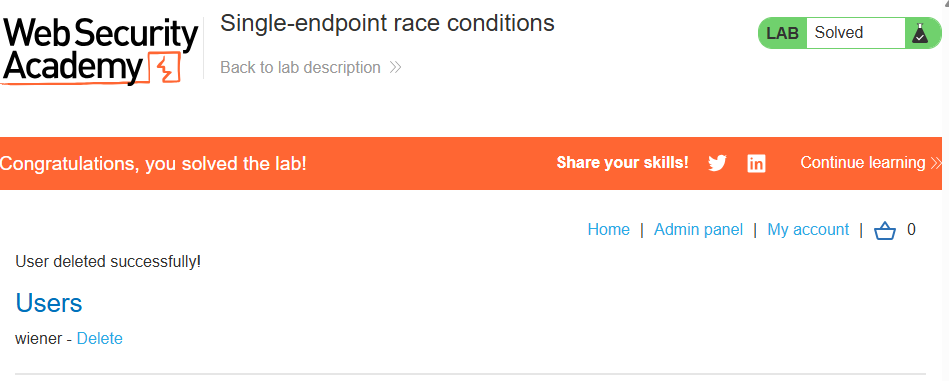

# __Lab: Exploiting time-sensitive vulnerabilities__

