# Mục Lục

1. [Lab: SQL injection vulnerability in WHERE clause allowing retrieval of hidden data](#lab-sql-injection-vulnerability-in-where-clause-allowing-retrieval-of-hidden-data)

2. [Lab: SQL injection vulnerability allowing login bypass](#lab-sql-injection-vulnerability-allowing-login-bypass)

3. [Lab: SQL injection attack, querying the database type and version on Oracle](#lab-sql-injection-attack-querying-the-database-type-and-version-on-oracle)

4. [Lab: SQL injection attack, listing the database contents on non-Oracle databases](#lab-sql-injection-attack-listing-the-database-contents-on-non-oracle-databases)

5. [Lab: SQL injection attack, listing the database contents on Oracle](#lab-sql-injection-attack-listing-the-database-contents-on-oracle)

6. [Lab: SQL injection UNION attack, determining the number of columns returned by the query](#lab-sql-injection-union-attack-determining-the-number-of-columns-returned-by-the-query)

7. [Lab: SQL injection UNION attack, finding a column containing text](#lab-sql-injection-union-attack-finding-a-column-containing-text)

8. [Lab: SQL injection UNION attack, retrieving data from other tables](#lab-sql-injection-union-attack-retrieving-data-from-other-tables)

9. [Lab: SQL injection UNION attack, retrieving multiple values in a single column](#lab-sql-injection-union-attack-retrieving-multiple-values-in-a-single-column)

10. [Lab: Blind SQL injection with time delays](#lab-blind-sql-injection-with-time-delays)

---

# __Lab: SQL injection vulnerability in WHERE clause allowing retrieval of hidden data__

Access Lab, dùng burpsuite để chặn khi truy cập vào 1 danh mục sản phẩm bất kì. Send to Repeater

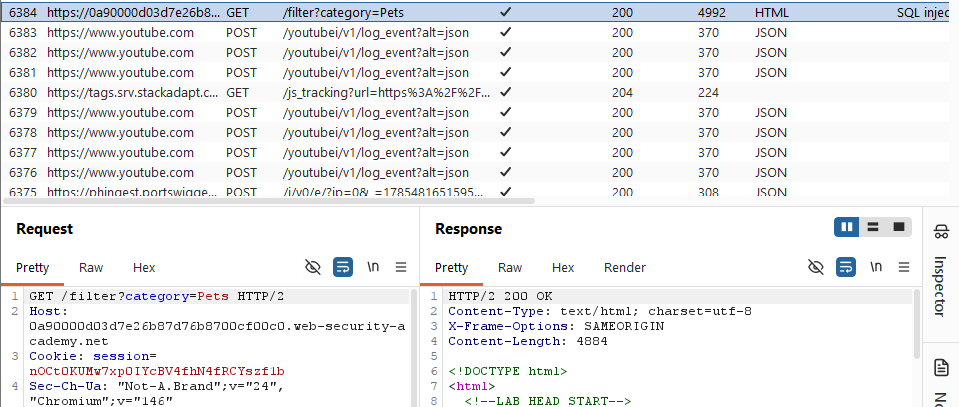

Khi này nhận thấy server sử dụng `category` để lọc dữ liệu sản phẩm. Gán thêm giá trị `'+OR+1=1--` vào sau và send. Khi này ứng dụng sẽ hiển thị thêm những sản phẩm chưa được public và hoàn thành bài lab.

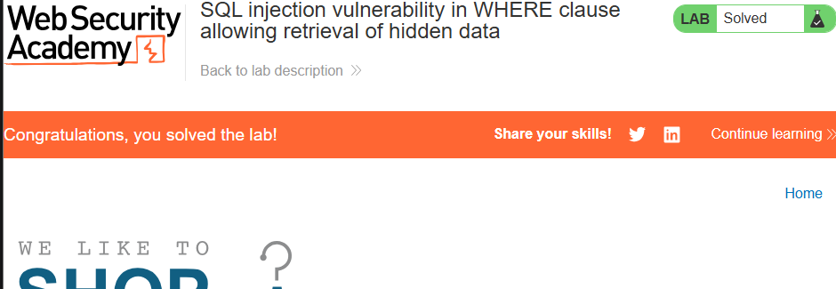

# __Lab: SQL injection vulnerability allowing login bypass__

Access Lab, truy cập my account và tìm cách đăng nhập vào tài khoản administrator. Bằng cách dùng chuỗi chú thích `--` khi thêm vào sau username server sẽ loại bỏ việc kiểm tra mật khẩu khỏi `WHERE`.

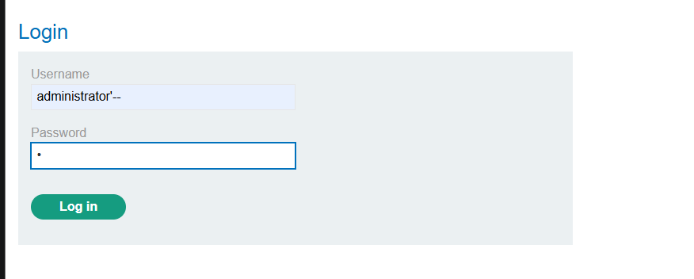

Tiến hành đăng nhập và hoàn thành bài lab.

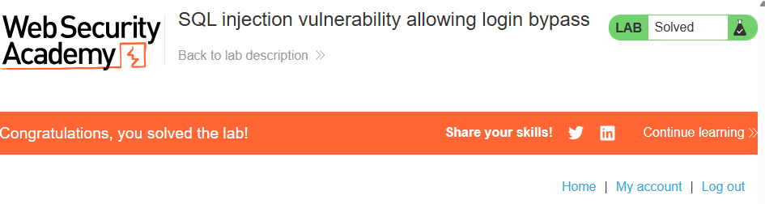

# __Lab: SQL injection attack, querying the database type and version on Oracle__

Access Lab, Sử dụng Burp Suite để chặn và chỉnh sửa khi truy cập danh mục sản phẩm. Send to Repeater.

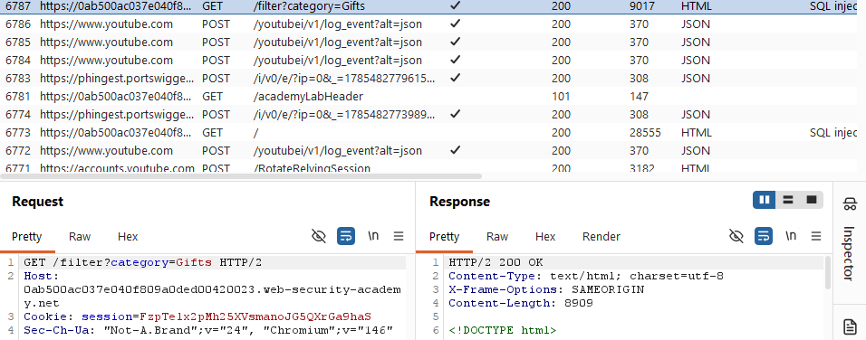

Khi này nhận thấy server sử dụng `category` để lọc dữ liệu sản phẩm. Để hoàn thành bài lab cần hiển thị được version của ứng dụng. Kiểm tra xem số lượng cột hiển thị text được trả về bởi truy vấn là bao nhiêu bằng cách thêm : `'+UNION+SELECT+'abc','def'+FROM+dual--`

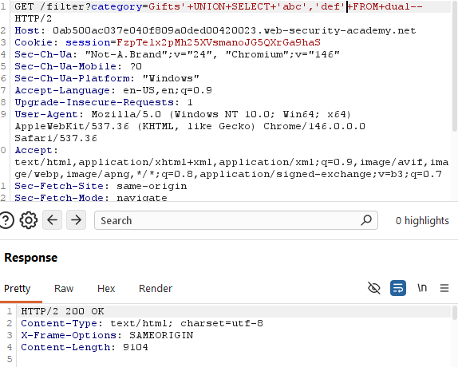

Tuy nhiên khi thêm 1 cột thì được báo `Internal Server Error` tức là chỉ có tối đa 2 cột và cả 2 cột đều hiển thị text. Sử đổi lại và thay bằng Payload: `'+UNION+SELECT+BANNER,+NULL+FROM+v$version--` để hiển thị version hiện tại của ứng dụng và hoàn thành bài lab.

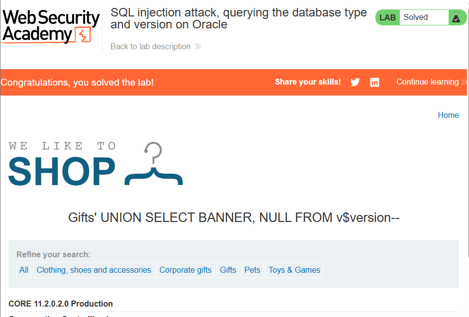

# __Lab: SQL injection attack, listing the database contents on non-Oracle databases__

Access Lab, ử dụng Burp Suite để chặn và chỉnh sửa khi truy cập danh mục sản phẩm. Send to Repeater.

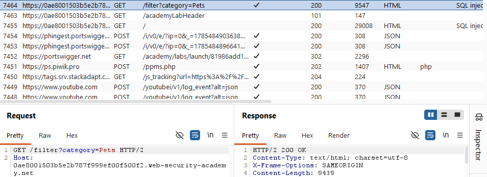

Khi này nhận thấy server sử dụng `category` để lọc dữ liệu sản phẩm. Để hoàn thành bài lab cần hiển thị được version của ứng dụng. Kiểm tra xem số lượng cột hiển thị text được trả về bởi truy vấn là bao nhiêu bằng cách thêm : `'+UNION+SELECT+NULL,NULL--`

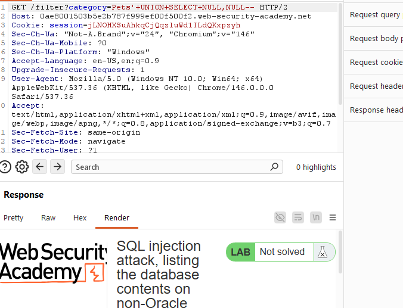

Tuy nhiên khi thêm 1 cột thì được báo `Internal Server Error` tức là chỉ có tối đa 2 cột. Thử kiểm tra xem cột nào hiển thị text bằng cách thay `NULL` bằng các giá trị như `'abc'` hoặc `'def'` thì nhận thấy cả 2 cột đều hiển thị text.

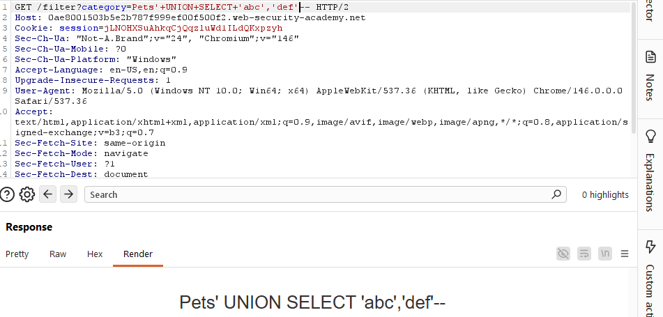

Truy xuất các bảng trong cơ sở dữ liệu bằng cách thêm: `'+UNION+SELECT+table_name,+NULL+FROM+information_schema.tables--`

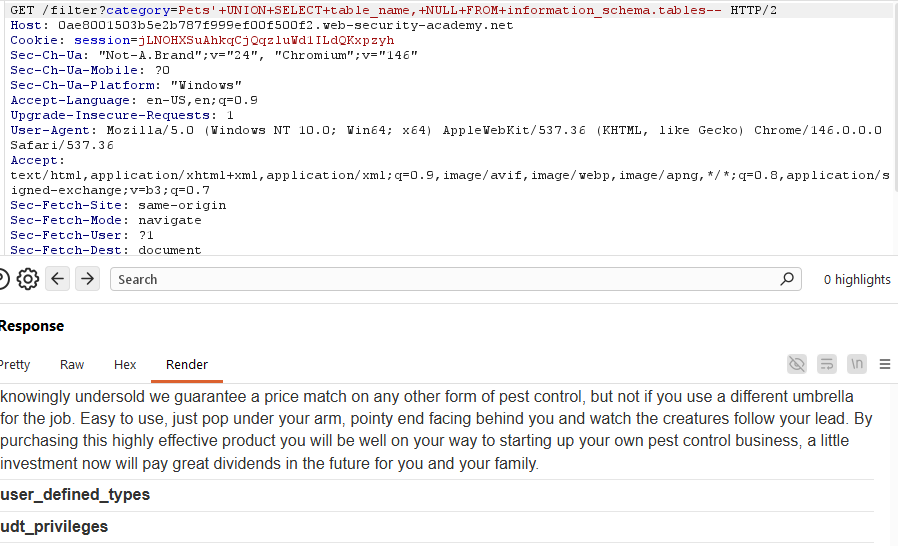

Khi này ứng dụng sẽ hiển thị các bảng bị ẩn hoặc không được public. Vì để hoàn thành bài lab cần đăng nhập được vào account `administrator`. Tìm trong các bảng đã hiển thị bảng có chứa danh sách các thông tin đăng nhập. 

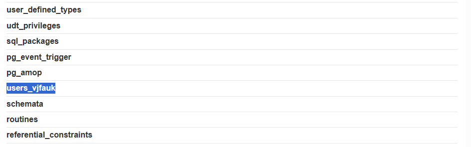

Sử dụng `information_schema.tables` để liệt kê tên cột của bảng `users`. Thêm `' UNION SELECT column_name, NULL FROM information_schema.columns WHERE table_name='users_xxxxx'--` vào trong đấy `users_xxxxx` là bảng liên quan đến người dùng.

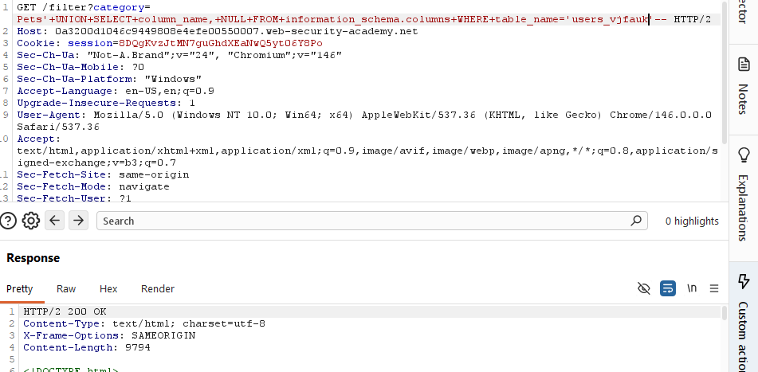

Khi này ứng dụng sẽ xuất hiện các bảng `user` và `password` 

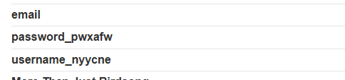

Sử dụng `'+UNION+SELECT+username_abcdef,+password_abcdef+FROM+users_abcdef--` để liệt kê các username và password trong các bảng.

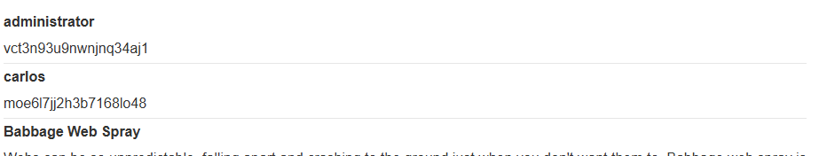

Sử dụng password đã lấy được để đăng nhập vào account `administrator` và hoàn thành bào lab.

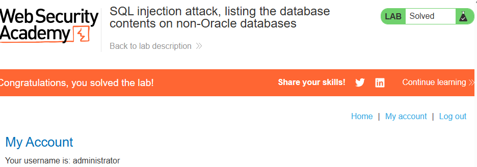

# __Lab: SQL injection attack, listing the database contents on Oracle__

Access Lab, sử dụng Burp Suite để chặn và chỉnh sửa khi truy cập danh mục sản phẩm. Send to Repeater.

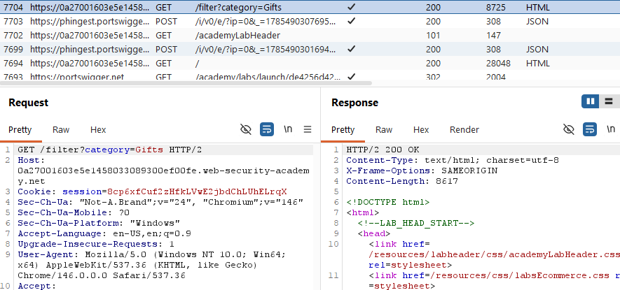

Khi này nhận thấy server sử dụng `category` để lọc dữ liệu sản phẩm. Để hoàn thành bài lab cần hiển thị được version của ứng dụng. Kiểm tra xem số lượng cột hiển thị text được trả về bởi truy vấn là bao nhiêu bằng cách thêm : `'+UNION+SELECT+'abc','def'+FROM+dual--`

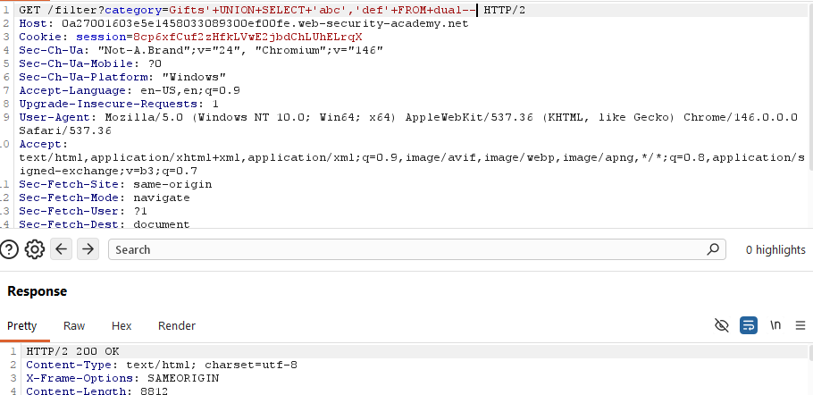

Tuy nhiên khi thêm 1 cột thì được báo `Internal Server Error` tức là chỉ có tối đa 2 cột. Truy xuất các bảng trong cơ sở dữ liệu bằng cách thêm: `'+UNION+SELECT+table_name,NULL+FROM+all_tables--`

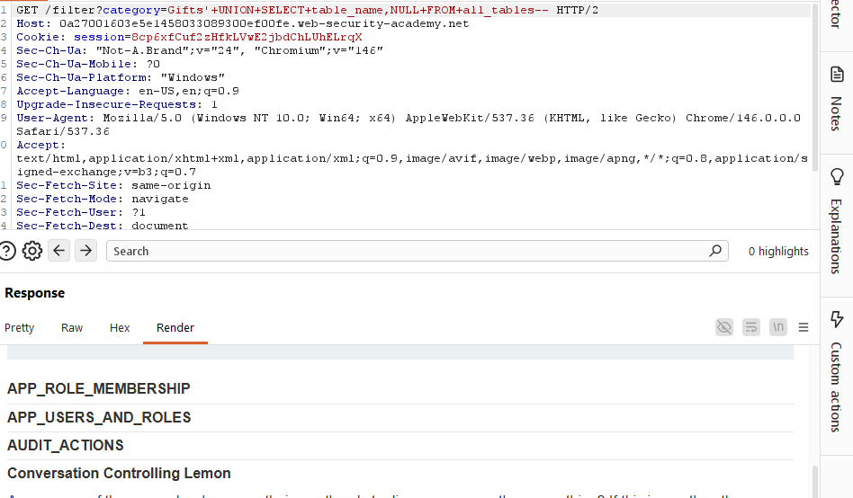

Khi này ứng dụng sẽ hiển thị các bảng bị ẩn hoặc không được public. Vì để hoàn thành bài lab cần đăng nhập được vào account `administrator`. Tìm trong các bảng đã hiển thị bảng có chứa danh sách các thông tin đăng nhập.

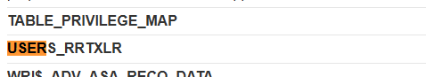

Truy xuất thông tin chi tiết của các cột trong bảng bằng `'+UNION+SELECT+column_name,NULL+FROM+all_tab_columns+WHERE+table_name='USERS_ABCDEF'--`

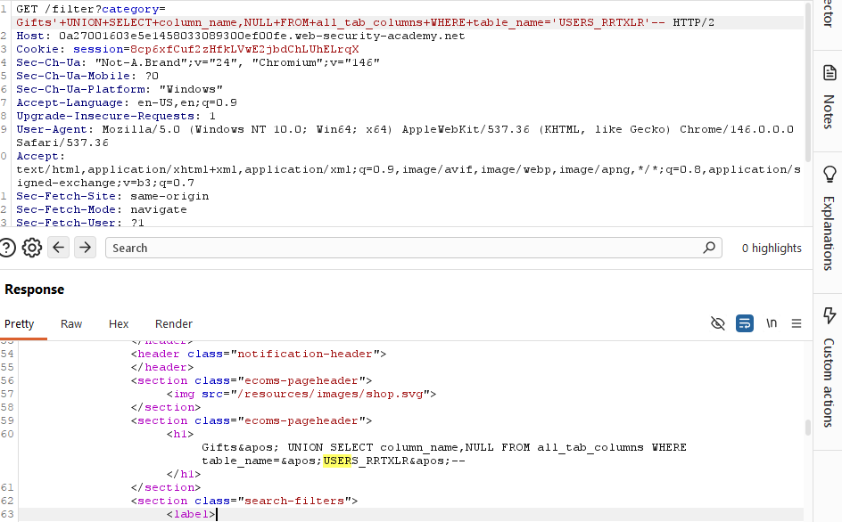

Khi này ứng dụng sẽ xuất hiện các bảng `user` và `password`

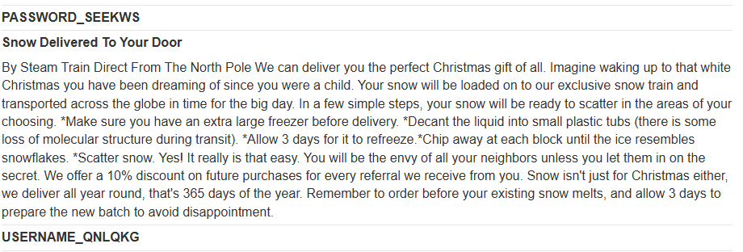

Sử dụng `'+UNION+SELECT+username_abcdef,+password_abcdef+FROM+users_abcdef--` để liệt kê các username và password trong các bảng.

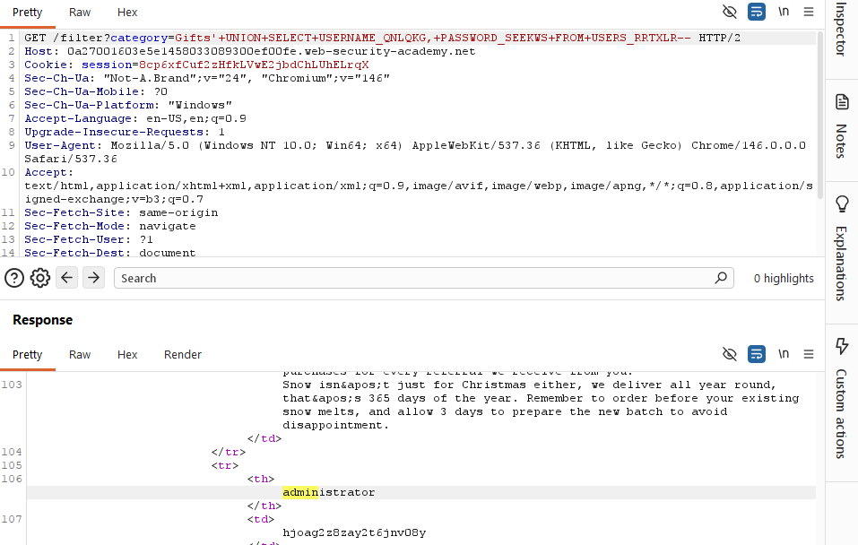

Sử dụng password đã lấy được để đăng nhập vào account `administrator` và hoàn thành bào lab.

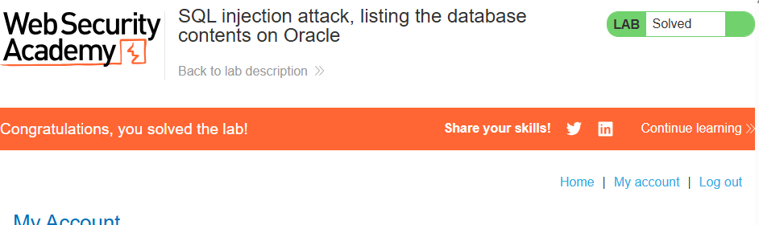

# __Lab: SQL injection UNION attack, determining the number of columns returned by the query__

Access Lab, để hoàn thành bài lab cần xác định định được số cột trả về từ truy vấn. Bằng cách thêm `'+UNION+SELECT+NULL,NULL,...--` liên tục thêm các cột `NULL` đến khi server trả về mã `200 OK` và hoàn thành bài lab.

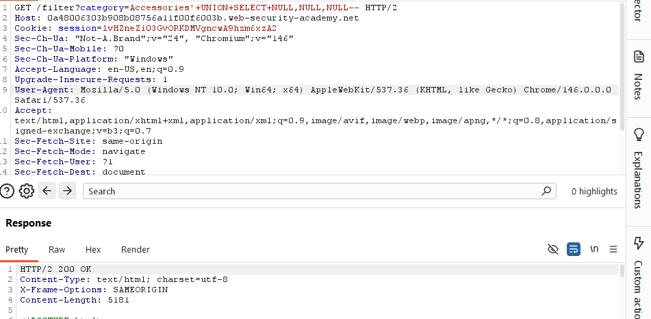

# __Lab: SQL injection UNION attack, finding a column containing text__

Access Lab, sử dụng Burp Suite để chặn và chỉnh sửa khi truy cập danh mục sản phẩm. Send to Repeater.

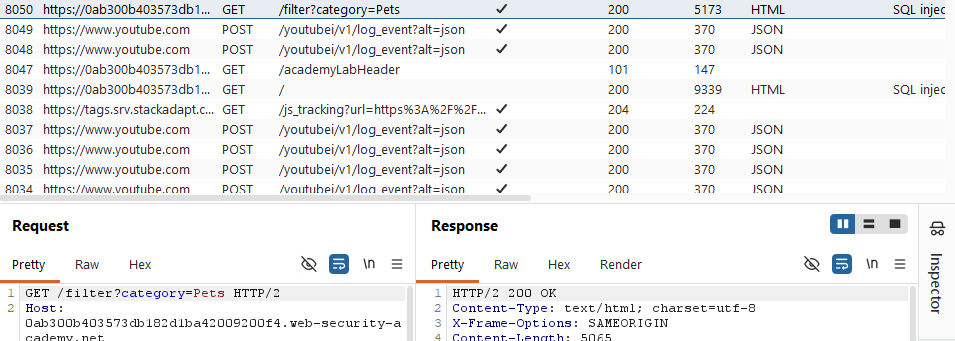

Để hoàn thành bài lab chỉ cần xác định được cột nào chứa văn bản. Bằng cách thêm `'+UNION+SELECT+NULL,NULL,...--` liên tục thêm các cột `NULL` đến khi server trả về mã `200 OK` để xác định được số lượng cột.

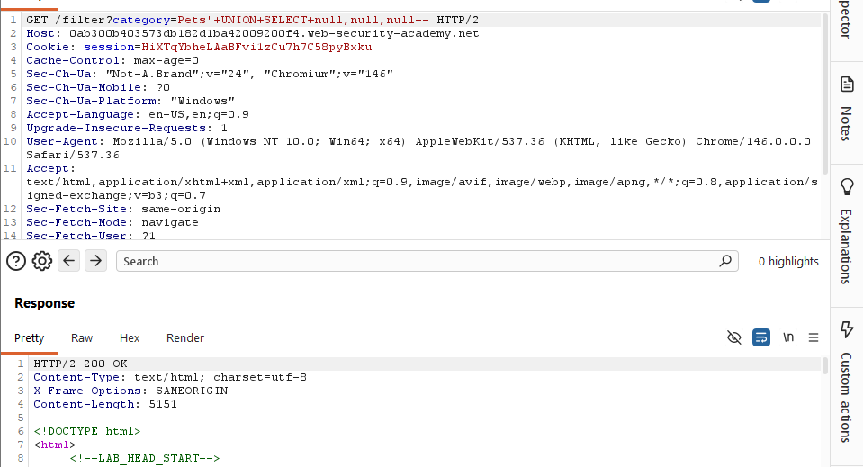

Ở đây là 3 cột. Để xác định được cột nào là cột có chứ văn bản lần lượt thay `'abc'` vào từng cột cho đến khi trả về mã `200 Ok`

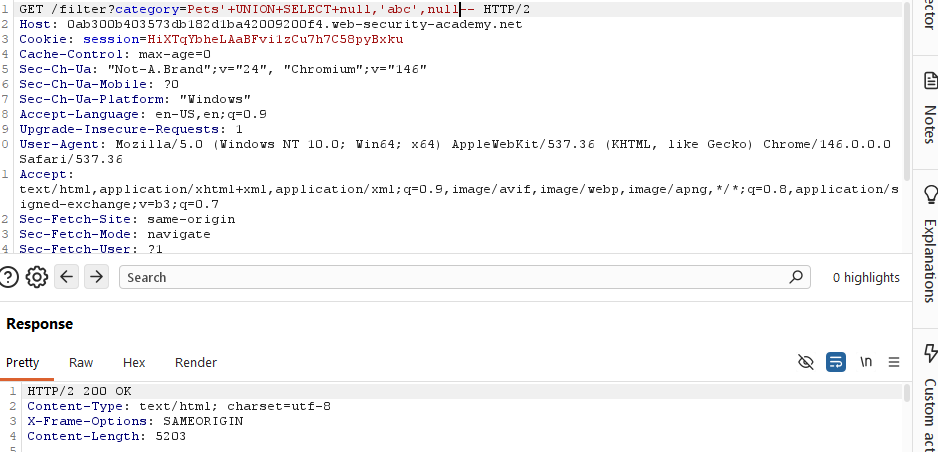

Ở đây là cột 2. Vì Lab yêu cầu hiển thị văn bản `zHh0BU` thay thế abc thành giá trị cần thiết và hoàn thành bài lab.

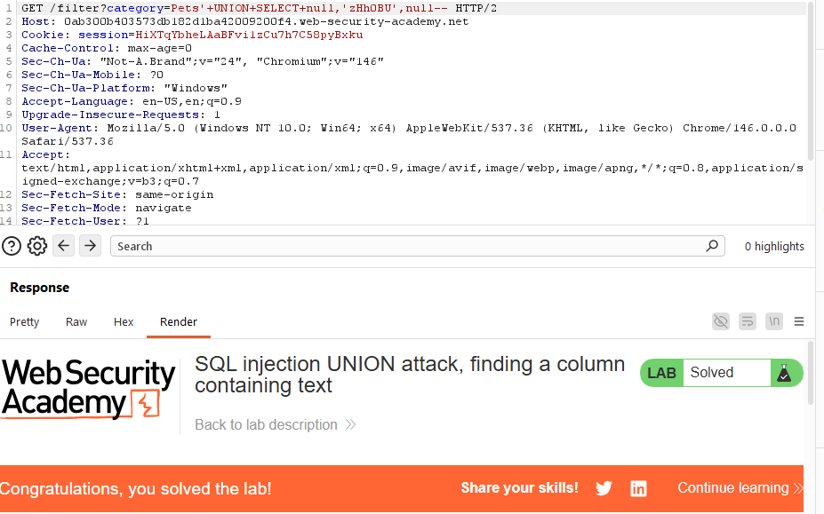