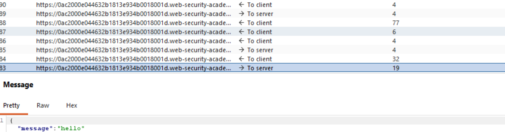
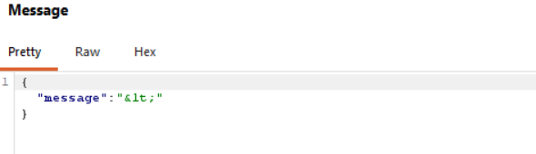
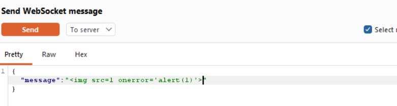
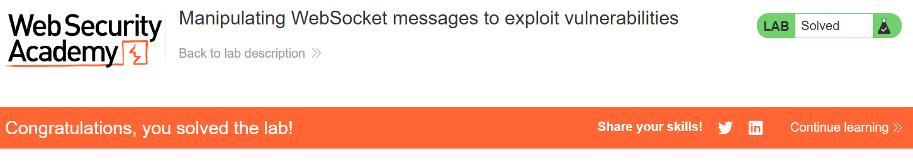
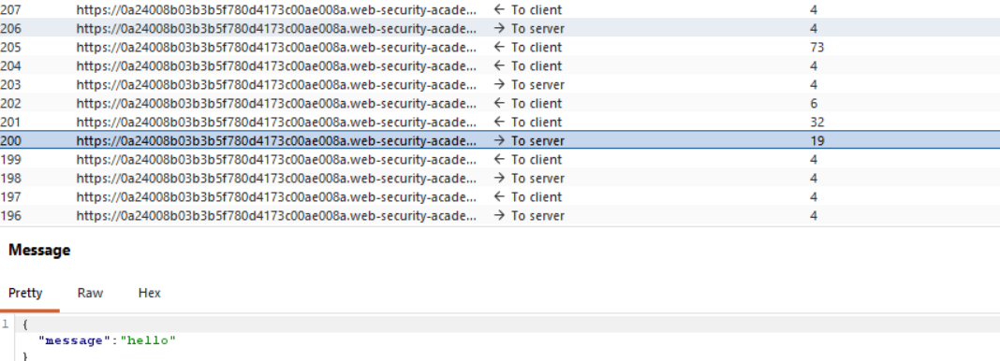
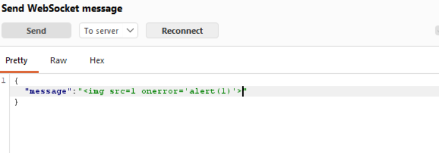
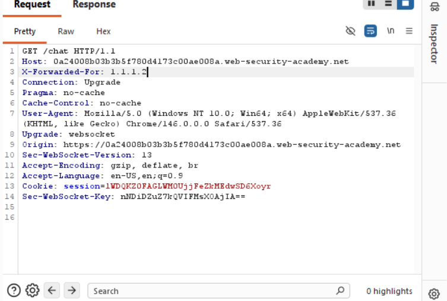
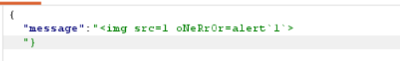
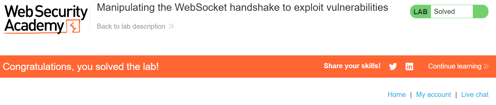
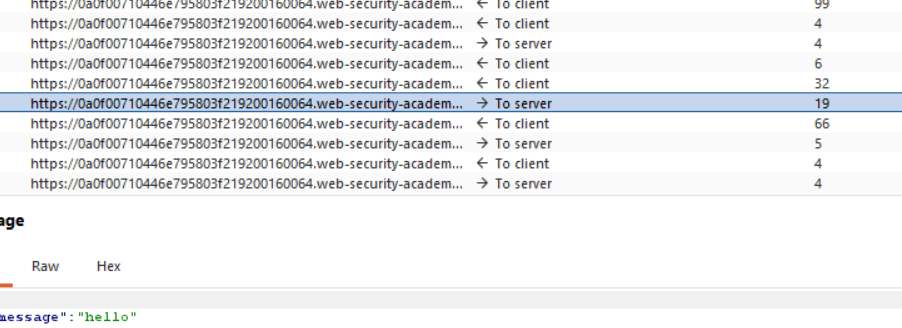

# WebSockets là gì:
WebSockets là một giao thức truyền thông hai chiều, song công hoàn toàn, được khởi tạo trên giao thức HTTP. Chúng thường được sử dụng trong các ứng dụng web hiện đại để truyền dữ liệu và các lưu lượng truy cập không đồng bộ khác.

# Thao tác với lưu lượng truy cập WebSocket
1. Chặn và chỉnh sửa tin nhắn WebSocket.
2. Phát lại và tạo các tin nhắn WebSocket mới.
3. Thao tác với các kết nối WebSocket.

# __Lab: Manipulating WebSocket messages to exploit vulnerabilities__

Access lab, sử dụng chức năng live chat của ứng dụng để gửi đi tin nhắn và dùng Burpsuite để bắt được các request vào lịch sử websockets để xem các tin đã được gửi.

Thử gửi các kí tự ddwacj biệt như `< " '`. Quan sát thấy kí tự đã bị mã hóa trước khi gửi đi.

Gửi tin nhắn đến Repeater để chỉnh sửa và gửi lại. Sử dụng payload `` để popup bảng `alert` để solved được bài lab.

# __Lab: Manipulating the WebSocket handshake to exploit vulnerabilities__
Access lab, sử dụng chức năng live chat của ứng dụng để gửi đi tin nhắn và dùng Burpsuite để bắt được các request vào lịch sử websockets để xem các tin đã được gửi.

Gửi tin nhắn đến Repeater để chỉnh sửa và gửi lại. Sử dụng payload `` để popup bảng `alert` Tuy nhiên ngay khi gửi thì server sẽ nhận diện và biết được là đang cố bị tấn công nên đã ngắt kết nối ngay llaapj tức

Khi thử kết nối lai thì thấy rằng IP đã bị chặn tuy nhiện 1 số ứng dụng có thể bị `Broken Access Control`. Thêm Header `X-Forwarded-For` để giả mạo địa chỉ IP 

Gửi một tin nhắn WebSocket chứa mã độc XSS đã được mã hóa để hoàn thành bài lab.

# __Lab: Cross-site WebSocket hijacking__
Access lab, sử dụng chức năng live chat của ứng dụng để gửi đi tin nhắn và dùng Burpsuite để bắt được các request vào lịch sử websockets để xem các tin đã được gửi.

