# Mục Lục

1. [Lab: Reflected XSS into HTML context with nothing encoded](#lab-reflected-xss-into-html-context-with-nothing-encoded)

2. [Lab: Stored XSS into HTML context with nothing encoded](#lab-stored-xss-into-html-context-with-nothing-encoded)

3. [Lab: DOM XSS in document.write sink using source location.search](#lab-dom-xss-in-documentwrite-sink-using-source-locationsearch)

4. [Lab: DOM XSS in innerHTML sink using source location.search](#lab-dom-xss-in-innerhtml-sink-using-source-locationsearch)

5. [Lab: DOM XSS in jQuery anchor href attribute sink using location.search source](#lab-dom-xss-in-jquery-anchor-href-attribute-sink-using-locationsearch-source)

6. [Lab: DOM XSS in jQuery selector sink using a hashchange event](#lab-dom-xss-in-jquery-selector-sink-using-a-hashchange-event)

7. [Lab: Reflected XSS into attribute with angle brackets HTML-encoded](#lab-reflected-xss-into-attribute-with-angle-brackets-html-encoded)

8. [Lab: Stored XSS into anchor href attribute with double quotes HTML-encoded](#lab-stored-xss-into-anchor-href-attribute-with-double-quotes-html-encoded)

9. [Lab: Reflected XSS into a JavaScript string with angle brackets HTML encoded](#lab-reflected-xss-into-a-javascript-string-with-angle-brackets-html-encoded)

10. [Lab: DOM XSS in document.write sink using source location.search inside a select element](#lab-dom-xss-in-documentwrite-sink-using-source-locationsearch-inside-a-select-element)

11. [Lab: DOM XSS in AngularJS expression with angle brackets and double quotes HTML-encoded](#lab-dom-xss-in-angularjs-expression-with-angle-brackets-and-double-quotes-html-encoded)

12. [Lab: Reflected DOM XSS](#lab-reflected-dom-xss)

13. [Lab: Stored DOM XSS](#lab-stored-dom-xss)

14. [Lab: Reflected XSS into HTML context with most tags and attributes blocked](#lab-reflected-xss-into-html-context-with-most-tags-and-attributes-blocked)

15. [Lab: Reflected XSS into HTML context with all tags blocked except custom ones](#lab-reflected-xss-into-html-context-with-all-tags-blocked-except-custom-ones)

16. [Lab: Reflected XSS with some SVG markup allowed](#lab-reflected-xss-with-some-svg-markup-allowed)

17. [Lab: Reflected XSS in canonical link tag](#lab-reflected-xss-in-canonical-link-tag)

18. [Lab: Reflected XSS into a JavaScript string with single quote and backslash escaped](#lab-reflected-xss-into-a-javascript-string-with-single-quote-and-backslash-escaped)

19. [Lab: Reflected XSS into a JavaScript string with angle brackets and double quotes HTML-encoded and single quotes escaped](#lab-reflected-xss-into-a-javascript-string-with-angle-brackets-and-double-quotes-html-encoded-and-single-quotes-escaped)

20. [Lab: Stored XSS into onclick event with angle brackets and double quotes HTML-encoded and single quotes and backslash escaped](#lab-stored-xss-into-onclick-event-with-angle-brackets-and-double-quotes-html-encoded-and-single-quotes-and-backslash-escaped)

21. [Lab: Reflected XSS into a template literal with angle brackets, single, double quotes, backslash and backticks Unicode-escaped](#lab-reflected-xss-into-a-template-literal-with-angle-brackets-single-double-quotes-backslash-and-backticks-unicode-escaped)
---
# __Lab: Reflected XSS into HTML context with nothing encoded__

Access Lab, trên trang chủ nhận thấy có một ô tìm kiếm (Search the blog...). Nhập đoạn payload `<script>alert(1)</script>` vào ô tìm kiếm và bấm Search.

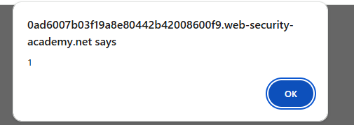

Khi này nhận thấy server nhận dữ liệu từ tham số `search` nhưng không hề mã hóa các ký tự đặc biệt mà in thẳng ra HTML. Trình duyệt sẽ hiểu đoạn payload trên là mã JavaScript và thực thi nó, làm xuất hiện hộp thoại pop-up cảnh báo và hoàn thành bài lab.

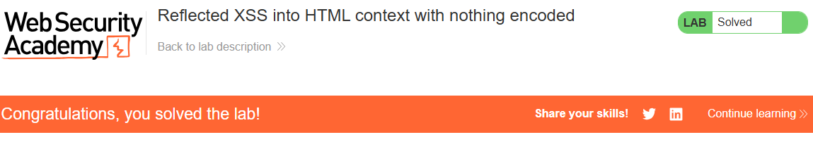


# __Lab: Stored XSS into HTML context with nothing encoded__

Access Lab, truy cập vào một bài blog bất kỳ. Kéo xuống phần comment.
Điền payload `<script>alert(1)</script>` vào ô Comment, điền bừa các thông tin Name, Email, Website và bấm Post Comment.

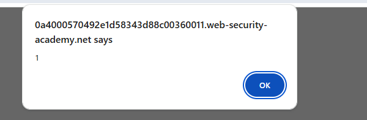

Bấm "Back to Blog" để quay lại bài viết. Khi này nhận thấy server đã lưu payload vào cơ sở dữ liệu và in thẳng ra mã HTML mà không hề mã hóa (encode). Mỗi lần bài viết được tải lại, trình duyệt sẽ đọc được thẻ script, tự động thực thi mã JavaScript làm xuất hiện hộp thoại pop-up và hoàn thành bài lab.

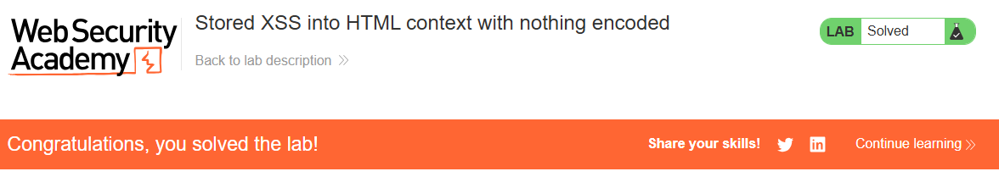


# __Lab: DOM XSS in document.write sink using source location.search__

Access Lab, trên trang chủ nhận thấy có một ô tìm kiếm. Nhập đoạn payload `"><svg onload=alert(1)>` vào ô tìm kiếm và bấm Search.

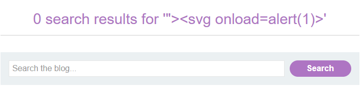

Khi này, kiểm tra source code nhận thấy trang web sử dụng JavaScript để lấy dữ liệu từ URL (`location.search`) thông qua biến `query`. Sau đó, hàm `document.write()` nhét thẳng biến này vào thuộc tính `src` của một thẻ `` để in ra màn hình.

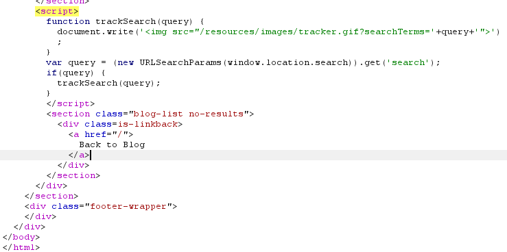

Ký tự `">` trong payload của chúng ta đã đóng sớm thuộc tính `src` và thẻ `` ban đầu. Phần còn lại `<svg onload=alert(1)>` trở thành một thẻ HTML hợp lệ hoàn toàn mới. Trình duyệt khi load thẻ `svg` này sẽ tự động kích hoạt thuộc tính `onload` và thực thi mã JavaScript `alert(1)`, hiển thị pop-up và hoàn thành bài lab.

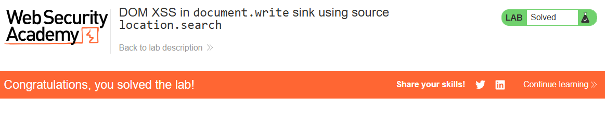


# __Lab: DOM XSS in innerHTML sink using source location.search__

Access Lab, nhận thấy trang web có một ô tìm kiếm. Tuy nhiên, nếu nhập `<script>alert(1)</script>` thì mã không được thực thi do HTML5 vô hiệu hóa các thẻ script được chèn qua `innerHTML`.

Tiến hành dùng payload tận dụng thuộc tính event handler của thẻ HTML khác: `` nhập vào ô tìm kiếm và bấm Search.

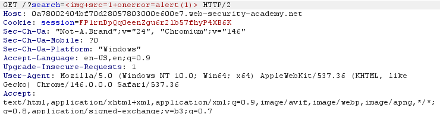

Kiểm tra mã nguồn JavaScript, hàm `doSearchQuery` đã dùng biến `query` (lấy từ URL) và gán thẳng vào `innerHTML` của phần tử `searchMessage`. Trình duyệt khi tải phần tử `` này sẽ không tìm thấy nguồn ảnh (`src=1`), từ đó kích hoạt sự kiện `onerror` và thực thi mã JavaScript `alert(1)`, làm hiển thị pop-up và hoàn thành bài lab.

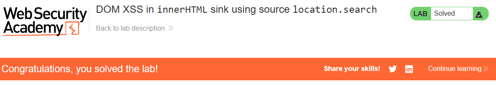


# __Lab: DOM XSS in jQuery anchor href attribute sink using location.search source__

Access Lab, truy cập vào chức năng "Submit feedback". Sử dụng Burp Suite để chặn (Intercept) request GET đến trang feedback này. 

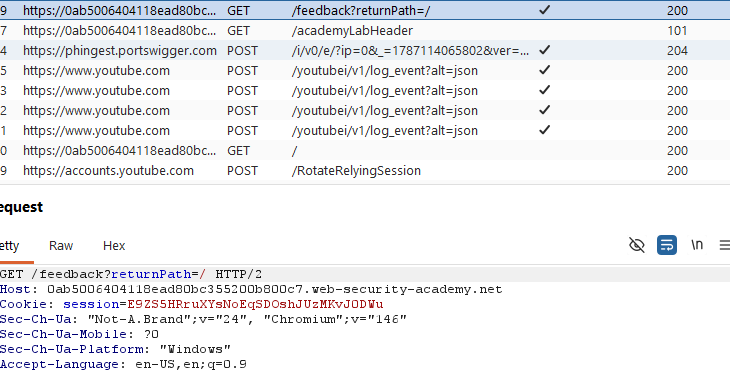

Khi này nhận thấy URL có sử dụng tham số `returnPath=/` để điều hướng cho nút Back. Gán thử giá trị `?returnPath=test_xss` và Forward request về trình duyệt. Kiểm tra mã nguồn thì thấy trang web dùng jQuery gán thẳng giá trị này vào thuộc tính `href` của nút Back mà không hề kiểm tra (validate).

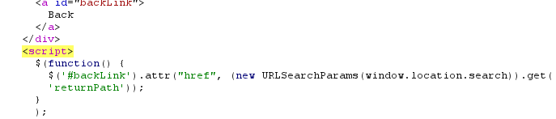

Tuy nhiên, nếu truyền thẻ `<script>` vào đây sẽ không chạy được vì dữ liệu bị ép nằm bên trong thuộc tính `href` của thẻ `<a>`. Sửa đổi lại tham số trong URL bằng Payload dùng pseudo-protocol: `?returnPath=javascript:alert(document.cookie)` và truy cập.

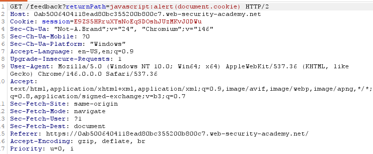

Tiến hành click vào chữ **Back** trên giao diện ứng dụng. Trình duyệt sẽ thực thi mã JavaScript trong thuộc tính `href`, làm hiển thị pop-up chứa cookie và hoàn thành bài lab.

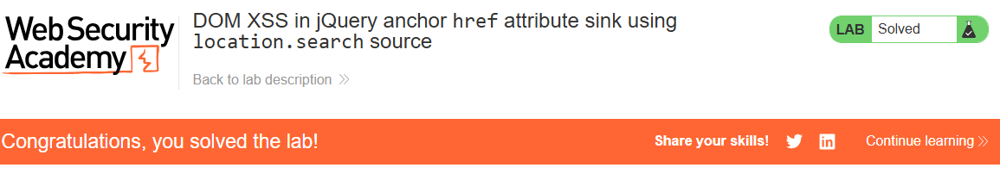


# __Lab: DOM XSS in jQuery selector sink using a hashchange event__

Access Lab, truy cập trang chủ của ứng dụng. Bấm F12 kiểm tra mã nguồn (hoặc chặn request trang chủ bằng Burp Suite để đọc response).

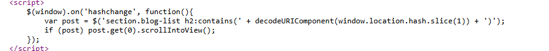

Khi này nhận thấy ứng dụng có một đoạn mã JavaScript sử dụng sự kiện `hashchange`. Nó lấy dữ liệu từ `window.location.hash`, giải mã và đưa thẳng vào hàm selector `$()` của jQuery để tìm tiêu đề bài viết và tự động cuộn (scroll) trang xuống vị trí đó. 


Lỗ hổng xảy ra do trong các phiên bản jQuery cũ, nếu bạn truyền một chuỗi HTML (bắt đầu bằng `<`) vào hàm `$()`, jQuery sẽ tự động render nó thành một thẻ HTML mới (giống hệt `innerHTML`). 

Để khai thác, ta cần tạo một trang web độc hại ép nạn nhân truy cập và kích hoạt sự kiện `hashchange`. Bấm vào nút **Go to exploit server**. 

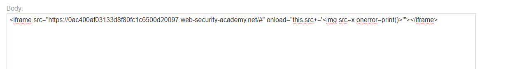

Tại ô `Body`, chèn payload sử dụng thẻ `<iframe>`. Thẻ này sẽ tải trang web gốc, sau đó thuộc tính `onload` sẽ tự động nối thêm đoạn mã XSS vào sau dấu `#` để kích hoạt hàm tạo thẻ của jQuery. Payload:

```html
<iframe src="https://0ac400af03133d8f80fc1c6500d20097.web-security-academy.net/#" onload="this.src+=''"></iframe>
```

Delivery to victim để hoàn thành bài lab.

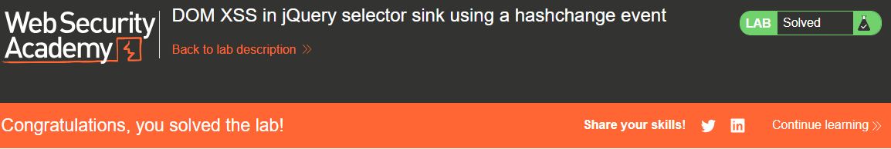


# __Lab: Reflected XSS into attribute with angle brackets HTML-encoded__

Access Lab, sử dụng chức năng tìm kiếm (Search the blog...). Thử nhập một đoạn payload chứa thẻ HTML như `<script>alert(1)</script>` và chặn request bằng Burp Suite để phân tích.

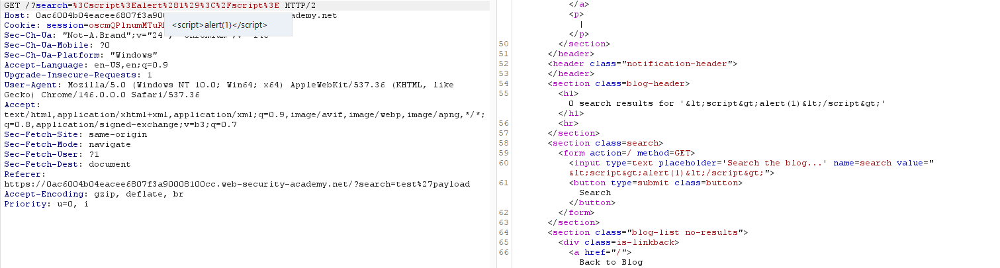

Khi này nhận thấy máy chủ đã mã hóa các ký tự ngoặc nhọn `<` và `>` thành `&lt;` và `&gt;`, ngăn chặn việc chèn thêm thẻ HTML mới. Tuy nhiên, dữ liệu đầu vào lại được phản xạ trực tiếp vào bên trong thuộc tính `value` của thẻ `<input>` và máy chủ không hề mã hóa dấu ngoặc kép (`"`).

Sửa đổi lại từ khóa tìm kiếm thành Payload: `" onmouseover="alert(1)` và bấm Search (hoặc sửa thông số `search` trực tiếp trong tab Proxy của Burp Suite rồi Forward).

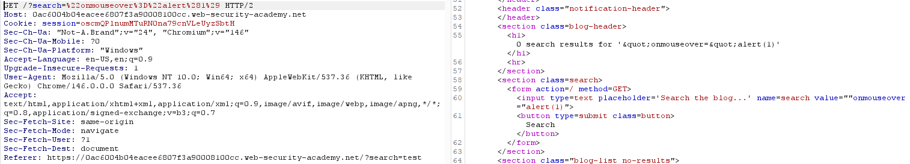

Payload này sử dụng dấu `"` đầu tiên để đóng sớm thuộc tính `value`, sau đó chèn thêm một thuộc tính xử lý sự kiện `onmouseover` vào chính thẻ `<input>` hiện tại. Mã HTML thực tế sinh ra trên trình duyệt sẽ có dạng: 
`<input type=text placeholder='Search the blog...' name=search value="" onmouseover="alert(1)">`

Tiến hành đưa trỏ chuột (di chuột) ngang qua ô tìm kiếm (Search box) trên giao diện. Trình duyệt sẽ kích hoạt sự kiện `onmouseover` và thực thi lệnh JavaScript, làm xuất hiện pop-up `alert(1)` và hoàn thành bài lab.

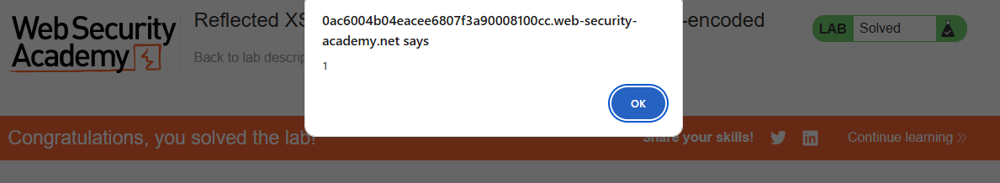


# __Lab: Stored XSS into anchor href attribute with double quotes HTML-encoded__

Access Lab, truy cập vào một bài blog bất kỳ và kéo xuống phần chức năng Leave a comment. Thử điền các thông tin và nhập một chuỗi payload chứa dấu ngoặc kép vào ô Website, ví dụ: `" onclick="alert(1)`.

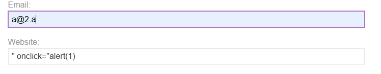

Bấm Post Comment, sau đó quay lại bài viết (bấm Back to blog). Sử dụng F12 (Inspect) để kiểm tra thẻ `<a>` ở phần tên của người bình luận. Nhận thấy toàn bộ payload `" onclick="alert(1)` bị gộp chung thành một chuỗi giá trị nằm gọn bên trong thuộc tính `href` (hiển thị màu xanh dương đồng nhất trên DevTools). Điều này chứng tỏ máy chủ đã mã hóa dấu ngoặc kép `"` thành `&quot;` ở mã nguồn gốc, khiến ta không thể đóng thuộc tính `href` để chèn thêm các event handler.

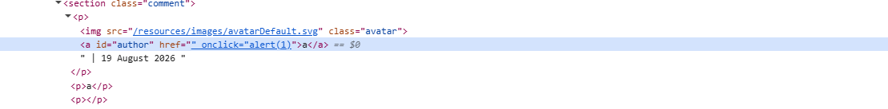

Tuy nhiên, do dữ liệu người dùng được chèn trực tiếp vào làm giá trị của đường link URL, ta có thể sử dụng pseudo-protocol `javascript:` để thực thi mã lệnh. Tiến hành tạo một bình luận mới, ở phần **Website** điền vào payload: `javascript:alert(1)`. Điền các thông tin Name, Email và bấm Post.

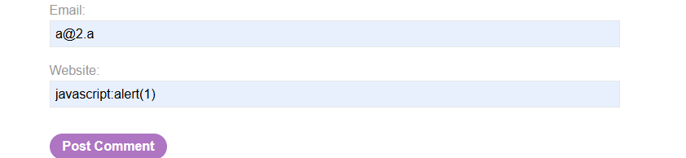

Lúc này trên giao diện, tên bình luận của bạn đã trở thành một đường link có chứa mã HTML: `<a href="javascript:alert(1)">[Tên]</a>`. Tiến hành click thẳng chuột vào tên người bình luận đó. Trình duyệt sẽ thực thi mã JavaScript, làm hiển thị pop-up `alert(1)` và hoàn thành bài lab.

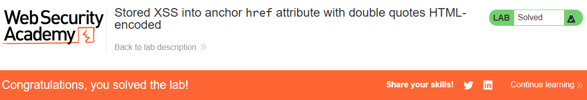


# __Lab: Reflected XSS into a JavaScript string with angle brackets HTML encoded__

Access Lab, sử dụng chức năng tìm kiếm. Thử nhập một đoạn payload cơ bản như `<script>alert(1)</script>` và kiểm tra mã nguồn trang.

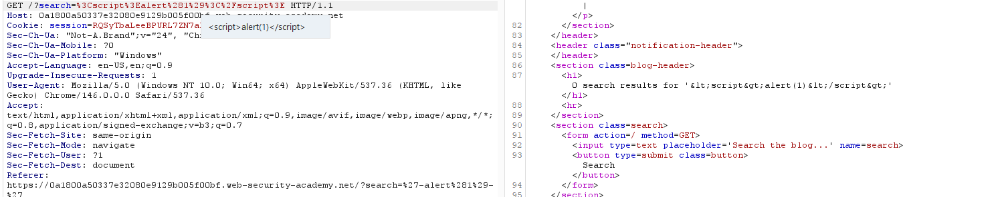

Khi này nhận thấy máy chủ đã HTML-encoded các dấu `<` và `>`, ngăn chặn việc tạo thẻ mới. Tuy nhiên, từ khóa tìm kiếm lại được chèn trực tiếp vào bên trong một biến kiểu chuỗi (string) của đoạn mã JavaScript hiện có: `var searchTerms = 'từ-khóa';`.

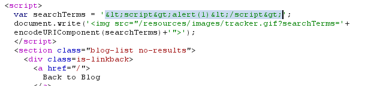

Do không thể thoát ra khỏi thẻ `<script>`, ta cần thực thi mã ngay bên trong context của JavaScript. Tiến hành thay đổi từ khóa tìm kiếm thành Payload: `'-alert(1)-'` và ấn Search.

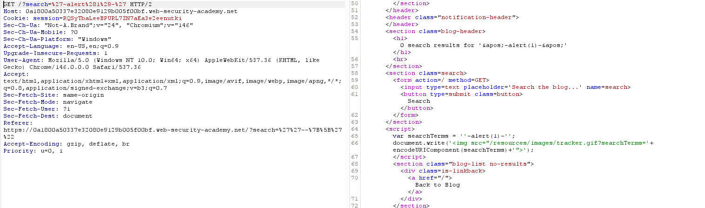

Payload này sử dụng dấu nháy đơn `'` đầu tiên để đóng chuỗi hiện tại của máy chủ. Sau đó, nó sử dụng toán tử trừ `-` để nối các thành phần lại thành một biểu thức toán học. Mã thực tế sinh ra là: `var searchTerms = ''-alert(1)-'';`.

Để tính toán biểu thức này, trình duyệt bắt buộc phải thực thi hàm `alert(1)`, làm xuất hiện pop-up và hoàn thành bài lab.

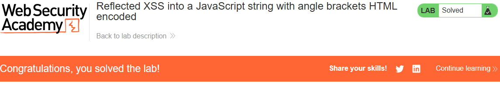